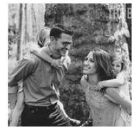
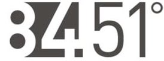
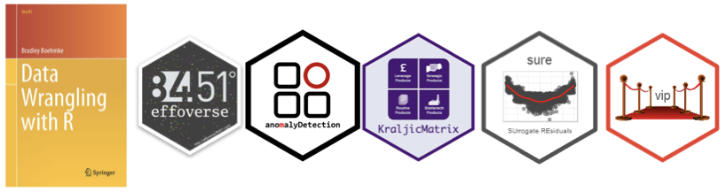
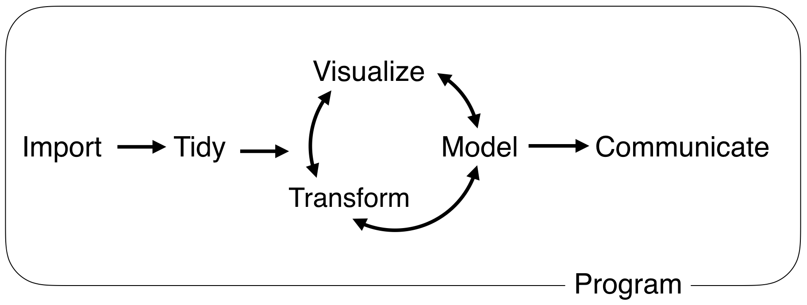
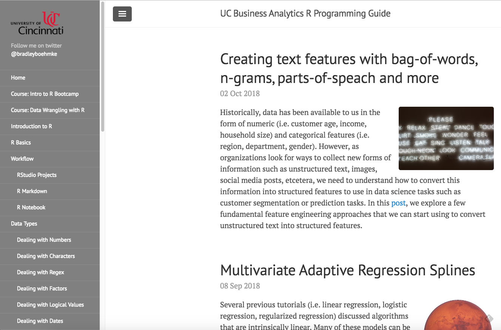

```{r setup, include=FALSE, cache=FALSE}
# set working directory to docs folder
setwd(here::here("docs"))

# Set global R options
options(htmltools.dir.version = FALSE, servr.daemon = TRUE)

# Set global knitr chunk options
knitr::opts_chunk$set(
  fig.align = "center", 
  cache = TRUE,
  error = FALSE,
  message = FALSE, 
  warning = FALSE, 
  collapse = TRUE 
)

# This is good for getting the ggplot background consistent with
# the html background color
library(ggplot2)
thm <- theme_bw()
theme_set(thm)
```

class: title-slide   
<a href="https://github.com/uc-r/Advanced-R"></a>


<br><br><br><br>
# .font200[Advanced Analytics with `r anicon::faa("r-project", animate = 'pulse', speed = 'slow', color = 'steelblue')`]

### Brad Boehmke
### Feb 28 - Mar 1, 2019


---

class: clear, center, middle


background-image: url(images/introductions.jpg)
background-size: cover


---

# About me

.pull-left[

```{r name-tag, echo=FALSE}
knitr::include_graphics("images/name-tag.png")
```

* [`r fontawesome::fa("globe", fill = "steelblue")`](http://bradleyboehmke.github.io/) bradleyboehmke.github.io
* [`r fontawesome::fa("github", fill = "steelblue")`](https://github.com/bradleyboehmke/) @bradleyboehmke
* [`r fontawesome::fa("twitter", fill = "steelblue")`](https://twitter.com/bradleyboehmke) @bradleyboehmke
* [`r fontawesome::fa("linkedin", fill = "steelblue")`](https://www.linkedin.com/in/brad-boehmke-ph-d-9b0a257/) @bradleyboehmke
* [`r fontawesome::fa("envelope", fill = "steelblue")`](mailto:bradleyboehmke@gmail.com) bradleyboehmke@gmail.com

]


.pull-right[

#### Family 

* Dayton, OH
* Kate, Alivia (9), Jules (6)


#### Professional 

* 84.51° - Data Science Enabler 

#### Academic

* University of Cincinnati 
* Air Force Institute of Technology

#### R Community



]

---
# Data science courses

<br><br><br>

.pull-left[
.font120[

| Course | Dates |
|:------|:------:|
| Intro to R | Dec 13-14 |
| Intermediate R | Jan 31 - Feb 1 |
| Advanced Analytics with R `r anicon::faa("map-pin", colour = "red")` | Feb 28 - Mar 1 |
| Machine Learning with R | Apr 1-2 |

]
]

.pull-right[

```{r ds-class-options, echo=FALSE}

```

]

---
# Course objectives

<br><br><br>
.font130[
This workshop will step through the process of building, visualizing, testing, and comparing supervised and unsupervised models. The goal is to expose you to building machine learning models in R using a variety of packages and model types.
]

<br><br>

.center.bold[_You will gain deeper knowledge around the analytic modeling process and apply various supervised and unsupervised machine learning algorithms_]

---
# Course overview

.font110[Moving from an analytic apprentice to journeyman with the `r anicon::faa("r-project", colour = "steelblue", size = 1, animate = FALSE)` programming language:]

.font90[

.pull-left[

.center[.bold[Day 1]]

| Topic                               |     Time      |
| :---------------------------------- | :-----------: |
| .opacity[<s>Breakfast / Social time</s>]      |  <s>8:00 - 9:00</s>  |
| Introductions                       |  9:00 - 9:30  |
| Unsupervised modeling               |  9:30 - 10:45 |
| .opacity[Break]                     | 10:45 - 11:00 |
| Supervised modeling process         | 11:00 - 12:00 |
| .opacity[Lunch]                     | 12:00 - 1:00  |
| Feature & target engineering        |  1:00 - 2:15  |
| .opacity[Break]                     |  2:15 - 2:30  |
| Regression & cousins                |  2:30 - 3:45  |
| Q&A                                 |  3:45 - 4:30  |

]
]

--

.font90[

.pull-right[

.center[.bold[Day 2]]
 
| Topic                                    |     Time      |
| :----------------------------------------| :-----------: |
| .opacity[Breakfast / Social time]        |  8:00 - 9:00  |
| Decision trees, bagging, & random forests | 9:00 - 10:45 |
| .opacity[Break]                          | 10:45 - 11:00 |
| Gradient boosting machines               | 11:00 - 12:00 |
| .opacity[Lunch]                          | 12:00 - 1:00  |
| Stacked models & auto ML                 |  1:00 - 2:00  |
| .opacity[Break]                          |  2:00 - 2:15  |
| Interpretable machine learning           |  2:15 - 3:45  |
| Q&A                                      |  3:45 - 4:30  |

]
]

---
# A hands-on learning environment

.pull-left[

### You may be overwhelmed

```{r drowning, echo=FALSE, out.height="400"}
knitr::include_graphics("images/drowning.gif")
```

]

--

.pull-right[

### So work together

```{r helping, echo=FALSE, out.height="400"}
knitr::include_graphics("images/dogs-helping.gif")
```

]

---
# Class material

<a href="https://github.com/uc-r/Advanced-R" class="github-corner" aria-label="View source on Github"><svg width="80" height="80" viewBox="0 0 250 250" style="fill:#fff; color:#151513; position: absolute; top: 0; border: 0; right: 0;" aria-hidden="true"><path d="M0,0 L115,115 L130,115 L142,142 L250,250 L250,0 Z"></path><path d="M128.3,109.0 C113.8,99.7 119.0,89.6 119.0,89.6 C122.0,82.7 120.5,78.6 120.5,78.6 C119.2,72.0 123.4,76.3 123.4,76.3 C127.3,80.9 125.5,87.3 125.5,87.3 C122.9,97.6 130.6,101.9 134.4,103.2" fill="currentColor" style="transform-origin: 130px 106px;" class="octo-arm"></path><path d="M115.0,115.0 C114.9,115.1 118.7,116.5 119.8,115.4 L133.7,101.6 C136.9,99.2 139.9,98.4 142.2,98.6 C133.8,88.0 127.5,74.4 143.8,58.0 C148.5,53.4 154.0,51.2 159.7,51.0 C160.3,49.4 163.2,43.6 171.4,40.1 C171.4,40.1 176.1,42.5 178.8,56.2 C183.1,58.6 187.2,61.8 190.9,65.4 C194.5,69.0 197.7,73.2 200.1,77.6 C213.8,80.2 216.3,84.9 216.3,84.9 C212.7,93.1 206.9,96.0 205.4,96.6 C205.1,102.4 203.0,107.8 198.3,112.5 C181.9,128.9 168.3,122.5 157.7,114.1 C157.9,116.9 156.7,120.9 152.7,124.9 L141.0,136.5 C139.8,137.7 141.6,141.9 141.8,141.8 Z" fill="currentColor" class="octo-body"></path></svg></a><style>.github-corner:hover .octo-arm{animation:octocat-wave 560ms ease-in-out}@keyframes octocat-wave{0%,100%{transform:rotate(0)}20%,60%{transform:rotate(-25deg)}40%,80%{transform:rotate(10deg)}}@media (max-width:500px){.github-corner:hover .octo-arm{animation:none}.github-corner .octo-arm{animation:octocat-wave 560ms ease-in-out}}</style>

.pull-left[

### Source code 

- `r anicon::faa("github", animate = "pulse", anitype="hover", rtext=" GitHub")`: [github.com/uc-r/Advanced-R](https://github.com/uc-r/Advanced-R)

   - `r anicon::faa("slideshare", animate = "pulse", anitype="hover", rtext=" Slides")`

   - `r anicon::faa("code", animate = "pulse", anitype="hover", rtext=" Student Scripts")`

   - `r anicon::faa("database", animate = "pulse", anitype="hover", rtext=" Data")`

]

--

.pull-right[

### UC R Programming Guide 

- http://uc-r.github.io

```{r effo, echo=FALSE, out.width="500"}

```

]

---
class: yourturn
# Your Turn!

<br>
## .font140[Meet your neighbors:]

.font130[
1. What is their experience with R and advanced analytics?

2. What programming experience other than R do they have?

3. How are they using, or how do they plan to use, R and advanced analytics in their job?
]

---
class: yourturn
# Your Turn!

<br>
## .font140[Meet your neighbors:]

```{r best-friends, echo=FALSE, out.height="85%", out.width="85%"}
knitr::include_graphics("https://media1.tenor.com/images/82ed88212e7752741e898cdd0fba7824/tenor.gif?itemid=3426841")
```


---
class: clear, center, middle

background-image: url(images/prereqs.jpg)
background-size: cover

<br><br><br><br><br><br><br><br>

.pull-left-narrow[
.font200[Prerequisites]
]

---

# Software

.pull-left[

### R (programming language) `r fontawesome::fa("r-project", fill = "steelblue")`

1. Go to https://cran.r-project.org/
2. Click "Download R for Mac/Windows"
3. Download the appropriate file:
   - Windows users click Base, and download the installer for the latest R version
   - Mac users select the file R-3.X.X that aligns with your OS version
4. Follow the instructions of the installer   

]

.pull-right[

### RStudio (IDE) 

1. Go to RStudio for desktop https://www.rstudio.com/products/rstudio/download/#download
2. Select the install file for your OS
3. Follow the instructions of the installer  

]

<br>
<br>

.center[
.content-box-gray[.bold[You should have R version 3.4.5 or greater installed.]]
]

---
# Environment

This course uses several R `r emo::ji("package")` .  You should've ran the `00-run-this-script-first.R` to ensure you have all required packages.

.scrollable90[
```{r pkg-requirements, eval=FALSE}
###############################
# Setting Up Your Environment #
###############################
# the following packages will be used
list_of_pkgs <- c(
  "AmesHousing",   # provides data we'll use
  "tidyverse",     # data munging & visualization
  "reshape2",      # data transformation for one example
  "extracat",      # visualizing missing data (one example)
  "cluster",       # clustering techniques
  "factoextra",    # clustering & PCA visualizations
  "rsample",       # sampling procedures
  "recipes",       # feature engineering procedures
  "caret",         # meta modeling package,
  "h2o",           # meta modeling, model stacking, & auto ML
  "glmnet",        # regularized regression
  "earth",         # multivariate adaptive regression splines
  "ranger",        # fast random forest
  "gbm",           # gradient boosting machines
  "xgboost",       # extreme gradient boosting
  "broom",         # provides model result clean up
  "vip",           # model interpretation
  "pdp",           # model interpretation
  "iml",           # model interpretation
  "DALEX",         # model interpretation
  "lime"           # model interpretation
)

# run the following line of code to install the packages you currently do not have
new_pkgs <- list_of_pkgs[!(list_of_pkgs %in% installed.packages()[,"Package"])]
if(length(new_pkgs)) install.packages(new_pkgs)
```

]

---
# Knowledge

This course makes some assumptions about your prior knowledge. To ensure your success, you should have reviewed the material covered in the Intro to R [`r fontawesome::fa("github", fill = "steelblue")`](https://github.com/uc-r/Intro-R) and Intermediate R [`r fontawesome::fa("github", fill = "steelblue")`](https://github.com/uc-r/Intermediate-R) courses.

.pull-left[
.bold.center[Intro to R]

| Topics                  | &nbsp;&nbsp; Slides &nbsp;&nbsp; |
| :---------------------- | :-----: |
| R & RStudio fundamentals &nbsp;&nbsp;&nbsp;&nbsp;&nbsp;&nbsp;&nbsp;&nbsp;&nbsp;&nbsp; | [`r anicon::faa("slideshare", animate = "pulse", anitype="hover", colour = "steelblue")`](https://uc-r.github.io/Intro-R/day-1a-intro.html) |
| Importing data          | [`r anicon::faa("slideshare", animate = "pulse", anitype="hover", colour = "steelblue")`](https://uc-r.github.io/Intro-R/day-1b-import.html) |
| Data transformation     | [`r anicon::faa("slideshare", animate = "pulse", anitype="hover", colour = "steelblue")`](https://uc-r.github.io/Intro-R/day-1c-transform.html) |
| Data visualization      | [`r anicon::faa("slideshare", animate = "pulse", anitype="hover", colour = "steelblue")`](https://uc-r.github.io/Intro-R/day-1e-visualization.html) |
| Data types              | [`r anicon::faa("slideshare", animate = "pulse", anitype="hover", colour = "steelblue")`](https://uc-r.github.io/Intro-R/day-2b-data-types.html) |
| Tidy data               | [`r anicon::faa("slideshare", animate = "pulse", anitype="hover", colour = "steelblue")`](https://uc-r.github.io/Intro-R/day-2c-tidy.html) |
| Joining data            | [`r anicon::faa("slideshare", animate = "pulse", anitype="hover", colour = "steelblue")`](https://uc-r.github.io/Intro-R/day-2d-joins.html) |
| Data structures         | [`r anicon::faa("slideshare", animate = "pulse", anitype="hover", colour = "steelblue")`](https://uc-r.github.io/Intro-R/day-2e-data-structures.html) | 

]

.pull-left[
.bold.center[Intermediate R]

| Topics                  | &nbsp;&nbsp; Slides &nbsp;&nbsp; |
| :---------------------- | :-----: |
| Scoped variable transformation | [`r anicon::faa("slideshare", animate = "pulse", anitype="hover", colour = "steelblue")`](https://uc-r.github.io/Intermediate-R/day-1b-scoped-dplyr.html) |
| Control statements          | [`r anicon::faa("slideshare", animate = "pulse", anitype="hover", colour = "steelblue")`](https://uc-r.github.io/Intermediate-R/day-1c-control-flow.html) |
| Workflow     | [`r anicon::faa("slideshare", animate = "pulse", anitype="hover", colour = "steelblue")`](https://uc-r.github.io/Intermediate-R/day-1d-workflow.html) |
| Iteration with loops      | [`r anicon::faa("slideshare", animate = "pulse", anitype="hover", colour = "steelblue")`](https://uc-r.github.io/Intermediate-R/day-2b-loops.html) |
| Iteration with functional programming              | [`r anicon::faa("slideshare", animate = "pulse", anitype="hover", colour = "steelblue")`](https://uc-r.github.io/Intermediate-R/day-2c-fp.html) |
| Writing functions               | [`r anicon::faa("slideshare", animate = "pulse", anitype="hover", colour = "steelblue")`](https://uc-r.github.io/Intermediate-R/day-2d-functions.html) |

]

---
# Data

.scrollable90[
.pull-left[

.center.bold[Unsupervised Methods]

1973 Arrests per 100K residents for assault, murder, and rape in each of the 50 US states (World Almanac, 1975) [`r anicon::aia("google-scholar", animate = 'tada', anitype="hover")`](https://books.google.ch/books?id=zl9qAAAAMAAJ&pg=PA20).
- .bold[problem type]: unsupervised (clustering & dimension reduction)
- .bold[features]: 4
- .bold[observations]: 50
- .bold[objective]: find common attributes across states or crimes
- .bold[access]: provided in base R
- .bold[more details]: See `?USArrests`

```{r crime-data}
# access data
crime <- USArrests

# initial dimension
dim(crime)

# first few observations
head(crime)
```

]

.pull-right[

.center.bold[Supervised Methods]

Ames, IA property sales information (De Cock, 2011) [`r anicon::aia("google-scholar", animate = 'tada', anitype="hover")`](https://www.tandfonline.com/doi/pdf/10.1080/10691898.2011.11889627).
- .bold[problem type]: supervised regression
- .bold[response variable]: sale price (i.e. $195,000, $215,000)
- .bold[features]: 80
- .bold[observations]: 2,930
- .bold[objective]: use property attributes to predict the sale price of a home
- .bold[access]: provided by the `AmesHousing` package
- .bold[more details]: See `?AmesHousing::ames_raw`

```{r ames-data}
# access data
ames <- AmesHousing::make_ames()

# initial dimension
dim(ames)

# response variable
head(ames$Sale_Price)

# first few observations
head(ames)
```

]
]

---
class: yourturn
# Your Turn!

<br><br>

.font120[
To get warmed up, let's do some basic exploratory data analysis such as exploratory visualizations or summary statistics with these data sets. The idea is to get a feel for the data.

Let's take 5-10 minutes and work with your neighbors.
]

---
# Ready to get started?

```{r ready-to-get-started, echo=FALSE, out.height="85%", out.width="85%"}
knitr::include_graphics("http://www.welovebuzz.com/wp-content/uploads/2016/10/Anchorman-2-The-Legend-Continue-Ron-Burgundy-Will-Ferrell-Are-You-Sure-Gif.gif")
```

---
# Back home

<br><br><br><br>
[.center[`r anicon::faa("home", size = 10, animate = FALSE)`]](https://github.com/uc-r/Advanced-R)

.center[https://github.com/uc-r/Advanced-R]
