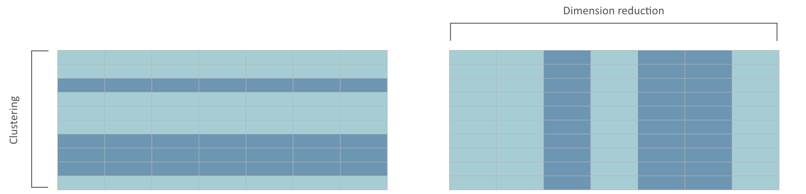
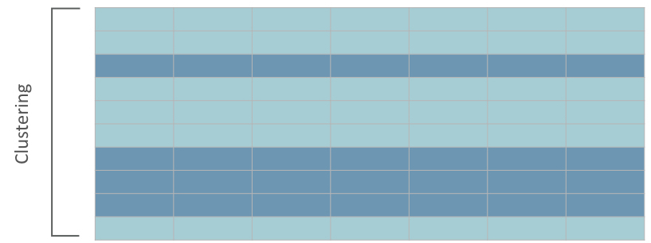
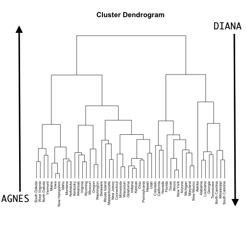
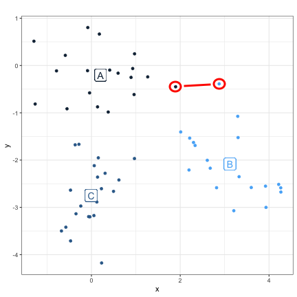
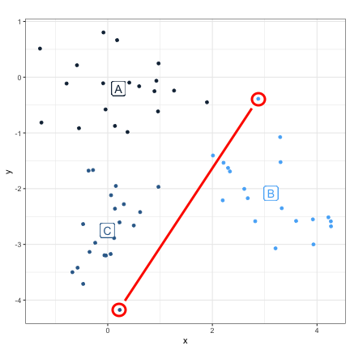
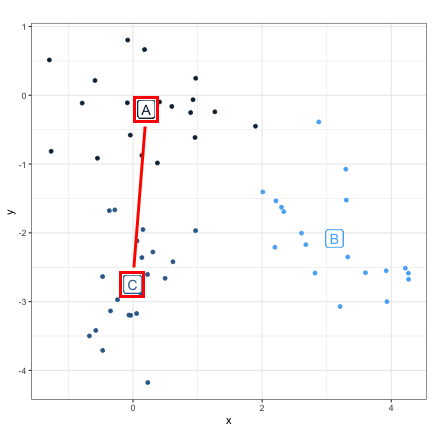
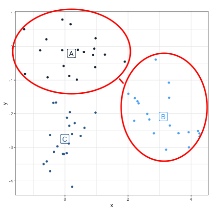
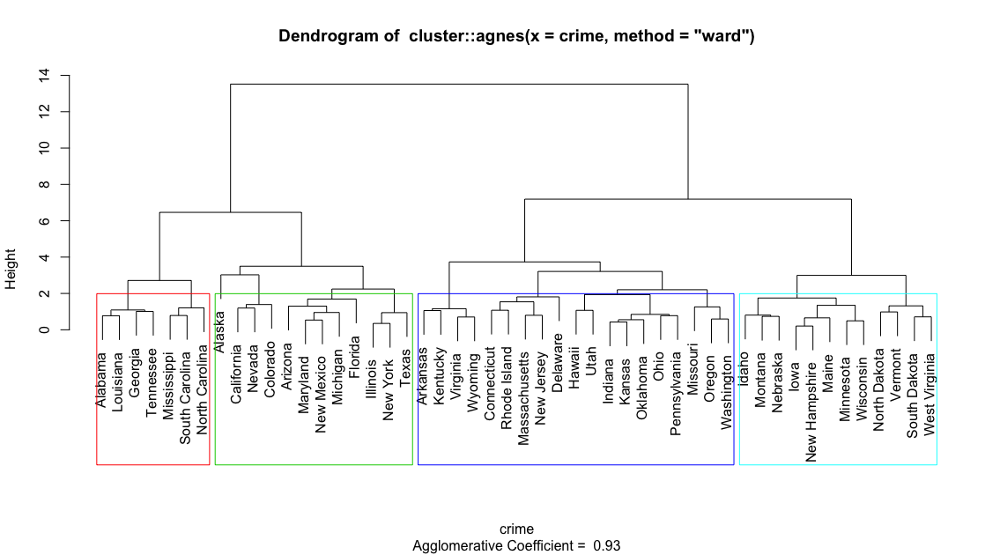
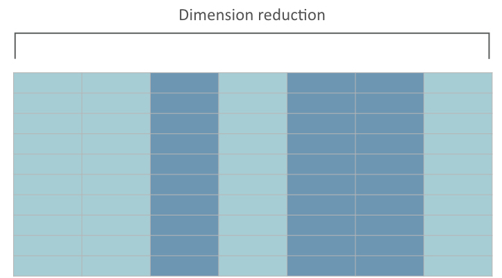

```{r setup, include=FALSE, cache=FALSE}
# Set global R options
options(htmltools.dir.version = FALSE, servr.daemon = TRUE)

# Set global knitr chunk options
knitr::opts_chunk$set(
  fig.align = "center", 
  cache = TRUE,
  error = FALSE,
  message = FALSE, 
  warning = FALSE, 
  collapse = TRUE 
)

# set ggplot to black and white theme
library(ggplot2)
theme_set(theme_bw())
```

class: clear, center, middle

background-image: url(images/unsupervised-cover.jpg)
background-position: center
background-size: contain

<br><br><br><br><br><br><br><br><br>
.font200.white[Unsupervised Learning]

---
# Concept

___Unsupervised learning___: a set of statistical tools to better understand *n* observations that contain a set of features ( $x_1, x_2, \dots, x_p$ ) without being guided by a response variable (*Y*).

In essence, unsupervised learning is concerned with identifying groups in a data set

* .bold[clustering]: reduce the observation space of a data set
* .bold[dimension reduction]:  reduce the feature space of a data set

```{r cluster-pca, echo=FALSE}

```


---
# Concept

___Unsupervised learning___: a set of statistical tools to better understand *n* observations that contain a set of features ( $x_1, x_2, \dots, x_p$ ) without being guided by a response variable (*Y*).

In essence, unsupervised learning is concerned with identifying groups in a data set

* .bold[clustering]: reduce the observation space of a data set
  - _k_-means clustering
  - hierarchical clustering
  - spectral clustering
* .bold[dimension reduction]: reduce the feature space of a data set
  - principal components analysis (PCA)
  - factor analysis
  - matrix factorization
  - autoencoders
* .bold[Generalized low rank models]: a generalization of the clustering & dimension reduction

   
---
# Concept

___Unsupervised learning___: a set of statistical tools to better understand *n* observations that contain a set of features ( $x_1, x_2, \dots, x_p$ ) without being guided by a response variable (*Y*).

In essence, unsupervised learning is concerned with identifying groups in a data set

* clustering: reduce the observation space of a data set
  - .bold.blue[_k_-means clustering]
  - .bold.blue[hierarchical clustering]
  - spectral clustering
* dimension reduction: reduce the feature space of a data set
  - .bold.blue[principal components analysis (PCA)]
  - factor analysis
  - matrix factorization
  - autoencoders
* Generalized low rank models: a generalization of the clustering & dimension reduction

<br>
.center.bold.white[.content-box-blue-dark[This module's focus]]
   
---
# Prerequisites .red[`r anicon::faa("hand-point-right", color = "red", animate = "horizontal")` code chunk 1]

.pull-left[

.center.font120[Packages]

```{r}
library(tidyverse)   # data munging & visualization
library(cluster)     # additional clustering techniques
library(factoextra)  # clustering & PCA visualizations
```

]

.pull-right[

.center.font120[Data]

```{r, eval=FALSE}
USArrests                 # primary example data
AmesHousing::make_ames()  # a few additional examples
```

]

---
class: center, middle, inverse

.font300.white[Clustering]

---
# Types of clustering

Clustering is a broad set of techniques for ___finding subgroups of observations___ within a data set.

.pull-left[

* .bold[Objective]: we want observations in the same group to be similar and observations in different groups to be dissimilar

* .bold[Use cases:]
  - customer segmentation
  - concentration of crime activity
  - common patient traits
  - voter profiles
  
]

.pull-right[

<br><br>
```{r cluster-icon, echo=FALSE}

```

]

---
# Types of clustering

Clustering is a broad set of techniques for ___finding subgroups of observations___ within a data set.

.pull-left[

* .bold[Objective]: we want observations in the same group to be similar and observations in different groups to be dissimilar

* .bold[Use cases:]
  - customer segmentation
  - concentration of crime activity
  - common patient traits
  - voter profiles
  
]

.pull-right[

* .bold[Methods]: several clustering algorithms exists:
  - k-means
  - hierarchical
  - partitioning around mediods (PAM)
  - clustering large applications (CLARA)

]

---
# Measuring observation distances

.pull-left[
* classification of observations into groups requires methods for computing the distance of the (dis)similarity between each pair of observations

* distance measures
  - Euclidean: $d_{euc}(x,y) = \sqrt{\sum^n_{i=1}(x_i - y_i)^2}$
  - Manhattan: $d_{man}(x,y) = \sum^n_{i=1}|(x_i - y_i)|$

]

.pull-right[

```{r}
(two_states <- USArrests[1:2, 1:2])

dist(two_states, method = "euclidean")
dist(two_states, method = "manhattan")
```
```{r, echo=FALSE, fig.height=3}
p1 <- ggplot(two_states, aes(Assault, Assault)) +
  geom_point() +
  geom_line(lty = "dashed") +
  ggtitle("Euclidean distance")
  

p2 <- ggplot(two_states, aes(Assault, Assault)) +
  geom_point() +
  geom_step(lty = "dashed") +
  ggtitle("Manhattan distance")

gridExtra::grid.arrange(p1, p2, nrow = 1)
```

]

---
# Measuring observation distances

.pull-left[
* classification of observations into groups requires methods for computing the distance of the (dis)similarity between each pair of observations

* distance measures
  - .opacity20[Euclidean]
  - .opacity20[Manhattan]
  - Correlation-based (i.e. Pearson, Spearman)
  
]

.pull-right[

<br>
```{r correlation-distance-example, echo=FALSE, fig.height=5}
# generate data
corr_ex <- data_frame(
  v = 1:20,
  obs_1 = sample(5:7, 20, replace = TRUE),
  obs_2 = sample(4:10, 20, replace = TRUE)
) %>%
  mutate(obs_3 = obs_2 * 2 + sample(0:1, 1))

corr_ex %>%
  gather(observation, value, obs_1:obs_3) %>%
  ggplot(aes(v, value, color = observation)) +
  geom_line() +
  scale_colour_manual(values = c("#00AFBB", "#E7B800", "#FC4E07")) +
  scale_x_continuous("Variable index")
```

]

--

<br>

.center.bold.blue.font120[.content-box-gray[There are several other distance measures but these are the most common]]

---
# Measuring observation distances

When to use certain distance measures

* Euclidean
   - most sensitive to outliers 
   - outliers can skew clusters giving false interpretation
   - use if you are relatively certain minimal outliers exists
* Manhattan
   - less sensitive to outliers 
   - use if you want to be more robust to existing outliers
* Correlation-based 
   - captures common relationships regardless of magnitude
   - use if you want to analyze unscaled data where observations may have larger differences in magnitudes but possibly similar behaviors 
   - i.e. group customers based on purchased quantities (large volume and low volume customers can be in same group if they exhibit common preferences)

<br>
.center.bold.blue[.content-box-gray[Euclidean is the most commonly used.]]

---
# *k*-means clustering


Basic idea behind k-means clustering consists of defining clusters so that the total intra-cluster variation (known as total .blue[within-cluster variation]) is .blue[minimized]

$$\underset{C_1, \dots, C_k}{\texttt{minimize}} \bigg\{ \sum^K_{k=1}(W(C_k)) \bigg \}$$


```{r generated-data, echo=FALSE, fig.height=3.5, fig.width=10}
# generate data
create_data <- function(sd) {
  data_frame(
    x1 = c(rnorm(100, sd = sd), rnorm(100, sd = sd) + 3),
    x2 = c(rnorm(100, sd = sd), rnorm(100, sd = sd) - 2)
  ) %>%
    mutate(`W(Ck)` = case_when(
      sd == .5  ~ "Best",
      sd == .75 ~ "Better",
      sd == 1   ~ "Good"
    ))
}

df <- map(c(.5, .75, 1), create_data)

# compute cluster info
k2 <- map(df, ~ kmeans(.x[, 1:2], 2, nstart = 20))

# add cluster info and plot
df <- map2(df, k2, ~ mutate(.x, cluster = .y$cluster)) %>%
  map2_dfr(k2, ~ inner_join(.x, .y$centers %>% 
                          as.data.frame() %>% 
                          mutate(cluster = row_number()), by = "cluster")
       ) %>%
  rename(x1 = x1.x, x2 = x2.x, x_center = x1.y, y_center = x2.y) %>%
  mutate(`W(Ck)` = factor(`W(Ck)`, levels = c("Good", "Better", "Best")))

df %>%
  ggplot(aes()) +
  facet_wrap(~ `W(Ck)`) + 
  geom_point(aes(x_center, y_center), size = 4) +
  geom_point(aes(x1, x2, colour = factor(cluster)), show.legend = FALSE, alpha = .5) +
  scale_x_continuous(bquote(X[1]), breaks = NULL, labels = NULL) +
  scale_y_continuous(bquote(X[2]), breaks = NULL, labels = NULL) +
  theme(legend.position="none")
```

.bold.red.center[Tighter clusters = more well defined clusters]

---
# *k*-means clustering


Basic idea behind k-means clustering consists of defining clusters so that the total intra-cluster variation (known as total .blue[within-cluster variation]) is .blue[minimized]

$$\underset{C_1, \dots, C_k}{\texttt{minimize}} \bigg\{ \sum^K_{k=1} (\texttt{Mean Euclidean Distance}_k )\bigg \}$$

```{r, echo=FALSE, fig.height=3.5, fig.width=10}
df %>%
  ggplot(aes(colour = factor(cluster))) +
  facet_wrap(~ `W(Ck)`) +
  geom_segment(aes(x = x1, xend = x_center, y = x2, yend = y_center), lty = "dashed", alpha = .5) +
  geom_point(aes(x_center, y_center), size = 4) +
  geom_point(aes(x1, x2), show.legend = FALSE, alpha = .5) +
  scale_x_continuous(bquote(X[1]), breaks = NULL, labels = NULL) +
  scale_y_continuous(bquote(X[2]), breaks = NULL, labels = NULL) +
  theme(legend.position="none")
```

.bold.red.center[We measure within-cluster variation using our distance measure of choice (i.e. Euclidean, Manhattan)]

---
# *k*-means algorithm

.pull-left[
* Unfortunately we cannot evaluate every possible cluster combination because there are almost $K^n$ ways to partition _n_ observations into _K_ clusters
* Estimate _greedy local optimum_ ([`r anicon::aia("google-scholar", animate = 'tada', anitype="hover")`](https://www.jstor.org/stable/pdf/2346830.pdf?casa_token=DyTW0ZLNC4gAAAAA:VNX2TGwDfcs5foMa96ZxnOM2mjaQU1WuCOLL8qF6iDBWp6ClU8-i2-OSXKbtO1uHm6_1oda_2egpvgYCvaix8UxUqUryqZj-Pw3G4m771Ev5-4kL46Y))
   1. .red[randomly] assign each observation to an initial cluster
   2. iterate until the cluster assignments stop changing  
     a. compute cluster centroids  
     b. reassign each observation to the cluster whose centroid is closest  
* Do to randomization
   - we can get slightly different results each try
   - use several random starts (rule of `r anicon::cia("https://emojis.slackmojis.com/emojis/images/1511903783/3230/wiggle_thumbs_up.gif?1511903783", animate = "slow")`: 20)
   - algorithm uses iteration with lowest $W(C_k)$

]

.pull-right[
```{r, echo=FALSE, fig.height=6}
df <- data_frame(
    x1 = c(rnorm(100), rnorm(100) + 3),
    x2 = c(rnorm(100), rnorm(100) - 2)
)

map(1:6, ~ kmeans(df, 3)) %>%
  map2_dfr(1:6, ~ df %>% mutate(
    cluster = .x$cluster,
    name = paste0("Iteration: ",.y, ";  W(Ck): ", round(.x$tot.withinss, 2))
    )) %>%
  ggplot(aes(x1, x2, colour = cluster)) +
  geom_point(show.legend = FALSE) +
  facet_wrap(~ name, nrow = 2)
```
]

---
# Prepare our data for _k_-means .red[`r anicon::faa("hand-point-right", color = "red", animate = "horizontal")` code chunk 2]

.pull-left[

1. Rows are observations (individuals) and columns are variables.

2. Any missing value in the data must be removed or estimated.

3. The data must be standardized (centered at mean zero and scaled to one standard deviation) to make variables comparable. $^a$

<br><br><br><br><br>
$^a$ .font60[In some rare cases you may want to leave data unstandardized.]

]

.pull-right[

```{r}
crime <- USArrests %>%
  drop_na() %>%
  scale() %>%
  print()
```

]


---
# Applying _k_-means .red[`r anicon::faa("hand-point-right", color = "red", animate = "horizontal")` code chunk 3]

.scrollable90[
.pull-left[

1. .opacity20[Rows are observations (individuals) and columns are variables.]

2. .opacity20[Any missing value in the data must be removed or estimated.]

3. .opacity20[The data must be standardized (centered at mean zero and scaled to one standard deviation) to make variables comparable.]

4. Apply `kmeans()`
]

.pull-right[

```{r}
k3 <- kmeans(crime, centers = 3, nstart = 20)

# tidied output
broom::tidy(k3)

# full model output
glimpse(k3)
```

]
]

---
# Interpreting output .red[`r anicon::faa("hand-point-right", color = "red", animate = "horizontal")` code chunk 4]

```{r, fig.width=15, fig.height=4.25}
as_tibble(crime) %>%
  mutate(
    cluster = k3$cluster, 
    label = paste0(row.names(USArrests), " (", cluster, ")")
    ) %>% 
  gather(Crime, Rate, Murder, Assault, Rape) %>%
  ggplot(aes(UrbanPop, Rate, color = factor(cluster), label = label)) +
  geom_text(show.legend = FALSE) +
  facet_wrap(~ Crime) +
  ylab("arrests per 100,000 residents (standardized)")
```

---
class: yourturn
# How many clusters `r anicon::cia("https://emojis.slackmojis.com/emojis/images/1542340471/4979/thinking.gif?1542340471", animate = FALSE, size = 1.25)`

.font150.center[But how do we know we specified the right value for _k_?]

```{r, echo=FALSE, out.height="95%", out.width="95%"}
knitr::include_graphics("https://media.giphy.com/media/xT5LMXWSmQ5xjWyTpC/giphy.gif")
```


---
class: yourturn
# How many clusters `r anicon::cia("https://emojis.slackmojis.com/emojis/images/1542340471/4979/thinking.gif?1542340471", animate = FALSE, size = 1.25)`

.font150.center[But how do we know we specified the right value for _k_?]

```{r, echo=FALSE, fig.height=5.5, fig.width=12}
df <- data_frame(
    x1 = c(rnorm(100), rnorm(100) + 3),
    x2 = c(rnorm(100), rnorm(100) - 2)
)

map2(1:6, 2:7, ~ kmeans(df, .y)) %>%
  map2_dfr(2:7, ~ df %>% mutate(
    cluster = .x$cluster,
    name = paste0("Clusters: ",.y, ";  W(Ck): ", round(.x$tot.withinss, 2))
    )) %>%
  ggplot(aes(x1, x2, colour = factor(cluster))) +
  geom_point(show.legend = FALSE) +
  facet_wrap(~ name, nrow = 2)
```

.center.bold[.content-box-gray[What do you notice?]]

---
# Determining optimal clusters

Choice for the number of _K_ clusters depends on the goal:


- .bold.font120[Deterministic resource allocation]: a company may employ *k* sales people, and the goal is to partition customers into one of the _k_ segments. (_k_ is predetermined: `r anicon::cia("https://emojis.slackmojis.com/emojis/images/1471045870/910/rock.gif?1471045870", animate = FALSE)`)


- .bold.font120[Descriptive understanding]: *k* is unknown and the goal is to ascertain what natural distinct groupings exist in the data (you need to determine _k_: `r anicon::cia("https://emojis.slackmojis.com/emojis/images/1471045885/967/wtf.gif?1471045885", animate = FALSE, size = 1.5)`)

--

.pull-left[

- Elbow heuristic:
  - monotonic decreasing
  - Most common approach (looks for the kink in the $W(C_k)$)


]

.pull-right[

```{r, fig.height=3}
fviz_nbclust(df, kmeans, method = "wss", k.max = 20)
```

]

---
# Determining optimal clusters

Choice for the number of _K_ clusters depends on the goal:


- .bold.font120[Deterministic resource allocation]: a company may employ *k* sales people, and the goal is to partition customers into one of the _k_ segments. (_k_ is predetermined: `r anicon::cia("https://emojis.slackmojis.com/emojis/images/1471045870/910/rock.gif?1471045870", animate = FALSE)`)


- .bold.font120[Descriptive understanding]: *k* is unknown and the goal is to ascertain what natural distinct groupings exist in the data (you need to determine _k_: `r anicon::cia("https://emojis.slackmojis.com/emojis/images/1471045885/967/wtf.gif?1471045885", animate = FALSE, size = 1.5)`)

.pull-left[

- Elbow heuristic:
  - monotonic decreasing
  - Most common approach (looks for the kink in the $W(C_k)$)
- Gap stat ([`r anicon::aia("google-scholar", animate = 'tada', anitype="hover")`](http://web.stanford.edu/~hastie/Papers/gap.pdf)):
  - compares $\texttt{log}(W(C_k))$ with with their expected values under null reference distribution of the data
  - automated way to id "kink"
  - can ID when optimal _k_ is one

]

.pull-right[

```{r, fig.height=4, echo=FALSE}
set.seed(123)
gap_stat <- cluster::clusGap(df, FUN = kmeans, nstart = 20, K.max = 20, B = 50, verbose = FALSE)
biggest <- which.max(gap_stat$Tab[, "gap"])

as.data.frame(gap_stat$Tab[, c("logW", "E.logW")]) %>%
  mutate(clusters = 1:20) %>%
  gather(Stat, value, -clusters) %>%
  ggplot(aes(clusters, value, color = Stat)) +
    geom_rect(aes(xmin = 1.75, xmax = 2.25, 
                  ymin = gap_stat$Tab[, "logW"][biggest]-.1, ymax = gap_stat$Tab[, "E.logW"][biggest]+.1), 
              fill = "gray90",
              colour = "gray90",
              alpha = .25,
              size = .25) +
    geom_point() +
    geom_line() +
    scale_x_continuous(breaks = 1:20) +
  theme(
    legend.position = c(0.9, 0.85),
    legend.background=element_blank()
    )
```

]

---
# Determining optimal clusters

Choice for the number of _K_ clusters depends on the goal:


- .bold.font120[Deterministic resource allocation]: a company may employ *k* sales people, and the goal is to partition customers into one of the _k_ segments. (_k_ is predetermined: `r anicon::cia("https://emojis.slackmojis.com/emojis/images/1471045870/910/rock.gif?1471045870", animate = FALSE)`)


- .bold.font120[Descriptive understanding]: *k* is unknown and the goal is to ascertain what natural distinct groupings exist in the data (you need to determine _k_: `r anicon::cia("https://emojis.slackmojis.com/emojis/images/1471045885/967/wtf.gif?1471045885", animate = FALSE, size = 1.5)`)

.pull-left[

- Elbow heuristic:
  - monotonic decreasing
  - Most common approach (looks for the kink in the $W(C_k)$)
- Gap stat ([`r anicon::aia("google-scholar", animate = 'tada', anitype="hover")`](http://web.stanford.edu/~hastie/Papers/gap.pdf)):
  - compares $\texttt{log}(W(C_k))$ with with their expected values under null reference distribution of the data
  - automated way to id "kink"
  - can ID when optimal _k_ is one

]

.pull-right[

```{r, fig.height=3}
fviz_nbclust(df, kmeans, method = "gap_stat", k.max = 20, verbose = FALSE)
```

]

---
class: yourturn
# Determine optimal clusters .red[`r anicon::faa("hand-point-right", color = "red", animate = "horizontal")` code chunks 5 & 6]

.pull-left[

Fill in code chunks 5 & 6 to identify the optimal number of clusters for our crime data.

```
# use the elbow heuristic (hint: "wss")
fviz_nbclust(____, kmeans, method = "___", k.max = 20)
```

```
# use the gab stat (hint: "gap_stat")
fviz_nbclust(____, kmeans, method = "___", k.max = 20)
```

]

--

.pull-right[

```{r fig.height=6}
p1 <- fviz_nbclust(crime, kmeans, method = "wss", k.max = 20)
p2 <- fviz_nbclust(crime, kmeans, method = "gap_stat", k.max = 20, verbose = FALSE)
gridExtra::grid.arrange(p1, p2)
```

]

---
# Hierarchical clustering

.pull-left[

- .bold.font120[_k_-means]
   - Requires _k_ to be predetermined
   - clusters are not nested
   
- .bold.font120[Hierarchical]
   - Do not require _k_ to be predetermined
   - clusters can be nested
   - user must specify measure of _dissimilarity between groups_
   - results in a .bold[dendrogram]
]

.pull-right[

```{r dendrogram, echo=FALSE}
# Dissimilarity matrix
d <- dist(crime, method = "euclidean")

# Hierarchical clustering using Complete Linkage
hc1 <- hclust(d, method = "complete" )

# Plot the obtained dendrogram
plot(hc1, cex = 0.6, hang = -1, xlab = "", sub = "")
```

]

---
# Hierarchical strategies

.pull-left[

- .bold.font120[_k_-means]
   - Requires _k_ to be predetermined
   - clusters are not nested
   
- .bold.font120[Hierarchical]
   - Do not require _k_ to be predetermined
   - clusters can be nested
   - user must specify measure of _dissimilarity between groups_
   - results in a .bold[dendrogram]
   - two main strategies
     1. Agglomerative nesting (AGNES): bottom up
     2. Divisive analysis (DIANA): top down
]

.pull-right[

```{r dendrogram2, echo=FALSE, out.width="95%"}


```

]

---
# Group clustering strategies

.pull-left[

- .bold[AGNES]
   - start with individual observation clusters
   - merge closest two clusters based on:
      - Single linkage
      - Complete linkage
      - Group average linkage
      - Centroid linkage
      - Ward's linkage
   - repeat until all clusters have been merged
- .bold[DIANA]
   - start with all obs in one cluster
   - iteratively divide one cluster into two daughter clusters
   - uses a dissimiliarity matrix (see [Kaufman & Rousseeuw, 1990](https://www.amazon.com/Finding-Groups-Data-Introduction-Analysis/dp/0471735787/ref=sr_1_1?ie=UTF8&qid=1548179235&sr=8-1&keywords=Finding+Groups+in+Data%3A+An+Introduction+to+Cluster+Analysis))
   - .blue[Pro tip:] used if focused on relatively small number of clusters

]

.pull-right[

```{r, echo=FALSE, fig.height=6, fig.width=6}
df1 <- data_frame(
    group = "A",
    x = rnorm(20, sd = .75),
    y = rnorm(20, sd = .75)
)

df2 <- data_frame(
    group = "B",
    x = rnorm(20, sd = .75) + 3,
    y = rnorm(20, sd = .75) - 2
)

df3 <- data_frame(
    group = "C",
    x = rnorm(20, sd = .75),
    y = rnorm(20, sd = .75) -3
)

df <- df1 %>%
  rbind(df2) %>%
  rbind(df3)

k3 <- kmeans(df[, c("x", "y")], 3, nstart = 20)
centers <- as.data.frame(k3$centers) %>% 
  mutate(cluster = row_number()) %>% 
  rename(x_center = "x", y_center = "y")

df <- df %>%
  mutate(cluster = k3$cluster) %>%
  inner_join(centers, by = "cluster")

ggplot(df, aes(x, y, colour = cluster)) +
  geom_point(show.legend = FALSE) +
  geom_label(aes(x_center, y_center, label = group), size = 5, show.legend = FALSE) +
  ggtitle("")
  
```

]

---
# Group clustering strategies

.pull-left[

- AGNES
   - start with individual observation clusters
   - merge closest two clusters based on:
     - __Single linkage__
     - Complete linkage
     - Group average linkage
     - Centroid linkage
     - Ward's linkage
   - repeat until all clusters have been merged
- DIANA
   - start with all obs in one cluster
   - iteratively divide one cluster into two daughter clusters
   - uses a dissimiliarity matrix (see Kaufman & Rousseeuw, 1990)
   - Pro tip: used if focused on relatively small number of clusters

]

.pull-right[

```{r, echo=FALSE, out.height="82%", out.width="82%"}

```

.center.bold.red[Merge clusters where the closest two observations have the smallest distance]

]

---
# Group clustering strategies

.pull-left[

- AGNES
   - start with individual observation clusters
   - merge closest two clusters based on:
     - Single linkage
     - __Complete linkage__
     - Group average linkage
     - Centroid linkage
     - Ward's linkage
   - repeat until all clusters have been merged
- DIANA
   - start with all obs in one cluster
   - iteratively divide one cluster into two daughter clusters
   - uses a dissimiliarity matrix (see Kaufman & Rousseeuw, 1990)
   - Pro tip: used if focused on relatively small number of clusters

]

.pull-right[

```{r, echo=FALSE, out.height="82%", out.width="82%"}

```

.center.bold.red[Merge clusters where the most distant two observations have the smallest distance]

]

---
# Group clustering strategies

.pull-left[

- AGNES
   - start with individual observation clusters
   - merge closest two clusters based on:
     - Single linkage
     - Complete linkage
     - __Group average linkage__
     - Centroid linkage
     - Ward's linkage
   - repeat until all clusters have been merged
- DIANA
   - start with all obs in one cluster
   - iteratively divide one cluster into two daughter clusters
   - uses a dissimiliarity matrix (see Kaufman & Rousseeuw, 1990)
   - Pro tip: used if focused on relatively small number of clusters

]

.pull-right[

```{r, echo=FALSE, out.height="82%", out.width="82%"}
knitr::include_graphics("images/group-average-linkage.png")
```

.center.bold.red[Merge clusters where the average distance between all observations are smallest]

]

---
# Group clustering strategies

.pull-left[

- AGNES
   - start with individual observation clusters
   - merge closest two clusters based on:
     - Single linkage
     - Complete linkage
     - Group average linkage
     - __Centroid linkage__
     - Ward's linkage
   - repeat until all clusters have been merged
- DIANA
   - start with all obs in one cluster
   - iteratively divide one cluster into two daughter clusters
   - uses a dissimiliarity matrix (see Kaufman & Rousseeuw, 1990)
   - Pro tip: used if focused on relatively small number of clusters

]

.pull-right[

```{r, echo=FALSE, out.height="82%", out.width="82%"}

```

.center.bold.red[Merge clusters with the smallest distance between their centroids]

]

---
# Group clustering strategies

.pull-left[

- AGNES
   - start with individual observation clusters
   - merge closest two clusters based on:
     - Single linkage
     - Complete linkage
     - Group average linkage
     - Centroid linkage
     - __Ward's linkage__
   - repeat until all clusters have been merged
- DIANA
   - start with all obs in one cluster
   - iteratively divide one cluster into two daughter clusters
   - uses a dissimiliarity matrix (see Kaufman & Rousseeuw, 1990)
   - Pro tip: used if focused on relatively small number of clusters

]

.pull-right[

```{r, echo=FALSE, out.height="82%", out.width="82%"}

```

.center.bold.red[Merge clusters with the smallest between cluster variation]

]

---
# Comparing AGNES clustering

.pull-left[

- AGNES
   - start with individual observation clusters
   - merge closest two clusters based on:
     - Single linkage: produces many "loose" clusters
     - Complete linkage: produces "compact" clusters
     - Centroid linkage: depends on variability
     - Group average linkage: balances clusters 
     - Ward's linkage: balances clusters
   - repeat until all clusters have been merged

<br>

.center.bold.red[I tend to look for the method that produces more compact clusters]

]

.pull-right[
```{r, echo=FALSE}
d <- dist(crime)

par(mfrow = c(2, 3))

# multiple plots
hclust(d, method = "single") %>% 
  plot(main = "Single Linkage", cex = 0.6, hang = -1, xlab = "", sub = "", labels = FALSE)

hclust(d, method = "complete") %>% 
  plot(main = "Complete Linkage", cex = 0.6, hang = -1, xlab = "", sub = "", labels = FALSE)

hclust(d, method = "centroid") %>% 
  plot(main = "Centroid Linkage", cex = 0.6, hang = -1, xlab = "", sub = "", labels = FALSE)

hclust(d, method = "average") %>% 
  plot(main = "Average Linkage", cex = 0.6, hang = -1, xlab = "", sub = "", labels = FALSE)

hclust(d, method = "ward.D") %>% 
  plot(main = "Ward's Linkage", cex = 0.6, hang = -1, xlab = "", sub = "", labels = FALSE)
```
]

---
# Applying hierarchical clustering .red[`r anicon::faa("hand-point-right", color = "red", animate = "horizontal")` code chunks 7 & 8]

.pull-left[

```{r}
# you can use hclust
option1 <- hclust(dist(crime), method = "average")
plot(option1)
```

]

.pull-left[

```{r}
# or agnes
option2 <- cluster::agnes(crime, method = "average")
plot(option2, which = 2)
```

]

---
# Interpreting the dendrogram

- vertical axis represents distance at fusion
- 9 & 2 appear close on dendrogram but, in fact, their closeness on the dendrogram imply they are approximately the same distance from obs (5, 7, & 8)

.pull-left[
```{r, echo=FALSE, out.height="80%", out.width="80%"}
df <- data.frame(
  x1 = c(-1.5, -1.3, -.9, -.6, .1, .1, .6, 1.2, 1.4),
  x2 = c(-.4, -1.5, -1.2, -1, -1.1, .6, -.2, -.5, -.3),
  label = c(3, 4, 6, 1, 2, 9, 8, 5, 7)
)

ggplot(df, aes(x1, x2, label = label)) +
  geom_label()
```
]

.pull-right[

```{r, echo=FALSE, out.height="90%", out.width="90%"}
df <- data.frame(
  x1 = c(-1.5, -1.3, -.9, -.6, .1, .1, .6, 1.2, 1.4),
  x2 = c(-.4, -1.5, -1.2, -1, -1.1, .6, -.2, -.5, -.3),
  row.names = c(3, 4, 6, 1, 2, 9, 8, 5, 7)
)

hclust(dist(df)) %>% plot()
```

]

---
# Which method to use? .red[`r anicon::faa("hand-point-right", color = "red", animate = "horizontal")` code chunk 9]


The `agnes()` function provides an ___agglomerative coefficent___, which measures the amount of clustering structure found (values closer to 1 suggest strong clustering structure).

.code70[
```{r}
# agglomerative coefficent from earlier agnes() model
option2$ac
```
]

--

This allows us to find certain hierarchical clustering methods that can identify stronger clustering structures.

.code70[
```{r}
# methods to assess
m <- c("average", "single", "complete", "ward")
names(m) <- m

# function to compute coefficient
ac <- function(x) {
  cluster::agnes(crime, method = x)$ac
}

# get agglomerative coefficient for each linkage method
map_dbl(m, ac)
```
]

---
# Which clusters to use? .red[`r anicon::faa("hand-point-right", color = "red", animate = "horizontal")` code chunks 10 & 11]

.pull-left[

.center.bold[Visual assessment]

```{r, eval=FALSE}
# re-run hc with Ward method
hc_ward <- cluster::agnes(crime, method = "ward")

# highlight 4 clusters
plot(hc_ward, which = 2)
rect.hclust(hc_ward, k = 4, border = 2:5)
```

```{r, echo=FALSE}
hc_ward <- cluster::agnes(crime, method = "ward")

```


]

.pull-right[

.center.bold[Elbow method or Gap stat]

```{r, fig.height=5}
# fviz_nbclust can use differen FUNctions
# see ?fviz_nbclust & ?hcut
fviz_nbclust(crime, FUN = hcut, method = "gap_stat", verbose = FALSE)
```

]

---
# Extract results and visualize .red[`r anicon::faa("hand-point-right", color = "red", animate = "horizontal")` code chunk 12]

```{r, fig.width=15, fig.height=4.25}
as_tibble(crime) %>%
  mutate(
    cluster = cutree(hc_ward, k = 3), # use cutree to get clusters #<<
    label = paste0(row.names(USArrests), " (", cluster, ")")
    ) %>% 
  gather(Crime, Rate, Murder, Assault, Rape) %>%
  ggplot(aes(UrbanPop, Rate, color = factor(cluster), label = label)) +
  geom_text(show.legend = FALSE) +
  facet_wrap(~ Crime) +
  ylab("arrests per 100,000 residents (standardized)")
```

---
# Ohio's cluster .red[`r anicon::faa("hand-point-right", color = "red", animate = "horizontal")` code chunks 13]

```{r, echo=FALSE}
# get ohio neighbors with k-means
df_kmeans <- as_tibble(crime) %>%
  mutate(
    cluster = kmeans(crime, 3, nstart = 20)$cluster, # use cutree to get clusters #<<
    label = paste0(row.names(USArrests))
    )

ohio_cluster <- filter(df_kmeans, label == "Ohio") %>% pull(cluster)

kmean_friends <- df_kmeans %>%
  filter(cluster == ohio_cluster) %>%
  arrange() %>%
  pull(label)

# get ohio neighbors with hierarchical
df_hc <- as_tibble(crime) %>%
  mutate(
    cluster = cutree(hc_ward, k = 3), # use cutree to get clusters #<<
    label = paste0(row.names(USArrests))
    )

ohio_cluster <- filter(df_hc, label == "Ohio") %>% pull(cluster)

hcut_friends <- df_hc %>%
  filter(cluster == ohio_cluster) %>%
  arrange() %>%
  pull(label)
```

.bold[Common states between _k_-means and Hierarchical clustering]

```{r, echo=FALSE}
# same
intersect(hcut_friends, kmean_friends)
```

.bold[Different states between _k_-means and Hierarchical clustering]

```{r, echo=FALSE}
# differences
setdiff(union(hcut_friends, kmean_friends), intersect(hcut_friends, kmean_friends))
```

---
# Final Thoughts 

.pull-left[

.center.bold[What to remember]

- We measure differences between obs with
   - Euclidean distance
   - Manhattan distance
   - Correlation-based distances
- Data prep
   - clean & standardize data
- _k_-means
   - minimizes within cluster variance
   - find optimal clusters w/elbow & Gap stat
- Hierarchical
   - AGNES vs DIANA
   - Many ways to merge clusters
   - Use method that produces compact clusters
]

.pull-right[

.center.bold[What to learn]

- Many more methods exist
   - `daisy()`: compute distance measures for mixed data
   - `pam()`: medoid clustering
   - `clara()`: big data clustering
   - `diana()`: Devisive hierarchical clustering
- Great resources
   - [Introduction to Statistical Learning](http://www-bcf.usc.edu/~gareth/ISL/)
   - [Elements of Statistical Learning](https://web.stanford.edu/~hastie/ElemStatLearn/)
   - [Practical Guide to Cluster Analysis in R](https://www.amazon.com/Practical-Guide-Cluster-Analysis-Unsupervised/dp/1542462703)
   - [Finding Groups in Data](https://www.amazon.com/Finding-Groups-Data-Introduction-Analysis/dp/0471735787)

]

---
class: center, middle, inverse

# Dimension Reduction via PCA

---
# Motivation

PCA ___reduces the dimensionality of a feature set___.

.pull-left[

* .bold[Objective]:  explain the variability of our feature set using fewer variables than the original data set.

* .bold[Use cases:]
  - descriptive: explaining common feature attributes
     - customer profiling
     - student profiling
     - recidivism profiling
     - &lowbar;&lowbar;&lowbar;&lowbar;&lowbar;&lowbar;&lowbar;&lowbar;&lowbar; profiling
  - predictive: feature engineering for downstream modeling
     - reducing noise
     - minimizing multicollinearity
  
]

.pull-right[

<br>
```{r pca-icon, echo=FALSE}

```

]

---
# Motivation

PCA ___reduces the dimensionality of a feature set___.

.pull-left[

* .opacity20[Objective:  explain the variability of our feature set using fewer variables than the original data set.]

* .opacity20[Use cases:]
  - descriptive: explaining common feature attributes
     - customer profiling
     - student profiling
     - recidivism profiling
     - &lowbar;&lowbar;&lowbar;&lowbar;&lowbar;&lowbar;&lowbar;&lowbar;&lowbar; profiling
  - .opacity20[predictive: feature engineering for downstream modeling]
  
]

.pull-right[

```{r example-pca, echo=FALSE, fig.height=6}
pca_result <- prcomp(crime)
pca_result$rotation <- -pca_result$rotation
pca_result$x <- -pca_result$x
fviz_pca(pca_result, alpha.ind = .5, labelsize = 3, repel = TRUE)
```

]

---
# Motivation

PCA ___reduces the dimensionality of a feature set___.

.pull-left[

* .opacity20[Objective:  explain the variability of our feature set using fewer variables than the original data set.]

* .opacity20[Use cases:]
  - .opacity20[descriptive: explaining common feature attributes]
     <br><br><br><br><br>
  - predictive: feature engineering for downstream modeling
     - reducing noise
     - minimizing multicollinearity
  
]

.pull-right[


```{r example-pca2, echo=FALSE, fig.height=5}
ames <- AmesHousing::make_ames()
p1 <- lm(Sale_Price ~ ., data = ames) %>%
  summary() %>%
  broom::tidy() %>%
  filter(term %in% c("Garage_Area", "Garage_Cars")) %>%
  select(term, estimate) %>%
  mutate(model = "Both variables in model")


p2 <- lm(Sale_Price ~ Garage_Area, data = ames) %>%
  summary() %>%
  broom::tidy() %>%
  filter(term == "Garage_Area") %>%
  select(term, estimate) %>%
  mutate(model = "Just Garage_Area")

p3 <- lm(Sale_Price ~ Garage_Cars, data = ames) %>%
  summary() %>%
  broom::tidy() %>%
  filter(term == "Garage_Cars") %>%
  select(term, estimate) %>%
  mutate(model = "Just Garage_Cars")

do.call(rbind, list(p1, p2, p3)) %>%
  ggplot(aes(term, estimate)) +
  facet_wrap(~ model) +
  geom_col() +
  scale_y_log10("Coefficient estimate", labels = scales::comma) +
  xlab("Predictor variable") +
  ggtitle("OLS regression models with two highly correlated variables (r = 0.89)")
  
```

]

---
# Finding principal components

.pull-left[

The *first principal component* of a data set $X_1$, $X_2$, ..., $X_p$ is the linear combination of the features

$$Z_{1} = \phi_{11}X_{1} + \phi_{21}X_{2} + ... + \phi_{p1}X_{p}$$

that has the largest variance. We refer to $\phi_{11}, \dots, \phi_{n1}$ as the _loadings_ of the first principal component.

We can find the second principal component $Z_2$ by identifying the linear combination of $X_1,\dots , X_p$ that has maximal variance out of all linear combinations that are __*uncorrelated*__ with $Z_1$.

]

--

.pull-right[

```{r pca-confused, echo=FALSE}
knitr::include_graphics("https://gifimage.net/wp-content/uploads/2017/10/how-do-you-say-gif-9.gif")
```

.center.bold.red[Do you prefer pictures?]

]

---
# Finding principal components

.pull-left[

The *first principal component* of a data set $X_1$, $X_2$, ..., $X_p$ is the linear combination of the features

$$Z_{1} = \phi_{11}X_{1} + \phi_{21}X_{2} + ... + \phi_{p1}X_{p}$$

that has the largest variance. We refer to $\phi_{11}, \dots, \phi_{n1}$ as the _loadings_ of the first principal component.

We can find the second principal component $Z_2$ by identifying the linear combination of $X_1,\dots , X_p$ that has maximal variance out of all linear combinations that are __*uncorrelated*__ with $Z_1$.

]

.pull-right[

```{r create-pca-image, echo=FALSE, fig.width=6, fig.height=5}
df <- ames %>%
  select(var1 = First_Flr_SF, var2 = Gr_Liv_Area) %>%
  filter(var1 != var2) %>%
  mutate_all(log) %>%
  scale() %>% 
  data.frame() %>%
  filter(var1 < 4)

ggplot(df, aes(var1, var2)) +
  geom_jitter(alpha = .25, color = "dodgerblue") +
  geom_segment(
    aes(x = 0, xend = 1.5 , y = 0, yend = 1.5),
    arrow = arrow(length = unit(0.3,"cm")), size = 1.25, color = "black"
    ) +
  annotate("text", x = .5, y = .2, label = "First principal component", size = 5, hjust = 0) +
  annotate("text", x = -3.5, y = .8, label = "Second principal component", size = 5, hjust = 0) +
  geom_segment(
    aes(x = 0, xend = -0.25 , y = 0, yend = .5),
    arrow = arrow(length = unit(0.3,"cm")), size = 1.25, color = "black"
    ) +
  xlab(bquote(X[1])) +
  ylab(bquote(X[2])) +
  theme_bw()
```

]

---
# Finding principal components

.pull-left[

The *first principal component* of a data set $X_1$, $X_2$, ..., $X_p$ is the linear combination of the features

$$Z_{1} = \phi_{11}X_{1} + \phi_{21}X_{2} + ... + \phi_{p1}X_{p}$$

that has the largest variance. We refer to $\phi_{11}, \dots, \phi_{n1}$ as the _loadings_ of the first principal component.

We can find the second principal component $Z_2$ by identifying the linear combination of $X_1,\dots , X_p$ that has maximal variance out of all linear combinations that are __*uncorrelated*__ with $Z_1$.

]

.pull-right[

```{r create-3D-pca-image, echo=FALSE, eval=FALSE}
df <- ames %>%
  select(var1 = First_Flr_SF, var2 = Gr_Liv_Area, var3 = TotRms_AbvGrd) %>%
  filter(var1 != var2) %>%
  mutate_at(vars(var1, var2), log)

library(pca3d)
pca <- prcomp(df, scale = FALSE)
pca3d(pca)
#snapshotPCA3d(file="3D-PCA.png")
```

```{r pca-3d-plot, echo=FALSE}
knitr::include_graphics("images/3D-PCA.png")
```

<br>

.right.font50[Made with pca3d package]

]

---
# Prepare our data for PCA

.pull-left[
1. Rows are observations (individuals) and columns are variables.

2. Any missing value in the data must be removed or estimated.

3. The data must be standardized (centered at mean zero and scaled to one standard deviation) to make variables comparable.
]

.pull-right[

```{r, eval=FALSE}
# exact same procedure you ran for clustering
crime <- USArrests %>%
  drop_na() %>%
  scale() %>%
  print()
```

]

---
# Applying PCA .red[`r anicon::faa("hand-point-right", color = "red", animate = "horizontal")` code chunk 14]

.pull-left[
1. .opacity20[Rows are observations (individuals) and columns are variables.]

2. .opacity20[Any missing value in the data must be removed or estimated.]

3. .opacity20[The data must be standardized (centered at mean zero and scaled to one standard deviation) to make variables comparable.]

4. Apply `prcomp()`
]

.pull-right[

```{r pca-apply}
# perform PCA
pca_result <- prcomp(crime, scale = FALSE)

# PCA model output
names(pca_result)
```

.font120[`rotation`] provides the principal component loadings ( $\phi_{ij}$ )

]

---
# Understanding PCs .red[`r anicon::faa("hand-point-right", color = "red", animate = "horizontal")` code chunk 15]

.pull-left[

* .font110[`rotation`] provides the principal component loadings ( $\phi_{ij}$ )

* There will be the same number of PCs as variables

* Positive vs negative direction:
   - By default, loadings (aka eigenvectors) in R point in the negative direction. 
   - Positive pointing eigenvectors are more intuitive 
   - To use the positive-pointing vector, we multiply the default loadings by -1.

]

.pull-right[

```{r pca-convert-loadings}
# convert loadings to positive
pca_result$rotation <- -pca_result$rotation

# there will be the same number of PCs as variables
pca_result$rotation
```

]

<br>

.center.bold[__Loadings represent coefficients; illustrates each variables influence on the principal component__]

---
# Understanding PCs .red[`r anicon::faa("hand-point-right", color = "red", animate = "horizontal")` code chunk 16]

We can visualize these contributions

.pull-left[

```{r pca-pc1-contributions, fig.height=4}
fviz_contrib(pca_result, choice = "var", axes = 1)
```

.center[PC1 appears to represent violent crime]

]

.pull-right[

```{r pca-pc2-contributions, fig.height=4}
fviz_contrib(pca_result, choice = "var", axes = 2)
```

.center[PC2 appears to represent urban density]

]

---
# Understanding PCs .red[`r anicon::faa("hand-point-right", color = "red", animate = "horizontal")` code chunk 17]

.pull-left[

* .font110[`x`] provides the principal component scores

* The principal components scores simply places a standardized score for each observation for each principal component.

* Interpretation example: Alaska
   - PC1: 1.93 standard deviations above average value for PC1 (high violent crime)
   - PC2: 1 standard deviation below average value for PC2 (low urbanization)

]

.pull-right[

```{r, echo=FALSE}
pca_result$x <- -pca_result$x
```


```{r pca-scores, eval=FALSE}
# convert scores to positive
pca_result$x <- -pca_result$x
pca_result$x
##                        PC1         PC2         PC3          PC4
## Alabama         0.97566045 -1.12200121  0.43980366 -0.154696581
## Alaska          1.93053788 -1.06242692 -2.01950027  0.434175454 #<<
## Arizona         1.74544285  0.73845954 -0.05423025  0.826264240
## Arkansas       -0.13999894 -1.10854226 -0.11342217  0.180973554
## California      2.49861285  1.52742672 -0.59254100  0.338559240
## Colorado        1.49934074  0.97762966 -1.08400162 -0.001450164
## Connecticut    -1.34499236  1.07798362  0.63679250  0.117278736
## Delaware        0.04722981  0.32208890  0.71141032  0.873113315
## Florida         2.98275967 -0.03883425  0.57103206  0.095317042
## Georgia         1.62280742 -1.26608838  0.33901818 -1.065974459
## Hawaii         -0.90348448  1.55467609 -0.05027151 -0.893733198
## Idaho          -1.62331903 -0.20885253 -0.25719021  0.494087852
## Illinois        1.36505197  0.67498834  0.67068647  0.120794916
## Indiana        -0.50038122  0.15003926 -0.22576277 -0.420397595
## Iowa           -2.23099579  0.10300828 -0.16291036 -0.017379470
## Kansas         -0.78887206  0.26744941 -0.02529648 -0.204421034
## Kentucky       -0.74331256 -0.94880748  0.02808429 -0.663817237
## Louisiana       1.54909076 -0.86230011  0.77560598 -0.450157791
## Maine          -2.37274014 -0.37260865  0.06502225
```

]

---
# Selecting the number of principal components

.pull-left[

* The goal of PCA is dimension reduction but how many PCs do we keep?

* Two common approaches:
   1. scree plot
   2. proportion of variance explained

]

---
# Selecting the number of PCs .red[`r anicon::faa("hand-point-right", color = "red", animate = "horizontal")` code chunk 18]

.pull-left[

* The goal of PCA is dimension reduction but how many PCs do we keep?

* Two common approaches:
   1. scree plot  
      a. Eigenvalue: retain PCs $\geq$ 1 (an eigenvalue of 1 means that the principal component would explain about one variable’s worth of the variability)  
      b. Variance explained: look for elbow

]

.pull-right[

```{r scree-plots, fig.height=2.5}
fviz_screeplot(pca_result, choice = "eigenvalue")
fviz_screeplot(pca_result, choice = "variance")
```

]

---
# Selecting the number of PCs .red[`r anicon::faa("hand-point-right", color = "red", animate = "horizontal")` code chunk 18]

.pull-left[

* The goal of PCA is dimension reduction but how many PCs do we keep?

* Two common approaches:
   1. .opacity20[scree plot]
   2. proportion of variance explained

]

.pull-right[

```{r pve}
# compute eigenvalues
eigen <- pca_result$sdev^2

# compute the PVE of each principal component
PVE <- eigen / sum(eigen)

# how many PCs required to explain at least 90% of total variability
min(which(cumsum(PVE) >= .90))
```

]

<br>

.center[_PVE provides us a technical way to identify the optimal number of principal components to keep based on the total variability that we would like to account for. In feature engineering, it is common for the default to be set at 95%._]

---
# Insight interpretation .red[`r anicon::faa("hand-point-right", color = "red", animate = "horizontal")` code chunk 19]

.pull-left[

```{r, fig.height=6}
fviz_pca_var(pca_result, alpha.var = "contrib")
```

]

.pull-right[

```{r pca-2-dimensional-loadings-scatterplot, fig.height=6}
fviz_pca(pca_result, alpha.ind = .5, labelsize = 3, repel = TRUE)
```

]

---
# PCA with mixed data

.pull-left[

* Rarely do we have only numeric data

* But what do we do with categorical features?

* The answer is...it depends

]

.pull-right[

```{r it-depends, echo=FALSE, out.width="90%", out.height="90%"}
knitr::include_graphics("https://media.giphy.com/media/3dWbqRU3Q4YAo/giphy.gif")
```

]

---
# PCA with mixed data .red[`r anicon::faa("hand-point-right", color = "red", animate = "horizontal")` code chunk 20]

.scrollable90[
.pull-left[

* Rarely do we have only numeric data

* But what do we do with categorical features?

* The answer is...it depends

* .bold[PCA for inference]
   - option 1: one hot encode `r anicon::cia("https://emojis.slackmojis.com/emojis/images/1542340469/4974/notinterested.gif?1542340469", size = 2, animate = FALSE)`
   - option 2: use GLRMs `r anicon::cia("https://emojis.slackmojis.com/emojis/images/1471045870/910/rock.gif?1471045870", size = 1.5, animate = FALSE)`

]

.pull-right[

.center.bold[One-hot encoding example]

```{r one-hot, fig.height=3}
# full ames data set --> recode ordinal variables to numeric
ames_full <- AmesHousing::make_ames() %>%
  mutate_if(str_detect(names(.), "Qual|Cond|QC|Qu"), as.numeric)

# one-hot encode --> retain only the features and not sale price
full_rank  <- caret::dummyVars(Sale_Price ~ ., data = ames_full, fullRank = TRUE)
ames_1hot <- predict(full_rank, ames_full)

# new dimensions
dim(ames_1hot)

# apply PCA to one-hot encoded data
pca_one_hot <- prcomp(ames_1hot, scale = TRUE)

# sign adjustment to loadings and scores
pca_one_hot$rotation <- -pca_one_hot$rotation
pca_one_hot$x <- -pca_one_hot$x

# scree plot
fviz_screeplot(pca_one_hot, ncp = 20, choice = "eigenvalue")
```

```{r one-hot2}
# variable contributions
fviz_pca_var(pca_one_hot, alpha.var = "contrib", geom = "text", labelsize = 3, arrowsize = NULL)
```


]
]

---
# PCA with mixed data .red[`r anicon::faa("hand-point-right", color = "red", animate = "horizontal")` code chunk 21]

.scrollable90[
.pull-left[

* Rarely do we have only numeric data

* But what do we do with categorical features?

* The answer is...it depends

* PCA for inference
   - option 1: one hot encode
   - option 2: use GLRMs

* .bold[PCA for downstream modeling]

]

.pull-right[

```{r down-stream-modeling}
# get feature set
ames_full <- AmesHousing::make_ames()
features <- subset(ames_full, select = -Sale_Price)

# preprocess data
preprocess <- caret::preProcess(
  x = features,
  method = c("center", "scale", "pca"),
  thresh = 0.95
)

preprocess
```
]
]

---
# .red[A lot of information in a little amount of time!]

```{r what-just-happened, echo=FALSE, out.height="80%", out.width="80%"}
knitr::include_graphics("https://i.gifer.com/CdDA.gif")
```


---
# Final Thoughts

.pull-left[

.center.bold[What to remember]

- PCA reduces the dimensionality of a feature set
- PCA explains the variability of our feature set using fewer variables than the original data set.
- Data prep
   - clean & standardize data
- convert `prcomp()` eigenvalues & scores to positive
- Eigenvalues (loadings) represent a variables influence on the principal component
- PC scores represent standardized value for observation for a given PC
- Select number of PCs with
   - scree plot or
   - PVE
- Got mixed data
   - one-hot encode for inference
   - PCA on numeric for downstream modeling
]

.pull-right[

.center.bold[What to learn]

- Many more methods exist; definitely start learning
   - Non-negative matrix factorization
   - [Generalized low rank models](https://stanford.edu/~boyd/papers/pdf/glrm.pdf)
- Great resources
   - [Introduction to Statistical Learning](http://www-bcf.usc.edu/~gareth/ISL/)
   - [Elements of Statistical Learning](https://web.stanford.edu/~hastie/ElemStatLearn/)
   - [Practical Guide to Principal Component Methods in R](https://www.amazon.com/s/ref=nb_sb_noss?url=search-alias%3Daps&field-keywords=Practical+Guide+to+Principal+Component+Methods+in+R)

]

---
# Questions?

```{r unsupervised-questions, echo=FALSE, out.height="60%", out.width="60%"}
knitr::include_graphics("https://media3.giphy.com/media/DUrdT2xEmJWbS/giphy.gif")
```

---
# Back home

<br><br><br><br>
[.center[`r anicon::faa("home", size = 10, animate = FALSE)`]](https://github.com/uc-r/Advanced-R)

.center[https://github.com/uc-r/Advanced-R]

