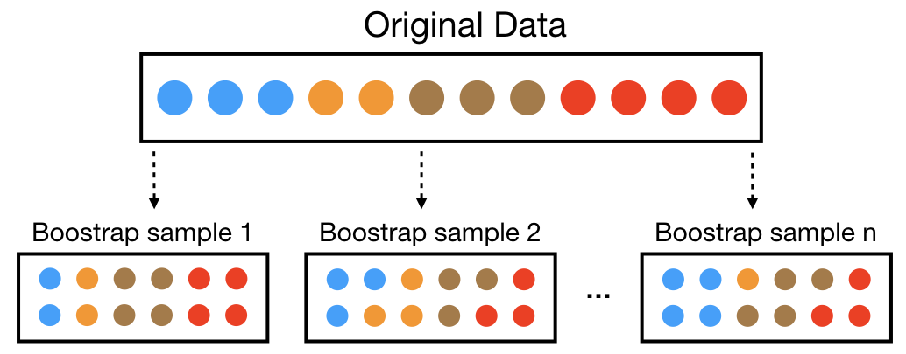
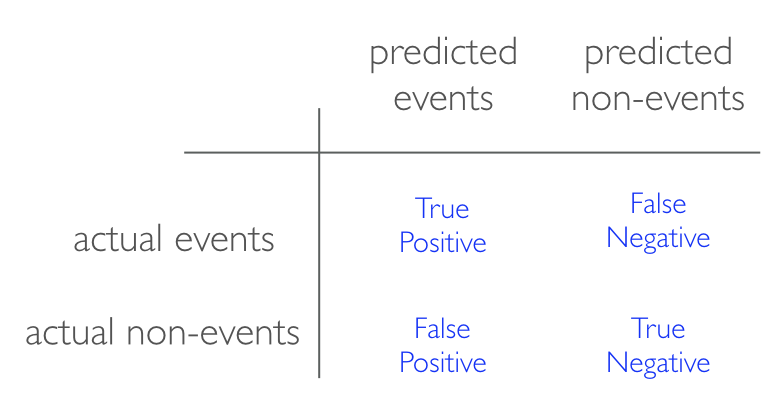

```{r setup, include=FALSE, cache=FALSE}
# Set global R options
options(htmltools.dir.version = FALSE, servr.daemon = TRUE)

# Set global knitr chunk options
knitr::opts_chunk$set(
  fig.align = "center", 
  cache = TRUE,
  error = FALSE,
  message = FALSE, 
  warning = FALSE, 
  collapse = TRUE 
)

# set ggplot to black and white theme
library(ggplot2)
theme_set(theme_bw())
```

class: clear, center, middle

background-image: url(images/process-icon.svg)
background-position: center
background-size: contain

<br><br><br><br><br>
&nbsp;&nbsp;&nbsp;&nbsp;&nbsp;&nbsp;&nbsp;&nbsp;&nbsp;&nbsp;&nbsp;&nbsp;&nbsp;&nbsp;&nbsp;&nbsp;&nbsp;&nbsp;&nbsp;&nbsp;&nbsp;&nbsp;&nbsp;&nbsp; .font200.grey[Supervised Modeling Process]

---
# Introduction

This module introduces concepts that are useful for any type of machine learning model:

- modeling process versus a model

- data splitting

- nuances of the R modeling ecosystem

- resampling

- bias-variance trade-off

- model evaluation

<br>

.center.bold[Many of these topics will be put into action in later sections.]

---
# Overview

.pull-left[

* the machine learning process is very iterative and heurstic-based 

* common for many ML approaches to be applied, evaluated, and modified before a final, optimal model can be determined

* A proper process needs to be implemented to have confidence in our results

<br><br>

.center.bold.blue[_Not a short sprint!_]

]

.pull-right[

<br><br>

```{r general-process, echo=FALSE}
knitr::include_graphics("images/modeling_process.png")
```

]

---
# Prerequisites

.pull-left[

.center.bold.font110[Packages]

```{r prereq-pkg}
library(rsample)
library(caret)
library(tidyverse)
```

]

.pull-right[

.center.bold.font110[Data]

```{r prereq-data}
# ames data
ames <- AmesHousing::make_ames()

# attrition data
churn <- rsample::attrition
```

]

---
class: center, middle, inverse

.font300.white[Data Splitting]

---
# Generalizability

__Generalizability__: we want an algorithm that not only fits well to our past data, but more importantly, one that .blue[predicts a future outcome accurately].

--

- .bold[Training Set]: these data are used to develop feature sets, train our algorithms, tune hyper-parameters, compare across models, and all of the other activities required to reach a final model decision.

- .bold[Test Set]: having chosen a final model, these data are used to estimate an unbiased assessment of the model’s performance (generalization error).

--

.pull-left[

<br><br>
.center.bold.red[DO NOT TOUCH THE TEST SET UNTIL THE VERY END!!!]

]

.pull-right[

```{r nope, echo=FALSE, out.height="30%", out.width="30%"}
knitr::include_graphics("images/nope.png")
```

]

---
# What's the right split?

* typical recommendations for splitting your data into training-testing splits include 60% (training) - 40% (testing), 70%-30%, or 80%-20%

* as data sets get smaller ( $n<500$ ):
   - spending too much in training (*> 80%*) won’t allow us to get a good assessment of predictive performance. We may find a model that fits the training data very well, but is not generalizable (overfitting),
   - sometimes too much spent in testing (*< 40%*) won’t allow us to get a good assessment of model parameters

* as data gets larger ( $n>100K$ ):
   - marginal gains with larger sample sizes
   - may use a smaller training sample to increase computation speed
   - as $n \geq p$ (where *p* represents the number of features), larger samples sizes are often required to identify consistent signals in the features

---
# Mechanics of data splitting

Two most common ways of splitting data include:

* .bold[simple random sampling]: randomly select observations

* .bold[stratified sampling]: preserving distributions
   - <u>classification</u>: sampling within the classes to preserve the distribution of the outcome in the training and test sets
   - <u>regression</u>: determine the quartiles of the data set and sample within those artificial groups

.pull-left[
   
```{r split-diamonds, eval=FALSE}
set.seed(123) # for reproducibility
split <- initial_split(diamonds, strata = "price", prop = 0.7)
train <- training(split)
test  <- testing(split)

# Do the distributions line up? 
ggplot(train, aes(x = price)) + 
  geom_line(stat = "density", 
            trim = TRUE) + 
  geom_line(data = test, 
            stat = "density", 
            trim = TRUE, col = "red")
```
   
]

.pull-right[
   
```{r split-diamonds2, echo=FALSE, fig.height=3.5}
set.seed(123) # for reproducibility
split <- initial_split(diamonds, strata = "price", prop = 0.7)
train <- training(split)
test  <- testing(split)

# Do the distributions line up? 
ggplot(train, aes(x = price)) + 
  geom_line(stat = "density", 
            trim = TRUE) + 
  geom_line(data = test, 
            stat = "density", 
            trim = TRUE, col = "red")
```
   
]
  
---
class: yourturn
# Your Turn!

1. Use __rsample__ to split the Ames housing data (`ames`) and the Employee attrition data (`churn`) using stratified sampling and with a 80% split.

   ```r
   # ames data
   set.seed(123)
   ames_split <- initial_split(ames, prop = _____, strata = "Sale_Price")
   ames_train <- training(_____)
   ames_test  <- testing(_____)
   
   # attrition data
   set.seed(123)
   churn_split <- initial_split(churn, prop = _____, strata = "Attrition")
   churn_train <- training(_____)
   churn_test  <- testing(_____)
   ```
2. Verify that the distribution between training and test sets are similar.

---
class: yourturn
# Your Turn!

.scrollable90[
.pull-left[

.center.bold[Ames Housing]

```{r split-ames, fig.height=3}
set.seed(123)
ames_split <- initial_split(ames, prop = 0.7, strata = "Sale_Price")
ames_train <- training(ames_split)
ames_test  <- testing(ames_split)

# Do the distributions line up? 
ggplot(ames_train, aes(x = Sale_Price)) + 
  geom_line(stat = "density", 
            trim = TRUE) + 
  geom_line(data = ames_test, 
            stat = "density", 
            trim = TRUE, col = "red")
```


]

.pull-right[

.center.bold[Employee Attrition]

```{r split-churn}
set.seed(123)
churn_split <- initial_split(churn, prop = 0.7, strata = "Attrition")
churn_train <- training(churn_split)
churn_test  <- testing(churn_split)

# consistent response ratio between train & test
table(churn_train$Attrition) %>% prop.table()
table(churn_test$Attrition) %>% prop.table()
```

]
]

---
class: center, middle, inverse

.font300.white[Creating models in R]


---
# Many interfaces

To fit a model to our data, the model terms must be specified. There are .bold[three main interfaces] for doing this:

.pull-left[

1. .blue[Formula interface]

]

.pull-right[

```{r formula-interface, eval=FALSE}
# Variables + interactions
model_fn(Sale_Price ~ Neighborhood + Year_Sold + Neighborhood:Year_Sold, data = ames_train)

# Shorthand for all predictors
model_fn(Sale_Price ~ ., data = ames_train)

# Inline functions / transformations
model_fn(log10(Sale_Price) ~ ns(Longitude, df = 3) + ns(Latitude, df = 3), data = ames_train)
```

]

---
# Many interfaces

To fit a model to our data, the model terms must be specified. There are .bold[three main interfaces] for doing this:

.pull-left[

1. Formula interface
2. .blue[XY interface]

]

.pull-right[

```{r XY-interface, eval=FALSE}
# Usually, the variables must all be numeric
pre_vars <- c("Year_Sold", "Longitude", "Latitude")
model_fn(x = ames_train[, pre_vars], y = ames_train$Sale_Price)
```

]

---
# Many interfaces

To fit a model to our data, the model terms must be specified. There are .bold[three main interfaces] for doing this:

.pull-left[

1. Formula interface
2. XY interface
3. .blue[Variable name specification]

]

.pull-right[

```{r name-interface, eval=FALSE}
# specify x & y by character strings
model_fn(
  x = c("Year_Sold", "Longitude", "Latitude"),
  y = "Sale_Price",
  data = ames.h2o
  )
```

]

--

<br><br><br><br>

.center.bold.font110.red[_We can get around these inconsistencies with meta-engines_]

---
# Many engines

With the prevelance of ML packages available, this results in an abundance of direct and meta engines that can be used.

For example, the following all produce the same linear regression model output:

```{r lm-engines, eval=FALSE}
lm_lm    <- lm(Sale_Price ~ ., data = ames_train)
lm_glm   <- glm(Sale_Price ~ ., data = ames_train, family = gaussian)
lm_caret <- train(Sale_Price ~ ., data = ames_train, method = "lm")
```

* `lm()` and `glm()` are two different engines that can be used to fit the linear model
* `caret::train()` is a meta engine (aggregator) that allows you to apply almost any direct engine with `method = ?`

---
# Many engines

* Using direct engines provides .green[more flexibility] but

* requires you to be familiar with .red[syntax nuances]

<br>

| Algorithm | Package | Code |
| --------- | ------- | ------------- |
| Linear discriminant analysis | __MASS__ | `predict(obj)` |
| Generalized linear model |	__stats__	| `predict(obj, type = "response")` |
| Mixture discriminant analysis |	__mda__	|	`predict(obj, type = "posterior")` |
| Decision tree |	__rpart__	|	`predict(obj, type = "prob")` |
| Random Forest |	__ranger__ |	`predict(obj)$predictions` |
| Gradient boosting machine |	__gbm__ |	`predict(obj, type = "response", n.trees)` |

.center.bold[You'll be exposed to both direct and meta engines]


---
class: center, middle, inverse

.font300.white[Resampling Methods]

---
# Resampling methods

___Resampling___ provides an approach for us to repeatedly fit a model of interest to parts of the training data and testing the performance on other parts. 

.pull-left[

* Allows us to _estimate_ the generalization error while training, tuning, and comparing models without using the test data set

* The two most commonly used resampling methods include 
   - _k_-fold cross validation 
   - bootstrapping.
]

.pull-right[

```{r resampling, echo=FALSE}
knitr::include_graphics("images/resampling.png")
```

.center.font70[[Image by Max Kuhn](https://bookdown.org/max/FES/review-predictive-modeling-process.html#fig:review-resamp-scheme)]

]

---
# _K_-fold cross valiation

.pull-left[

* randomly divides the training data into k groups of approximately equal size

* assign one block as the .orange[test block] and the rest as .blue[training block]

* train model on each folds' .blue[training block] and evaluate on .orange[test block]

* average performance across all folds

]

.pull-right[

<br>

```{r cv-icon, echo=FALSE}
knitr::include_graphics("images/cv.png")
```

.center.bold[_k_ is usually taken to be 5 or 10]

]

---
# _K_-fold cross valiation

.pull-left[

* randomly divides the training data into k groups of approximately equal size

* assign one block as the .orange[test block] and the rest as .blue[training block]

* train model on each folds' .blue[training block] and evaluate on .orange[test block]

* average performance across all folds

* .blue[Pro tip]: for smaller data sets ( $n < 10,000$ ), 10-fold cross validation repeated 5 or 10 times will improve accuracy of your estimated performance

]

.pull-right[

```{r cv-demo, echo=FALSE, fig.height=4}
cv <- vfold_cv(mtcars, 10)

cv_plot <- cv$splits %>%
  map2_dfr(seq_along(cv$splits), ~ mtcars %>% mutate(
    Resample = paste0("Fold_", str_pad(.y, 2, pad = 0)),
    ID = row_number(),
    Data = ifelse(ID %in% .x$in_id, "Training", "Validation"))
    ) %>%
  ggplot(aes(Resample, ID, fill = Data)) +
  geom_tile() +
  scale_fill_manual(values = c("#f2f2f2", "#AAAAAA")) +
  scale_y_reverse("Observation ID", breaks = 1:nrow(mtcars), expand = c(0, 0)) +
  scale_x_discrete(NULL, expand = c(0, 0)) +
  theme_classic() +
  theme(legend.title=element_blank())

cv_plot
```

.center.bold[10-fold cross validation with _n = 32_]

]

---
# Applying

Three main approaches to apply cross-validation:

.scrollable90[
.bold[Within a direct engine:]

```{r cv-h2o, eval=FALSE}
# example of 10 fold CV in h2o
h2o_cv <- h2o.glm(
  x = x, 
  y = y, 
  training_frame = train.h2o,
  nfolds = 10 #<<
  )
```

.bold[Within a meta engine:]

```{r cv-caret, eval=FALSE}
# example of 10 fold CV in caret
caret_cv <- train(
  Sale_Price ~ .,
  data = ames_train,
  method = "lm",
  trControl = trainControl(method = "cv",  number = 10) #<<
  )
```

.bold[External to engine:]

```{r cv-external}
# example of 10 fold CV with rsample::vfold_cv
ext_cv <- vfold_cv(ames_train, v = 10)
ext_cv
names(ext_cv$splits$`1`)
```
]

---
# Bootstrapping

A bootstrap sample is the same size as the training set but each data point is selected ___with replacement___.

.pull-left[
* .bold[Analysis set]: Will contain more than one replicate of a training set instance.

* .bold[Assessment set]: Contains all samples that were never included in the corresponding bootstrap set. Often called the ___"out-of-bag"___ sample and can vary in size!

]

.pull-right[

```{r bootstrap-icon, echo=FALSE}

```

]

<br><br>

.center.bold[On average, 63.21% of the training set is contained at least once in the bootstrap sample.]

---
# Bootstrapping

A bootstrap sample is the same size as the training set but each data point is selected ___with replacement___.

.scrollable90[
.pull-left[
* .bold[Analysis set]: Will contain more than one replicate of a training set instance.

* .bold[Assessment set]: Contains all samples that were never included in the corresponding bootstrap set. Often called the ___"out-of-bag"___ sample and can vary in size!

* .blue[Pro tip]: For smaller data sets (*n < 500*), bootstrapping can have biased error estimates; use repeated k-fold or corrected bootstrapping methods.

]

.pull-right[

```{r sampling-comparison, echo=FALSE, fig.height=7.5}
boots <- rsample::bootstraps(mtcars, 10)

boots_plot <- boots$splits %>%
  map2_dfr(seq_along(boots$splits), ~ mtcars %>% 
             mutate(
               Resample = paste0("Bootstrap_", str_pad(.y, 2, pad = 0)),
               ID = row_number()
             ) %>%
             group_by(ID) %>%
             mutate(Replicates = factor(sum(ID == .x$in_id)))) %>%
  ggplot(aes(Resample, ID, fill = Replicates)) +
  geom_tile() +
  scale_fill_manual(values = c("#FFFFFF", "#F5F5F5", "#BEBEBE", "#808080", "#404040", "#000000")) +
  scale_y_reverse("Observation ID", breaks = 1:nrow(mtcars), expand = c(0, 0)) +
  scale_x_discrete(NULL, expand = c(0, 0)) +
  theme_classic() +
  theme(axis.text.x = element_text(angle = 90, hjust = 1)) +
  ggtitle("Bootstrap sampling") 

cv_plot <- cv_plot + 
  ggtitle("10-fold cross validation") +
  theme(axis.text.x = element_text(angle = 90, hjust = 1))

cowplot::plot_grid(boots_plot, cv_plot, align = "v", nrow = 2)
```

]
]

---
# Applying

.pull-left[

* Similiar to cross validation, we can incorporate bootstrapping with:
   - meta engines
   - external to engines

* however, bootstrapping is more of an internal resampling procedure that is naturally built into certain ML algorithms:
   - bagging
   - random forests
   - GBMs

]

.pull-right[

.bold[Within a meta engine:]

```{r boot-caret, eval=FALSE}
# example of 10 bootstrap samples in caret
caret_boot <- train(
  Sale_Price ~ .,
  data = ames_train,
  method = "lm",
  trControl = trainControl(method = "boot",  number = 10) #<<
  )
```

.bold[External to engine:]

```{r boot-external}
# example of 10 bootstrapped samples with rsample::bootstraps
bootstraps(ames, times = 10)
```
]

]

---
class: center, middle, inverse

.font300.white[Bias-Variance Trade-off]


---
# Bias-variance trade-off

* Prediction errors can be decomposed into two main subcomponents we care about:
   - error due to “bias”
   - error due to “variance”
   
* There is a tradeoff between a model’s ability to minimize bias and variance. 

* Understanding how different sources of error lead to bias and variance helps us improve the data fitting process resulting in more accurate models.

--

.pull-left[

```{r bias-model, fig.height=3.5, echo=FALSE}
# Simulate some nonlinear monotonic data
set.seed(123)  # for reproducibility
x <- seq(from = 0, to = 2 * pi, length = 500)
y <- sin(x) + rnorm(length(x), sd = 0.3)
df <- data.frame(x, y) %>%
  filter(x < 4.5)

# single model fit
bias_model <- lm(y ~ I(x^3), data = df)
df$predictions <- predict(bias_model, df)

p1 <- ggplot(df, aes(x, y)) +
  geom_point(alpha = .3) +
  geom_line(aes(x, predictions), size = 1.5, color = "dodgerblue") +
  scale_y_continuous("Response", limits = c(-1.75, 1.75), expand = c(0, 0)) +
  scale_x_continuous(limits = c(0, 4.5), expand = c(0, 0)) +
  ggtitle("Single biased model fit")

# bootstrapped model fit
bootstrap_n <- 25
bootstrap_results <- NULL
for(i in seq_len(bootstrap_n)) {
  # reproducible sampled data frames
  set.seed(i)
  index <- sample(seq_len(nrow(df)), nrow(df), replace = TRUE)
  df_sim <- df[index, ]
  
  # fit model and add predictions to results data frame
  fit <- lm(y ~ I(x^3), data = df_sim)
  df_sim$predictions <- predict(fit, df_sim)
  df_sim$model <- paste0("model", i)
  df_sim$ob <- index
  bootstrap_results <- rbind(bootstrap_results, df_sim)
}

p2 <- ggplot(bootstrap_results, aes(x, predictions, color = model)) +
  geom_line(show.legend = FALSE, size = .5) +
  scale_y_continuous("Response", limits = c(-1.75, 1.75), expand = c(0, 0)) +
  scale_x_continuous(limits = c(0, 4.5), expand = c(0, 0)) +
  ggtitle("25 biased models (bootstrapped)")

gridExtra::grid.arrange(p1, p2, nrow = 1)
```

]

--

.pull-right[

```{r variance-model, fig.height=3.5, echo=FALSE}
# Simulate some nonlinear monotonic data
set.seed(123)  # for reproducibility
x <- seq(from = 0, to = 2 * pi, length = 500)
y <- sin(x) + rnorm(length(x), sd = 0.3)
df <- data.frame(x, y) %>%
  filter(x < 4.5)

# single model fit
variance_model <- knnreg(y ~ x, k = 3, data = df)
df$predictions <- predict(variance_model, df)

p1 <- ggplot(df, aes(x, y)) +
  geom_point(alpha = .3) +
  geom_line(aes(x, predictions), size = 1.5, color = "dodgerblue") +
  scale_y_continuous("Response", limits = c(-1.75, 1.75), expand = c(0, 0)) +
  scale_x_continuous(limits = c(0, 4.5), expand = c(0, 0)) +
  ggtitle("Single high variance model fit")

# bootstrapped model fit
bootstrap_n <- 25
bootstrap_results <- NULL
for(i in seq_len(bootstrap_n)) {
  # reproducible sampled data frames
  set.seed(i)
  index <- sample(seq_len(nrow(df)), nrow(df), replace = TRUE)
  df_sim <- df[index, ]
  
  # fit model and add predictions to results data frame
  fit <- knnreg(y ~ x, k = 3, data = df_sim)
  df_sim$predictions <- predict(fit, df_sim)
  df_sim$model <- paste0("model", i)
  df_sim$ob <- index
  bootstrap_results <- rbind(bootstrap_results, df_sim)
}

p2 <- ggplot(bootstrap_results, aes(x, predictions, color = model)) +
  geom_line(show.legend = FALSE) +
  scale_y_continuous("Response", limits = c(-1.75, 1.75), expand = c(0, 0)) +
  scale_x_continuous(limits = c(0, 4.5), expand = c(0, 0)) +
  ggtitle("25 high variance models (bootstrapped)")

gridExtra::grid.arrange(p1, p2, nrow = 1)
```

]

---
# Bias-variance trade-off

* Prediction errors can be decomposed into two main subcomponents we care about:
   - error due to “bias”
   - error due to “variance”
   
* There is a tradeoff between a model’s ability to minimize bias and variance. 

* Understanding how different sources of error lead to bias and variance helps us improve the data fitting process resulting in more accurate models.

* Some models are naturally...
   - .bold[high bias]: generalized linear models
   - .bold[high variance]: tree-based models, NNets, KNN, etc. 
   
<br>

.center.bold.red.font120[Hyperparameters can help to control bias-variance trade-off]   

---
# Hyperparameter tuning

Hyperparameters (aka _tuning parameters_) are the "knobs to twiddle" to control of complexity of machine learning algorithms and, therefore, the bias-variance trade-off

```{r example-knn, fig.width=10, fig.height=5, echo=FALSE}
k_results <- NULL
k <- c(2, 5, 10, 20, 50, 150)
# fit many different models
for(i in seq_along(k)) {
  df_sim <- df
  fit <- knnreg(y ~ x, k = k[i], data = df_sim)
  df_sim$predictions <- predict(fit, df_sim)
  df_sim$model <- paste0("k = ", str_pad(k[i], 3, pad = " "))
  k_results <- rbind(k_results, df_sim)
}

ggplot() +
  geom_point(data = df, aes(x, y), alpha = .3) +
  geom_line(data = k_results, aes(x, predictions), color = "dodgerblue", size = 1.5) +
  scale_y_continuous("Response", limits = c(-1.75, 1.75), expand = c(0, 0)) +
  scale_x_continuous(limits = c(0, 4.5), expand = c(0, 0)) +
  facet_wrap(~ model)
```

.center[k-nearest neighbor model with differing values for *k*.  Small *k* value has too much variance.  Big *k* value has too much bias.  .red[How do we find the optimal value?]]

---
# Grid search

A grid search is an automated approach to searching across many combinations of hyperparameter values

.scrollable90[

.pull-left[
```{r grid-search}
# resampling procedure
cv <- trainControl(method = "repeatedcv", number = 10, repeats = 10)

# define grid search
hyper_grid <- expand.grid(k = seq(2, 150, by = 2))

# perform grid search with caret
knn_fit <- train(
  x ~ y, 
  data = df, 
  method = "knn", 
  trControl = cv, 
  tuneGrid = hyper_grid
  )
```
]

.pull-right[
```{r plot-grid-search-results, echo=FALSE, fig.height=4}
ggplot() +
  geom_line(data = knn_fit$results, aes(k, RMSE)) +
  geom_point(data = knn_fit$results, aes(k, RMSE)) +
  geom_point(data = filter(knn_fit$results, k == as.numeric(knn_fit$bestTune)),
             aes(k, RMSE),
             shape = 21,
             fill = "yellow",
             color = "black",
             stroke = 1,
             size = 2) +
  scale_y_continuous("Error (RMSE)")
```

```{r plot-best-k, echo=FALSE, fig.height=4}
# single model fit
best_model <- knnreg(y ~ x, k = knn_fit$bestTune$k, data = df)
df$predictions <- predict(best_model, df)
df$truth <- sin(df$x)

ggplot(df, aes(x, y)) +
  geom_point(alpha = .3) +
  geom_line(aes(y = truth), lty = "dashed", size = 1.5) +
  geom_line(aes(x, predictions), size = 1.5, color = "dodgerblue") +
  scale_y_continuous("Response", limits = c(-1.75, 1.75), expand = c(0, 0)) +
  scale_x_continuous(limits = c(0, 4.5), expand = c(0, 0)) +
  ggtitle("Optimal KNN model")
```

]
]

---
class: center, middle, inverse

.font300.white[Model Evaluation Metrics]

---
# Model evaluation

.pull-left[

.center.bold.font110[Regression]

- Mean Square Error (MSE)
- Root Mean Square Error (RMSE)
- Mean Absolute Error (MAE)
- Mean Absolute Percent Error (MAPE)
- Root Mean Squared Logarithmic Error (RMSLE)

]

.pull-right[

.center.bold.font110[Classification]

- Classification Accuracy
- Recall vs. Specificity
- $F_1$ Score
- Log Loss

]

---
# Model evaluation

.pull-left[

.center.bold.font110[Regression]

- .bold[Mean Square Error (MSE)]
- .bold[Root Mean Square Error (RMSE)]
- Mean Absolute Error (MAE)
- Mean Absolute Percent Error (MAPE)
- Root Mean Squared Logarithmic Error (RMSLE)

<br><br>

$$MSE = \frac{1}{n}\sum^n_{i=1}(y_i - \hat y_i)^2 $$

]

.pull-right[

.center.bold.font110[Classification]

- .bold[Classification Accuracy]
- .bold[Recall vs. Specificity]
- $F_1$ Score
- Log Loss

```{r cm, echo=FALSE, out.width="80%", out.height="80%"}

```


]

---
class: center, middle, inverse

.font300.white[Putting the process together]

---
# Putting the process together

.pull-left[
Let's put these pieces together and analyze the Ames housing data:

1. Split into training vs testing data

2. Specify a resampling procedure

3. Create our hyperparameter grid

4. Execute grid search

5. Evaluate performance
]


---
# Putting the process together

.scrollable90[
.pull-left[
Let's put these pieces together and analyze the Ames housing data:

1. Split into training vs testing data

2. Specify a resampling procedure

3. Create our hyperparameter grid

4. Execute grid search

5. Evaluate performance
]

.pull-right[

.center.bold[`r anicon::faa("exclamation-triangle", color = "red", animate = FALSE)`  This grid search takes ~2 min `r anicon::faa("exclamation-triangle", color = "red", animate = FALSE)`]

```{r example-process-splitting, fig.height=4}
# 1. stratified sampling with the rsample package
set.seed(123)
split  <- initial_split(ames, prop = 0.7, strata = "Sale_Price")
ames_train  <- training(split)
ames_test   <- testing(split)

# 2. create a resampling method
cv <- trainControl(
  method = "repeatedcv", 
  number = 10, 
  repeats = 5
  )

# 3. create a hyperparameter grid search
hyper_grid <- expand.grid(k = seq(2, 26, by = 2))

# 4. execute grid search with knn model
#    use RMSE as preferred metric
knn_fit <- train(
  Sale_Price ~ ., 
  data = ames_train, 
  method = "knn", 
  trControl = cv, 
  tuneGrid = hyper_grid,
  metric = "RMSE"
  )

# 5. evaluate results
# print model results
knn_fit

# plot cross validation results
ggplot(knn_fit$results, aes(k, RMSE)) + 
  geom_line() +
  geom_point() +
  scale_y_continuous(labels = scales::dollar)
```

]
]

---
# Putting the process together

.center.bold.font120.red[Is this the best predictive model we can find?]

* We may have identified the  optimal _k_-nearest neighbor model for our given data set but this doesn't mean we've found the best possible overall model.  

* Nor have we considered potential feature and target engineering options.  

* The remainder of this workshop will walk you through the journey of identifying alternative solutions and, hopefully, the optimal model.

--

```{r excited, echo=FALSE}
knitr::include_graphics("https://media.tenor.com/images/8dcbd6365535547e08b33dd08b3b74d8/tenor.gif")
```

---
# Questions?

```{r unsupervised-questions, echo=FALSE, out.height="50%", out.width="50%"}
knitr::include_graphics("https://media.makeameme.org/created/i-love-questions.jpg")
```

---
# Back home

<br><br><br><br>
[.center[`r anicon::faa("home", size = 10, animate = FALSE)`]](https://github.com/uc-r/Advanced-R)

.center[https://github.com/uc-r/Advanced-R]


