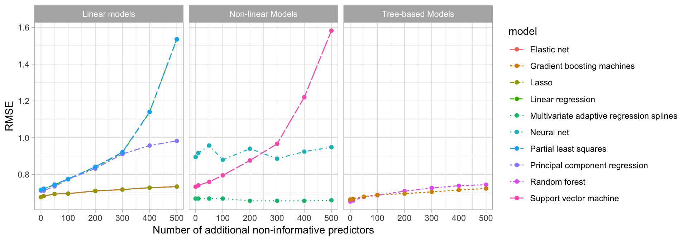
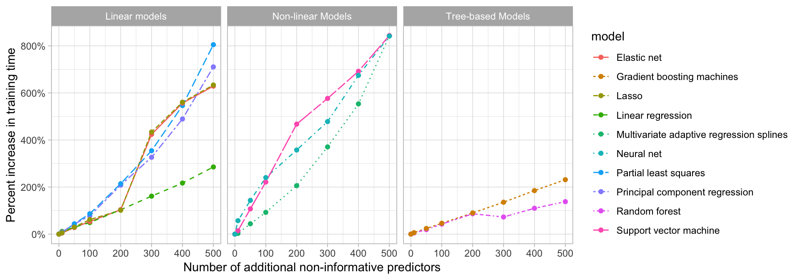
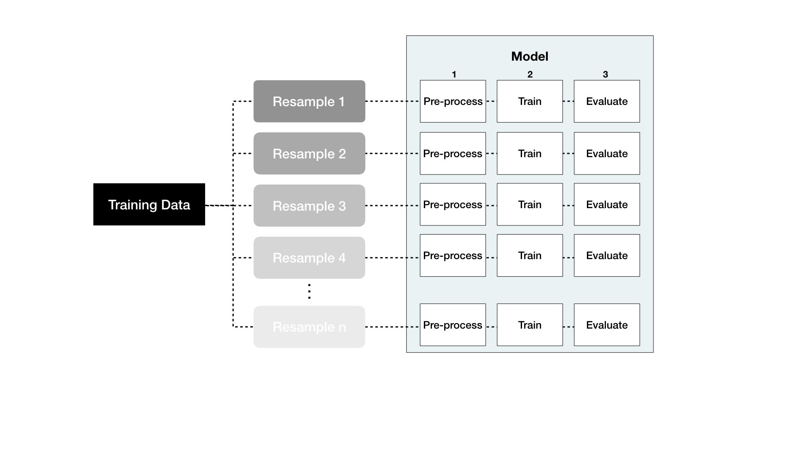

```{r setup, include=FALSE, cache=FALSE}
# Set global R options
options(htmltools.dir.version = FALSE, servr.daemon = TRUE)

# Set global knitr chunk options
knitr::opts_chunk$set(
  fig.align = "center", 
  cache = TRUE,
  error = FALSE,
  message = FALSE, 
  warning = FALSE, 
  collapse = TRUE 
)

# set ggplot to black and white theme
library(ggplot2)
theme_set(theme_bw())
```

class: clear, center, middle

background-image: url(images/engineering-icon.jpg)
background-position: center
background-size: cover

<br><br><br><br><br><br><br><br><br><br><br><br><br>
.font200.bold.white[Feature & Target Engineering]

---
# Introduction

Data pre-processing and engineering techniques generally refer to the .blue[___addition, deletion, or transformation of data___].

.pull-left[

.center.bold.font120[Thoughts]

- Substantial time commitment
- 1 hr module doesn't do justice
- Not a "sexy" area to study but well worth your time
- Additional resources to start with:
   - [Feature Engineering and Selection: A Practical Approach for Predictive Models](http://www.feat.engineering/)
   - [Feature Engineering for Machine Learning: Principles and Techniques for Data Scientists](https://www.amazon.com/Feature-Engineering-Machine-Learning-Principles/dp/1491953241)

]

--

.pull-right[

.center.bold.font120[Overview]

- Target engineering
- Missingness
- Feature filtering
- Numeric feature engineering
- Categorical feature engineering
- Dimension reduction
- Proper implementation

]

---
# Prereqs

.pull-left[

.center.bold.font120[Packages]

```{r prereqs-pks}
library(dplyr)
library(ggplot2)
library(rsample)
library(recipes)
```


]

.pull-right[

.center.bold.font120[Data]

```{r prereqs-data}
# ames data
ames <- AmesHousing::make_ames()

# split data
set.seed(123)
split <- initial_split(ames, strata = "Sale_Price")
ames_train <- training(split)
```

]

---
class: center, middle, inverse

.font300.white[Target Engineering]

---
# Normality correction

.pull-left[

Not a requirement but...

- can improve predictive accuracy for parametric & distance-based models
- can correct for residual assumption violations
- minimizes effects of outliers

plus...

- sometimes used to for shaping the business problem as well

.center[_“taking logs means that errors in predicting expensive houses and cheap houses will affect the result equally.”_]

]

.pull-right[

<br><br>

<center>
$\texttt{Sale_Price} = \beta_0 + \beta_1\texttt{Year_Built} + \epsilon$
</center>

```{r skewed-residuals, fig.width=6, fig.height=3, echo=FALSE}
library(tidyverse)
models <- c("Non-log transformed model residuals", "Log transformed model residuals")

list(
  m1 = lm(Sale_Price ~ Year_Built, data = ames_train),
  m2 = lm(log(Sale_Price) ~ Year_Built, data = ames_train)
) %>%
  map2_dfr(models, ~ broom::augment(.x) %>% mutate(model = .y)) %>%
  ggplot(aes(.resid)) +
  geom_histogram(bins = 75) +
  facet_wrap(~ model, scales = "free_x") +
  ylab(NULL) +
  xlab("Residuals")
```


]

---
# Transformation options

.pull-left[

- log (or log with offset)

- Box-Cox: automates process of finding proper transformation

$$
 \begin{equation} 
 y(\lambda) =
\begin{cases}
   \frac{y^\lambda-1}{\lambda}, & \text{if}\ \lambda \neq 0 \\
   \log y, & \text{if}\ \lambda = 0.
\end{cases}
\end{equation}
$$

- Yeo-Johnson: modified Box-Cox for non-strictly positive values

]

.pull-right[

We'll put these pieces together later

```{r eval=FALSE}
step_log()
step_BoxCox()
step_YeoJohnson()
```


]

```{r distribution-comparison, echo=FALSE, message=FALSE, warning=FALSE, fig.height=3, fig.width=12}
# log transformation
train_log_y <- log(ames_train$Sale_Price)

# Box Cox transformation
lambda  <- forecast::BoxCox.lambda(ames_train$Sale_Price)
train_bc_y <- forecast::BoxCox(ames_train$Sale_Price, lambda)

# Yeo-Johnson transformation
yeo <- caret::preProcess(ames_train["Sale_Price"], method = "YeoJohnson")
yeo <- predict(yeo, ames_train["Sale_Price"])

# plot differences
data.frame(
  Normal = ames_train$Sale_Price,
  Log_Transform = train_log_y,
  BoxCox_Transform = train_bc_y,
  Yeo_Johnson_Transform = yeo[[1]]
) %>%
  gather(Transform, Value) %>%
  mutate(Transform = factor(Transform, levels = c("Normal", "Log_Transform", "BoxCox_Transform", "Yeo_Johnson_Transform"))) %>% 
  ggplot(aes(Value, fill = Transform)) +
  geom_histogram(show.legend = FALSE, bins = 40) +
  facet_wrap(~ Transform, scales = "free_x", nrow = 1)
```

---
class: center, middle, inverse

.font300.white[Missingness]

.white[_Many models cannot cope with missing data so imputation strategies may be necessary._]

---
# Visualizing

An uncleaned version of Ames housing data:

```{r}
sum(is.na(AmesHousing::ames_raw))
```

.pull-left[

```{r missing-distribution, eval=FALSE}
AmesHousing::ames_raw %>%
  is.na() %>%
  reshape2::melt() %>%
  ggplot(aes(Var2, Var1, fill=value)) + 
    geom_raster() + 
    coord_flip() +
    scale_y_continuous(NULL, expand = c(0, 0)) +
    scale_fill_grey(name = "", labels = c("Present", "Missing")) +
    xlab("Observation") +
    theme(axis.text.y  = element_text(size = 4))
```


]

.pull-right[

```{r missing-distribution-plot, echo=FALSE, fig.height=5}
AmesHousing::ames_raw %>%
  is.na() %>%
  reshape2::melt() %>%
  ggplot(aes(Var2, Var1, fill=value)) + 
    geom_raster() + 
    coord_flip() +
    scale_y_continuous(NULL, expand = c(0, 0)) +
    scale_fill_grey(name = "", labels = c("Present", "Missing")) +
    xlab("Observation") +
    theme(axis.text.y  = element_text(size = 4))
```

]

---
# Visualizing

An uncleaned version of Ames housing data:

```{r}
sum(is.na(AmesHousing::ames_raw))
```

.pull-left[

```{r missing-distribution2, eval=FALSE}
extracat::visna(AmesHousing::ames_raw, sort = "b")
```


]

.pull-right[

```{r missing-distribution-plot2, echo=FALSE, fig.height=5}
extracat::visna(AmesHousing::ames_raw, sort = "b")
```

]

---
# Structural vs random

.pull-left[

Missing values can be a result of many different reasons; however, these reasons are usually lumped into two categories: 

* informative missingess

* missingness at random


]

.pull-right[

```{r structural-missingness}
AmesHousing::ames_raw %>% 
  filter(is.na(`Garage Type`)) %>% 
  select(`Garage Type`, `Garage Cars`, `Garage Area`)
```

]

<br>

.center.bold[Determines how you will, and if you can/should, impute.]

---
# Imputation

.pull-left[

Primary methods:

- Estimated statistic (i.e. mean, median, mode)

- K-nearest neighbor

- Tree-based (bagged trees)

]

.pull-right[

.center.font80[.red[Actual values] vs .blue[imputed values]]

```{r imputation-examples, echo=FALSE}
impute_ames <- ames_train

set.seed(123)
index <- sample(seq_along(impute_ames$Gr_Liv_Area), 50)
actuals <- ames_train[index, ]
impute_ames$Gr_Liv_Area[index] <- NA

p1 <- ggplot() +
  geom_point(data = impute_ames, aes(Gr_Liv_Area, Sale_Price), alpha = .2) +
  geom_point(data = actuals, aes(Gr_Liv_Area, Sale_Price), color = "red") +
  scale_x_log10(limits = c(300, 5000)) +
  scale_y_log10(limits = c(10000, 500000)) +
  ggtitle("Actual values")

# Mean imputation
mean_juiced <- recipe(Sale_Price ~ ., data = impute_ames) %>%
  step_meanimpute(Gr_Liv_Area) %>%
  prep(training = impute_ames, retain = TRUE) %>%
  juice()

mean_impute <- mean_juiced[index, ]
  
p2 <- ggplot() +
  geom_point(data = actuals, aes(Gr_Liv_Area, Sale_Price), color = "red") +
  geom_point(data = mean_impute, aes(Gr_Liv_Area, Sale_Price), color = "blue") +
  scale_x_log10(limits = c(300, 5000)) +
  scale_y_log10(limits = c(10000, 500000)) +
  ggtitle("Mean Imputation")

# KNN imputation
knn_juiced <- recipe(Sale_Price ~ ., data = impute_ames) %>%
  step_knnimpute(Gr_Liv_Area) %>%
  prep(training = impute_ames, retain = TRUE) %>%
  juice()

knn_impute <- bagged_juiced[index, ]
  
p3 <- ggplot() +
  geom_point(data = actuals, aes(Gr_Liv_Area, Sale_Price), color = "red") +
  geom_point(data = knn_impute, aes(Gr_Liv_Area, Sale_Price), color = "blue") +
  scale_x_log10(limits = c(300, 5000)) +
  scale_y_log10(limits = c(10000, 500000)) +
  ggtitle("KNN Imputation")

# Bagged imputation
bagged_juiced <- recipe(Sale_Price ~ ., data = impute_ames) %>%
  step_bagimpute(Gr_Liv_Area) %>%
  prep(training = impute_ames, retain = TRUE) %>%
  juice()

bagged_impute <- bagged_juiced[index, ]
  
p4 <- ggplot() +
  geom_point(data = actuals, aes(Gr_Liv_Area, Sale_Price), color = "red") +
  geom_point(data = bagged_impute, aes(Gr_Liv_Area, Sale_Price), color = "blue") +
  scale_x_log10(limits = c(300, 5000)) +
  scale_y_log10(limits = c(10000, 500000)) +
  ggtitle("Bagged Trees Imputation")

gridExtra::grid.arrange(p1, p2, p3, p4, nrow = 2)
```


]

---
# Imputation

.pull-left[

Primary methods:

- Estimated statistic (i.e. mean, median, mode)

- K-nearest neighbor

- Tree-based (bagged trees)

]

.pull-right[

We'll put these pieces together later

```{r impute-options, eval=FALSE}
step_meanimpute()
step_medianimpute()
step_modeimpute()
step_knnimpute()
step_bagimpute()
```


]

---
class: center, middle, inverse

.font300.white[Feature Filtering]

---
# More is not always better!

Excessive noisy variables can...

.font120.bold[reduce accuracy]

```{r impact-on-accuracy, echo=FALSE}

```


---
# More is not always better!

Excessive noisy variables can...

.font120.bold[increase computation time]

```{r impact-on-time, echo=FALSE}

```

---
# Options for filtering

.pull-left[
Filtering options include:

- removing 
   - zero variance features
   - near-zero variance features
   - highly correlated features (better to do dimension reduction)

- Feature selection
   - beyond scope of module
   - see [Applied Predictive Modeling, ch. 19](http://appliedpredictivemodeling.com/)
]

.pull-right[

```{r near-zero-variance}
caret::nearZeroVar(ames_train, saveMetrics= TRUE) %>% 
  rownames_to_column() %>% 
  filter(nzv)
```

]

---
# Options for filtering

.pull-left[
Filtering options include:

- removing 
   - zero variance features
   - near-zero variance features
   - highly correlated features (better to do dimension reduction)

- Feature selection
   - beyond scope of module
   - see [Applied Predictive Modeling, ch. 19](http://appliedpredictivemodeling.com/)
]

.pull-right[

We'll put these pieces together later

```{r filtering-options, eval=FALSE}
step_zv()
step_nzv()
step_corr()
```

]

---
class: center, middle, inverse

.font300.white[Numeric Feature Engineering]

---
# Transformations

.pull-left[
* skewness
   - parametric models that have distributional assumptions (i.e. GLMs, regularized models)
   - log
   - Box-Cox or Yeo-Johnson
   
* standardization
   - Models that incorporate linear functions (GLM, NN) and distance functions (i.e. KNN, clustering) of input features are sensitive to the scale of the inputs 
   - centering _and_ scaling so that numeric variables have $\mu = 0; \sigma = 1$ 
]   
 
.pull-right[

```{r standardizing, echo=FALSE, fig.height=7}
x1 <- data_frame(
  variable = "x1",
  `Real value` = runif(25, min = -30, max = 5),
  `Standardized value` = scale(`Real value`) %>% as.numeric()
)

x2 <- data_frame(
  variable = "x2",
  `Real value` = rlnorm(25, log(25)),
  `Standardized value` = scale(`Real value`) %>% as.numeric()
)

x3 <- data_frame(
  variable = "x3",
  `Real value` = rnorm(25, 150, 15),
  `Standardized value` = scale(`Real value`) %>% as.numeric()
)

x1 %>%
  bind_rows(x2) %>%
  bind_rows(x3) %>%
  gather(key, value, -variable) %>%
  mutate(variable = factor(variable, levels = c("x3", "x2", "x1"))) %>%
  ggplot(aes(value, variable)) +
  geom_point(alpha = .6) +
  facet_wrap(~ key, scales = "free_x", ncol = 1) +
  ylab("Feature") +
  xlab("Value")

```
] 

   
---
# Transformations

.pull-left[
* skewness
   - parametric models that have distributional assumptions (i.e. GLMs, regularized models)
   - log
   - Box-Cox or Yeo-Johnson
   
* standardization
   - Models that incorporate linear functions (GLM, NN) and distance functions (i.e. KNN, clustering) of input features are sensitive to the scale of the inputs 
   - centering _and_ scaling so that numeric variables have $\mu = 0; \sigma = 1$ 
] 

.pull-right[

We'll put these pieces together later

```{r num-feature-transformation-options, eval=FALSE}
step_log()
step_BoxCox()
step_YeoJohnson()
step_center()
step_scale()
```

]

---
class: center, middle, inverse

.font300.white[Categorical Feature Engineering]

---
# One-hot & Dummy encoding

.pull-left[

Many models require all predictor variables to be numeric (i.e. GLMs, SVMs, NNets)

```{r non-dummy, echo=FALSE}
library(knitr)
library(kableExtra)

set.seed(123)
ex1 <- data.frame(id = 1:4, x = sample(letters[1:3], 4, replace = TRUE))
knitr::kable(ex1) %>%
  kable_styling(bootstrap_options = "striped", full_width = TRUE)
```
   
Two most common approaches include...

]

.pull-right[

.bold.center[Dummy encoding]

```{r dummy-encoded, echo=FALSE}
# dummy encode
caret::dummyVars( ~ ., ex1, fullRank = TRUE) %>%
  predict(ex1) %>%
  knitr::kable() %>%
  kable_styling(bootstrap_options = "striped", full_width = FALSE)
```

.bold.center[One-hot encoding]

```{r one-hot-encoded, echo=FALSE}
caret::dummyVars( ~ ., ex1, fullRank = FALSE) %>%
  predict(ex1) %>%
  knitr::kable() %>%
  kable_styling(bootstrap_options = "striped", full_width = FALSE)
```

]

---
# Label encoding

.pull-left[
* One-hot and dummy encoding are not good when:
   - you have a lot of categorical features
   - with high cardinality
   - or you have ordinal features

* Label encoding:
   - pure numeric conversion of the levels of a categorical variable
   - most common: ordinal encoding
]

.pull-right[

.center.bold[Quality variables with natural ordering]

```{r}
ames_train %>% select(contains("Qual"))
```

]

---
# Label encoding

.pull-left[
* One-hot and dummy encoding are not good when:
   - you have a lot of categorical features
   - with high cardinality
   - or you have ordinal features

* Label encoding:
   - pure numeric conversion of the levels of a categorical variable
   - most common: ordinal encoding
]

.pull-right[

.center.bold[Original encoding for `Overall_Qual`]

```{r}
count(ames_train, Overall_Qual)
```

]

---
# Label encoding

.pull-left[
* One-hot and dummy encoding are not good when:
   - you have a lot of categorical features
   - with high cardinality
   - or you have ordinal features

* Label encoding:
   - pure numeric conversion of the levels of a categorical variable
   - most common: ordinal encoding
]

.pull-right[

.center.bold[Label/ordinal encoding for `Overall_Qual`]

```{r}
recipe(Sale_Price ~ ., data = ames_train) %>%
  step_integer(Overall_Qual) %>%
  prep(ames_train) %>%
  bake(ames_train) %>%
  count(Overall_Qual)
```

]

---
# Common categorical encodings

We'll put these pieces together later

```{r cat-feature-transformation-options, eval=FALSE}
step_dummy()
step_dummy(one_hot = TRUE)
step_integer()
step_ordinalscore()
```

---
class: center, middle, inverse

.font300.white[Dimension Reduction]

---
# PCA

.pull-left[
* We can use PCA for downstream modeling

* In the Ames data, there are potential clusters of highly correlated variables:

   - proxies for size: `Lot_Area`, `Gr_Liv_Area`, `First_Flr_SF`, `Bsmt_Unf_SF`, etc.
   - quality fields: `Overall_Qual`, `Garage_Qual`, `Kitchen_Qual`, `Exter_Qual`, etc.

* It would be nice if we could combine/amalgamate the variables in these clusters into a single variable that represents them.

* In fact, we can explain 95% of the variance in our numeric features with 38 PCs

]

.pull-right[

```{r pca, echo=FALSE}
# full ames data set --> recode ordinal variables to numeric
ames_num <- ames_train %>%
  mutate_if(str_detect(names(.), "Qual|Cond|QC|Qu"), as.numeric) %>%
  select_if(is.numeric) %>%
  select(-Sale_Price)

# apply PCA to numeric data
pca_ames <- prcomp(ames_num, scale = TRUE)

# compute eigenvalues
eigen <- pca_ames$sdev^2

# compute the PVE of each principal component
data_frame(
  PVE = cumsum(eigen / sum(eigen)),
  PC  = seq_along(eigen)
) %>%
  ggplot(aes(PC, PVE)) +
  geom_line() +
  geom_point() +
  geom_hline(yintercept = .9, lty = "dashed")
```

]

---
# PCA

.pull-left[
* We can use PCA for downstream modeling

* In the Ames data, there are potential clusters of highly correlated variables:

   - proxies for size: `Lot_Area`, `Gr_Liv_Area`, `First_Flr_SF`, `Bsmt_Unf_SF`, etc.
   - quality fields: `Overall_Qual`, `Garage_Qual`, `Kitchen_Qual`, `Exter_Qual`, etc.

* It would be nice if we could combine/amalgamate the variables in these clusters into a single variable that represents them.

* In fact, we can explain 95% of the variance in our numeric features with 38 PCs

]

.pull-right[

We'll put these pieces together later

```{r dimension-reduction-options, eval=FALSE}
step_pca()
step_kpca()
step_pls()
step_spatialsign()
```

]

---
class: center, middle, inverse

.font300.white[Blue Prints]

---
# Sequential steps

.pull-left[

.bold.center.font120[Some thoughts to consider]

- If using a log or Box-Cox transformation, don’t center the data first or do any operations that might make the data non-positive. 
- Standardize your numeric features prior to one-hot/dummy encoding.
- If you are lumping infrequently categories together, do so before one-hot/dummy encoding.
- Although you can perform dimension reduction procedures on categorical features, it is common to primarily do so on numeric features when doing so for feature engineering purposes.

]

--

.pull-right[

.bold.center.font120[Suggested ordering]

1. Filter out zero or near-zero variance features
2. Perform imputation if required
3. Normalize to resolve numeric feature skewness
4. Standardize (center and scale) numeric features
5. Perform dimension reduction (i.e. PCA) on numeric features
6. Create one-hot or dummy encoded features

]

---
# Data leakage

___Data leakage___ is when information from outside the training dataset is used to create the model.

- Often occurs when doing feature engineering
- Feature engineering should be done in isolation of each resampling iteration

```{r data-leakage, echo=FALSE, out.height="80%", out.width="80%"}

```


---
# Putting the process together

.pull-left[
.font120[

* __recipes__ provides a convenient way to create feature engineering blue prints

]
]

.pull-right[

```{r recipes-icon, echo=FALSE, out.width="70%", out.height="70%"}
knitr::include_graphics("https://raw.githubusercontent.com/rstudio/hex-stickers/master/PNG/recipes.png")
```

]

.center.bold.font120[https://tidymodels.github.io/recipes/index.html]

---
# Putting the process together

.pull-left[

* __recipes__ provides a convenient way to create feature engineering blue prints

* 3 main components to consider
   1. recipe: define your pre-processing blue print
   2. prepare: estimate parameters based on training data
   3. bake/juice: apply blue print to new data

]

---
# Putting the process together

.pull-left[

* __recipes__ provides a convenient way to create feature engineering blue prints

* 3 main components to consider
   1. .bold[recipe: define your pre-processing blue print]
   2. prepare: estimate parameters based on training data
   3. bake/juice: apply blue print to new data

<br>

.center.blue[Check out all the available `step_xxx()` functions at http://bit.ly/step_functions]

]

.pull-right[

```{r define-blue-print}
blueprint <- recipe(Sale_Price ~ ., data = ames_train) %>%
  step_nzv(all_nominal()) %>%
  step_center(all_numeric(), -all_outcomes()) %>%
  step_scale(all_numeric(), -all_outcomes()) %>%
  step_integer(matches("Qual|Cond|QC|Qu"))

blueprint
```

]

---
# Putting the process together

.pull-left[

* __recipes__ provides a convenient way to create feature engineering blue prints

* 3 main components to consider
   1. recipe: define your pre-processing blue print
   2. .bold[prepare: estimate parameters based on training data]
   3. bake/juice: apply blue print to new data

]

.pull-right[

```{r prepper}
prepare <- prep(blueprint, training = ames_train)
prepare
```

]

---
# Putting the process together

.scrollable90[
.pull-left[

* __recipes__ provides a convenient way to create feature engineering blue prints

* 3 main components to consider
   1. recipe: define your pre-processing blue print
   2. prepare: estimate parameters based on training data
   3. .bold[bake: apply blue print to new data]

]

.pull-right[

```{r bake}
baked_train <- bake(prepare, new_data = ames_train)
baked_test <- bake(prepare, new_data = ames_test)

baked_train
```

]
]

---
# Simplifying with __caret__

.pull-left[

* __recipes__ provides a convenient way to create feature engineering blue prints

* 3 main components to consider
   1. recipe: define your pre-processing blue print
   2. prepare: estimate parameters based on training data
   3. bake: apply blue print to new data
   
* Luckily, __caret__ simplifies this process for us.
   1. We supply __caret__ a recipe
   2. __caret__ will prepare & bake within each resample 

]

.pull-right[

<br>

```{r thank-goodness, echo=FALSE, out.width="90%", out.height="90%"}
knitr::include_graphics("https://media1.tenor.com/images/6358cb41e076a3c517e5a9988b1dc888/tenor.gif?itemid=5711499")
```


]

---
# Putting the process together

.scrollable90[
.pull-left[
Let's add a blue print to our modeling process for analyzing the Ames housing data:

1. Split into training vs testing data

2. .blue[Create feature engineering blue print]

3. Specify a resampling procedure

4. Create our hyperparameter grid

5. Execute grid search

6. Evaluate performance
]

.pull-right[

.center.bold[`r anicon::faa("exclamation-triangle", color = "red", animate = FALSE)`  This grid search takes ~8 min `r anicon::faa("exclamation-triangle", color = "red", animate = FALSE)`]

```{r example-blue-print-application, fig.height=4}
# 1. stratified sampling with the rsample package
set.seed(123)
split  <- initial_split(ames, prop = 0.7, strata = "Sale_Price")
ames_train  <- training(split)
ames_test   <- testing(split)

# 2. Feature engineering
blueprint <- recipe(Sale_Price ~ ., data = ames_train) %>%
  step_nzv(all_nominal()) %>%
  step_integer(matches("Qual|Cond|QC|Qu")) %>%
  step_center(all_numeric(), -all_outcomes()) %>%
  step_scale(all_numeric(), -all_outcomes()) %>%
  step_dummy(all_nominal(), -all_outcomes(), one_hot = TRUE)

# 3. create a resampling method
cv <- trainControl(
  method = "repeatedcv", 
  number = 10, 
  repeats = 5
  )

# 4. create a hyperparameter grid search
hyper_grid <- expand.grid(k = seq(2, 25, by = 1))

# 5. execute grid search with knn model
#    use RMSE as preferred metric
knn_fit <- train(
  blueprint, 
  data = ames_train, 
  method = "knn", 
  trControl = cv, 
  tuneGrid = hyper_grid,
  metric = "RMSE"
  )

# 6. evaluate results
# print model results
knn_fit

# plot cross validation results
ggplot(knn_fit$results, aes(k, RMSE)) + 
  geom_line() +
  geom_point() +
  scale_y_continuous(labels = scales::dollar)
```

]
]

---
# Putting the process together

.center.bold.font120[Feature engineering alone reduced our error by $10,000!]

```{r will-ferrell-excited, echo=FALSE, out.width="90%", out.height="90%"}
knitr::include_graphics("https://media1.tenor.com/images/2b6d0826f02a9ba7c9d4384a740013e9/tenor.gif?itemid=5531028")
```

---
# Questions?

```{r unsupervised-questions, echo=FALSE, out.height="50%", out.width="50%"}
knitr::include_graphics("http://www.whitehouse51.com/thumbnail/a/any-questions-meme-100-images-thanks-for-listening-any-1.jpeg")
```

---
# Back home

<br><br><br><br>
[.center[`r anicon::faa("home", size = 10, animate = FALSE)`]](https://github.com/uc-r/Advanced-R)

.center[https://github.com/uc-r/Advanced-R]

