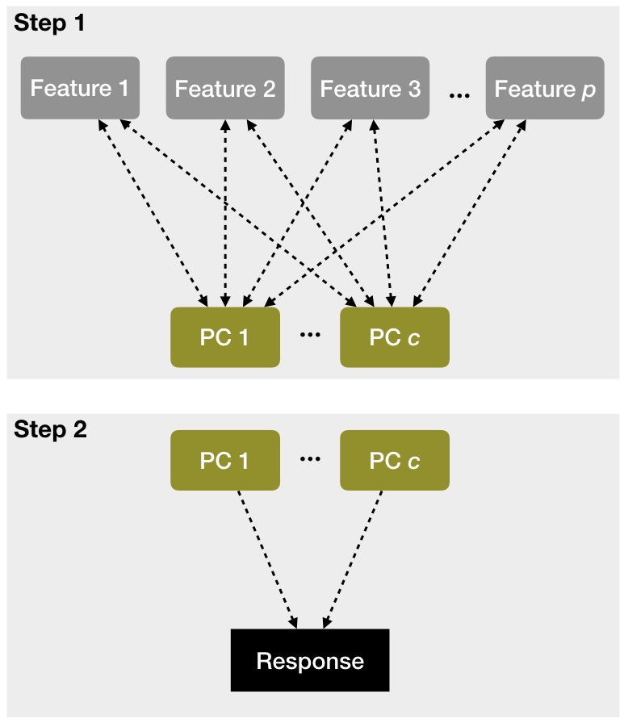
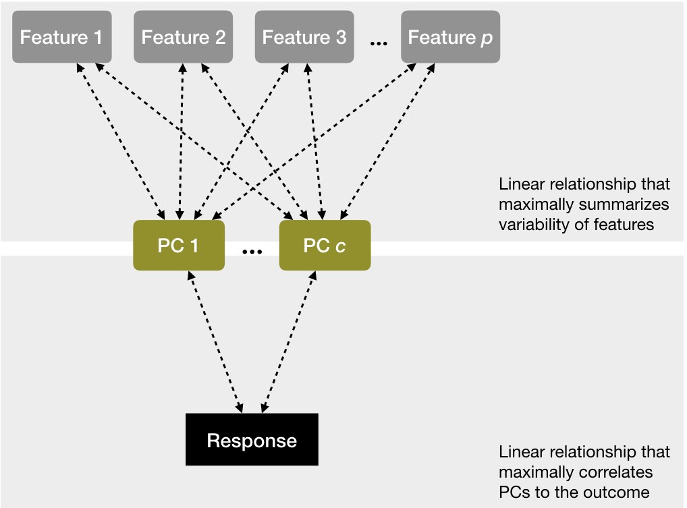

```{r setup, include=FALSE, cache=FALSE}
# Set global R options
options(htmltools.dir.version = FALSE, servr.daemon = TRUE)

# Set global knitr chunk options
knitr::opts_chunk$set(
  fig.align = "center", 
  cache = TRUE,
  error = FALSE,
  message = FALSE, 
  warning = FALSE, 
  collapse = TRUE 
)

library(tidyverse)
# set ggplot to black and white theme
library(ggplot2)
theme_set(theme_bw())
```

class: clear, center, middle

background-image: url(https://educationalresearchtechniques.files.wordpress.com/2014/08/1.jpg?w=624)
background-position: center
background-size: cover

<br><br><br><br><br><br><br><br><br><br><br><br><br>
.font200.bold[Regression & Cousins]

---
# Introduction

.pull-left[

.center.bold.font120[Thoughts]

- a fundamental analytic method
- still widely used
- basic approaches have large assumptions
- serves as a foundation to many extension methods

]

--

.pull-right[

.center.bold.font120[Overview]

- Ordinary Least Squares
- Principal Component Regression
- Partial Least Squares Regression
- Regularized Regression
- Multivariate Adaptive Regression Splines

]

---
# Prereqs

.pull-left[

.center.bold.font120[Packages]

```{r prereqs-pks}
library(dplyr)
library(ggplot2)
library(rsample)
library(recipes)
library(vip)
```


]

.pull-right[

.center.bold.font120[Data]

```{r prereqs-data}
# ames data
ames <- AmesHousing::make_ames()

# split data
set.seed(123)
split <- initial_split(ames, strata = "Sale_Price")
ames_train <- training(split)
```

]

---
class: center, middle, inverse

.font300.white[Ordinary Least Squares]

---
# The Objective

```{r, echo=FALSE, fig.height=5.5, fig.width=11}
lm(Sale_Price ~ Gr_Liv_Area, data = ames_train) %>%
  broom::augment() %>%
  ggplot(aes(Gr_Liv_Area, Sale_Price)) + 
  geom_segment(aes(x = Gr_Liv_Area, y = Sale_Price,
                   xend = Gr_Liv_Area, yend = .fitted), 
               alpha = 0.3) +
  geom_point(size = 2, alpha = 0.2) +
  geom_smooth(se = FALSE, method = "lm") +
  scale_y_continuous(labels = scales::dollar) +
  ggtitle("Fitted regression line (with residuals)")
```


* Model form: $y_i = \beta_0 + \beta_{1}x_{i1} + + \beta_{2}x_{i2} \cdots + \beta_{p}x_{ip} + \epsilon_i$

* Objective function: $\text{minimize} \bigg \{ SSE = \sum^n_{i=1} (y_i - \hat{y}_i)^2 \bigg \} \equiv \text{minimize MSE}$

---
# Simple linear regression

.pull-left.font120[

- .bold.blue[`lm()`] performs OLS in base R

- `glm()` also performs linear regression but extends to other generalized methods (i.e. logistic regression)

- `summary(model)` provides many results (i.e. "Residual Standard Error" is the RMSE)

- No method for resampling (i.e. cross validation) with `lm()`

]

.pull-right[
```{r}
model1 <- lm(Sale_Price ~ Gr_Liv_Area, data = ames_train)
summary(model1)
```
]

---
# Multiple linear regression

.pull-left[

```{r}
# OLS model with two predictors
model2 <- lm(Sale_Price ~ Gr_Liv_Area + Year_Built, data = ames_train)

# OLS model with specified interactions
model3 <- lm(Sale_Price ~ Gr_Liv_Area + Year_Built + Gr_Liv_Area : Year_Built, data = ames_train)

# include all possible main effects
model4 <- lm(Sale_Price ~ ., data = ames_train)
```


]

.pull-right[
```{r, echo=FALSE}
library(plotly)
library(reshape2)

# model
model2 <- lm(Sale_Price ~ Gr_Liv_Area + Year_Built, data = ames_train)

# Setup Axis
axis_x <- seq(min(ames_train$Gr_Liv_Area), max(ames_train$Gr_Liv_Area), by = 50)
axis_y <- seq(min(ames_train$Year_Built), max(ames_train$Year_Built), by = 10)

# Sample points
lm_surface <- expand.grid(Gr_Liv_Area = axis_x, Year_Built = axis_y, KEEP.OUT.ATTRS = F)
lm_surface$Sale_Price <- predict.lm(model2, newdata = lm_surface)
lm_surface <- acast(lm_surface, Year_Built ~ Gr_Liv_Area, value.var = "Sale_Price")

# plot
ames_plot <- plot_ly(ames_train,
                     x = ~ Gr_Liv_Area, 
                     y = ~ Year_Built, 
                     z = ~ Sale_Price,
                     type = "scatter3d", 
                     mode = "markers",
                     marker = list(
                       size = 5,
                       opacity = 0.25
                     ),
                     showlegend = F
                     )
# add surface
ames_plot <- add_trace(p = ames_plot,
                       z = lm_surface,
                       x = axis_x,
                       y = axis_y,
                       type = "surface")
ames_plot
```

]

---
# Assessing model accuracy

.pull-left[

We've fit four models to the Ames housing data: 

1. a single predictor, 
2. two predictors, 
3. two predictors with interaction,
4. and all possible main effect predictors. 

<br>

.center.bold.blue[Which model is "best"?]

]

---
# Assessing model accuracy

.scrollable90[
.pull-left[

We've fit four models to the Ames housing data: 

1. a single predictor, 
2. two predictors, 
3. two predictors with interaction,
4. and all possible main effect predictors. 

<br>

.center.bold.blue[Which model is "best"?]

]

.pull-right[

```{r}
# create a resampling method
cv <- trainControl(
  method = "repeatedcv", 
  number = 10, 
  repeats = 5
  )

# model 1 CV
set.seed(123)
(cv_model1 <- train(
  form = Sale_Price ~ Gr_Liv_Area, 
  data = ames_train, 
  method = "lm", #<<
  trControl = cv)
)
```

]
]

---
# Assessing model accuracy

.scrollable90[
.pull-left[

We've fit four models to the Ames housing data: 

1. a single predictor, 
2. two predictors, 
3. two predictors with interaction,
4. and all possible main effect predictors. 

<br>

.center.bold.blue[Model using most predictors is marginally superior]

]

.pull-right[

```{r}
# model 2 CV
set.seed(123)
cv_model2 <- train(
  Sale_Price ~ Gr_Liv_Area + Year_Built, 
  data = ames_train, 
  method = "lm",
  trControl = cv
  )

# model 3 CV
set.seed(123)
cv_model3 <- train(
  Sale_Price ~ Gr_Liv_Area + Year_Built + Gr_Liv_Area : Year_Built, 
  data = ames_train, 
  method = "lm",
  trControl = cv
  )

# model 4 CV
set.seed(123)
cv_model4 <- train(
  Sale_Price ~ ., 
  data = ames_train, 
  method = "lm",
  trControl = cv
  )

# Extract out of sample performance measures
summary(resamples(list(
  model1 = cv_model1, 
  model2 = cv_model2, 
  model3 = cv_model3,
  model4 = cv_model4
)))
```

]
]

---
# Model concerns

.pull-left[
1. .bold.red[Linear relationship]
2. Constant variance among residuals
3. No autocorrelation
4. More observations than predictors
5. No or little multicollinearity

<br>

.bold.center[<u>Sometimes</u> we can resolve this with transformations]

]

.pull-right[

```{r, echo=FALSE}
p1 <- ggplot(ames_train, aes(Year_Built, Sale_Price)) + 
  geom_point(size = 1, alpha = .4) +
  geom_smooth(se = FALSE) +
  scale_y_continuous("Sale price", labels = scales::dollar) +
  xlab("Year built") +
  ggtitle("Non-transformed variables with a \nnon-linear relationship.")

p2 <- ggplot(ames_train, aes(Year_Built, Sale_Price)) + 
  geom_point(size = 1, alpha = .4) + 
  geom_smooth(method = "lm", se = FALSE) +
  scale_y_log10("Sale price", labels = scales::dollar, breaks = seq(0, 400000, by = 100000)) +
  xlab("Year built") +
  ggtitle("Transforming variables can provide a \nnear-linear relationship.")

gridExtra::grid.arrange(p1, p2, nrow = 2)
```


]

---
# Model concerns

.pull-left[
1. Linear relationship
2. .bold.red[Constant variance among residuals]
3. No autocorrelation
4. More observations than predictors
5. No or little multicollinearity

<br>

.bold.center[<u>Sometimes</u> we can resolve this with transformations or adding more features]
]

.pull-right[

```{r, echo=FALSE}
df1 <- broom::augment(cv_model1$finalModel, data = ames_train)

p1 <- ggplot(df1, aes(.fitted, .resid)) + 
  geom_point(size = 1, alpha = .4) +
  xlab("Predicted values") +
  ylab("Residuals") +
  ggtitle("Model 1",
    subtitle = "Sale_Price ~ Gr_Liv_Area")

df2 <- broom::augment(cv_model3$finalModel, data = ames_train)

p2 <- ggplot(df2, aes(.fitted, .resid)) + 
  geom_point(size = 1, alpha = .4)  +
  xlab("Predicted values") +
  ylab("Residuals") +
  ggtitle("Model 3",
    subtitle = "Sale_Price ~ .")

gridExtra::grid.arrange(p1, p2, nrow = 2)
```

]

---
# Model concerns

.pull-left[
1. Linear relationship
2. Constant variance among residuals
3. .bold.red[No autocorrelation]
4. More observations than predictors
5. No or little multicollinearity

<br>

.bold.center[<u>Sometimes</u> we can resolve this by adding more features]
]

.pull-right[

```{r, echo=FALSE}
df1 <- mutate(df1, id = row_number())
df2 <- mutate(df2, id = row_number())

p1 <- ggplot(df1, aes(id, .resid)) + 
  geom_point(size = 1, alpha = .4) +
  xlab("Row ID") +
  ylab("Residuals") +
  ggtitle("Model 1",
    subtitle = "Correlated residuals.") +
  geom_smooth(se = FALSE, span = .2)

p2 <- ggplot(df2, aes(id, .resid)) + 
  geom_point(size = 1, alpha = .4) +
  xlab("Row ID") +
  ylab("Residuals") +
  ggtitle("Model 3",
    subtitle = "Uncorrelated residuals.") +
  geom_smooth(se = FALSE, span = .2)

gridExtra::grid.arrange(p1, p2, nrow = 2)
```

]

---
# Model concerns

.pull-left[
1. Linear relationship
2. Constant variance among residuals
3. No autocorrelation
4. .bold.red[More observations than predictors]
5. No or little multicollinearity

<br>

.bold.center[<u>Sometimes</u> we can resolve this with feature reduction techniques]
]

.pull-right[

```{r, echo=FALSE}
data.frame(
  y = sample(100000:400000, 5, replace = TRUE), 
  x1 = sample(1:10, 5, replace = TRUE),
  x2 = sample(1:10, 5, replace = TRUE),
  x3 = sample(1:10, 5, replace = TRUE),
  x4 = sample(1:10, 5, replace = TRUE),
  x5 = sample(1:10, 5, replace = TRUE),
  x6 = sample(1:10, 5, replace = TRUE),
  x7 = sample(1:10, 5, replace = TRUE),
  x8 = sample(1:10, 5, replace = TRUE),
  x9 = sample(1:10, 5, replace = TRUE),
  x10 = sample(1:10, 5, replace = TRUE)
  ) %>%
  knitr::kable() %>%
  kable_styling(bootstrap_options = "striped", full_width = TRUE)
```

.bold.center.red[Not invertible --> solutions are non-unique meaning there are many "right" solutions for our feature coefficients!]

]

---
# Model concerns

.pull-left[
1. Linear relationship
2. Constant variance among residuals
3. No autocorrelation
4. More observations than predictors
5. .bold.red[No or little multicollinearity]

<br>

.bold.center[<u>Sometimes</u> we can resolve this with feature reduction techniques]
]

.pull-right[

```{r multicollinearity}
m1 <- lm(Sale_Price ~ Gr_Liv_Area + TotRms_AbvGrd, data = ames_train)
m2 <- lm(Sale_Price ~ Gr_Liv_Area, data = ames_train)
m3 <- lm(Sale_Price ~ TotRms_AbvGrd, data = ames_train)

coef(m1) #<<
coef(m2) #<<
coef(m3) #<<
```

]

---
# Model concerns

.pull-left[
1. Linear relationship
2. Constant variance among residuals
3. No autocorrelation
4. More observations than predictors
5. No or little multicollinearity

]

.pull-right[

```{r so-complicated, echo=FALSE}
knitr::include_graphics("http://tinderdistrict.com/wp-content/uploads/2018/06/complicated.gif")
```

]

<br><br>

.bold.center[Many regression extensions have been developed to deal with these concerns.]

---
class: center, middle, inverse

.font300.white[Principal Component Regression]

---
# The idea

.pull-left[

PCR performs feature reduction to help minimize impact of:

- multicollinearity (becomes a bigger concern the more predictors we have)

- when $p >> n$

Steps:

1. Reduce *p* features to *c* PCs (not guided by the response)

2. Use PCs as predictors and perform regression as usual

]

.pull-right[

```{r pcr-steps, echo=FALSE, out.height="85%", out.width="85%"}

```

]

---
# Implementation

.pull-left[

```{r pcr}
# 1. hypergrid
hyper_grid <- expand.grid(ncomp = seq(2, 40, by = 2))

# 2. PCR
set.seed(123)
cv_pcr <- train(
  Sale_Price ~ ., 
  data = ames_train, 
  trControl = cv,
  method = "pcr", #<<
  preProcess = c("zv", "center", "scale"), #<<
  tuneGrid = hyper_grid, #<<
  metric = "RMSE"
  )

# model with lowest RMSE
cv_pcr$bestTune

cv_pcr$results %>%
  filter(ncomp == as.numeric(cv_pcr$bestTune))
```

]

.pull-right[
```{r pcr-plot-revised, fig.height=5}
# plot cross-validated RMSE
plot(cv_pcr)
```

.center.bold[Feature reduction with PCR improves prediction error by ~ $10K]

]

---
class: center, middle, inverse

.font300.white[Partial Least Squares Regression]

---
# The idea

.pull-left[

- A problem with PCR is that the PCs are developed independent of the response.

- PLS 
   - has similar intentions as PCR
   
   - finds PCs that maximize correlation with the response
   
   - typically results in a stronger signal between PCs and response

]

.pull-right[

```{r pls-steps, echo=FALSE, out.height="95%", out.width="95%"}

```

]

---
# Implementation

.pull-left[

```{r pls}
# PLS
set.seed(123)
cv_pls <- train(
  Sale_Price ~ ., 
  data = ames_train, 
  trControl = cv,
  method = "pls", #<<
  preProcess = c("zv", "center", "scale"),
  tuneGrid = hyper_grid,
  metric = "RMSE"
  )

# model with lowest RMSE
cv_pls$bestTune

cv_pls$results %>%
  filter(ncomp == as.numeric(cv_pls$bestTune))
```

]

.pull-right[
```{r pls-plot, fig.height=5}
# plot cross-validated RMSE
plot(cv_pls)
```

.center.bold[Using PLS improves prediction error by an additional $1300]

]

---
class: center, middle, inverse

.font300.white[Regularized Regression]


---
class: center, middle, inverse

.font300.white[Multivariate Adaptive Regression Splines]

---
# Questions?

```{r unsupervised-questions, echo=FALSE, out.height="80%", out.width="80%"}
knitr::include_graphics("https://66.media.tumblr.com/tumblr_lra006KFZc1qk976yo1_500.gif")
```

---
# Back home

<br><br><br><br>
[.center[`r anicon::faa("home", size = 10, animate = FALSE)`]](https://github.com/uc-r/Advanced-R)

.center[https://github.com/uc-r/Advanced-R]
