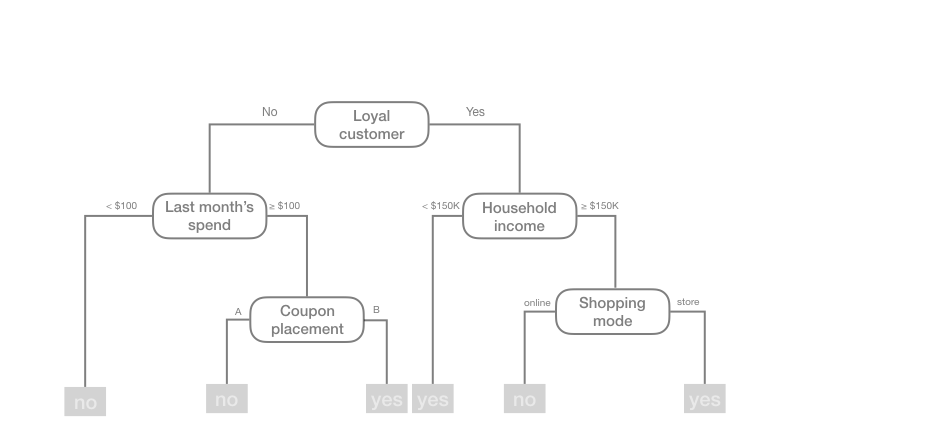
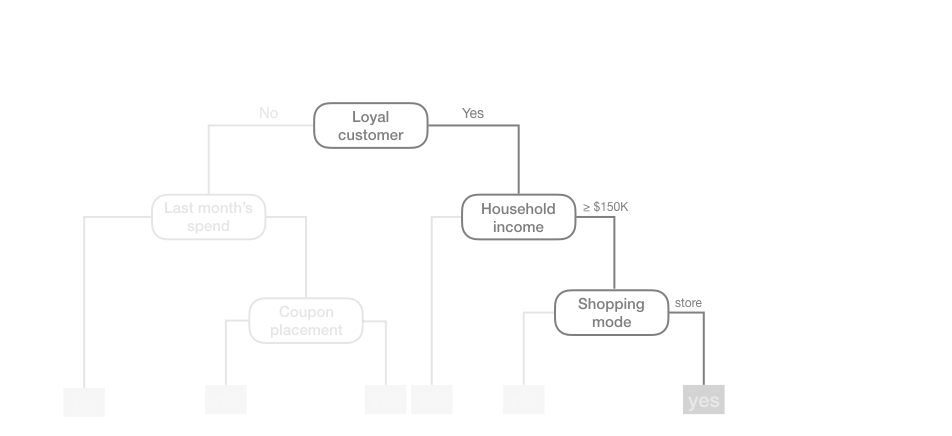
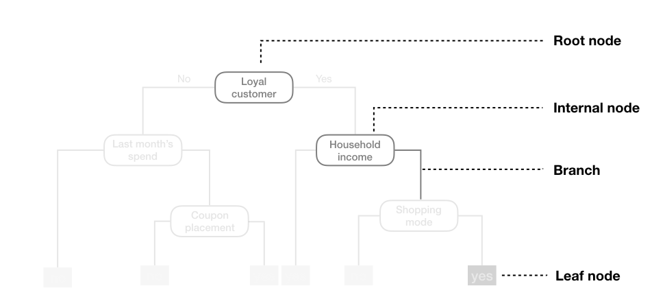
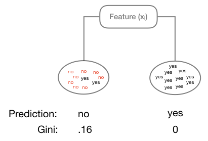
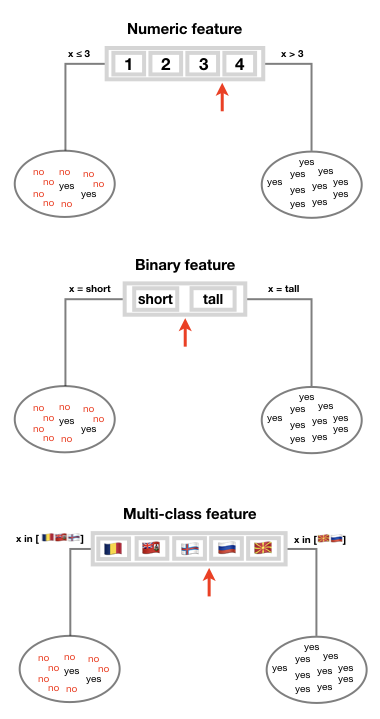
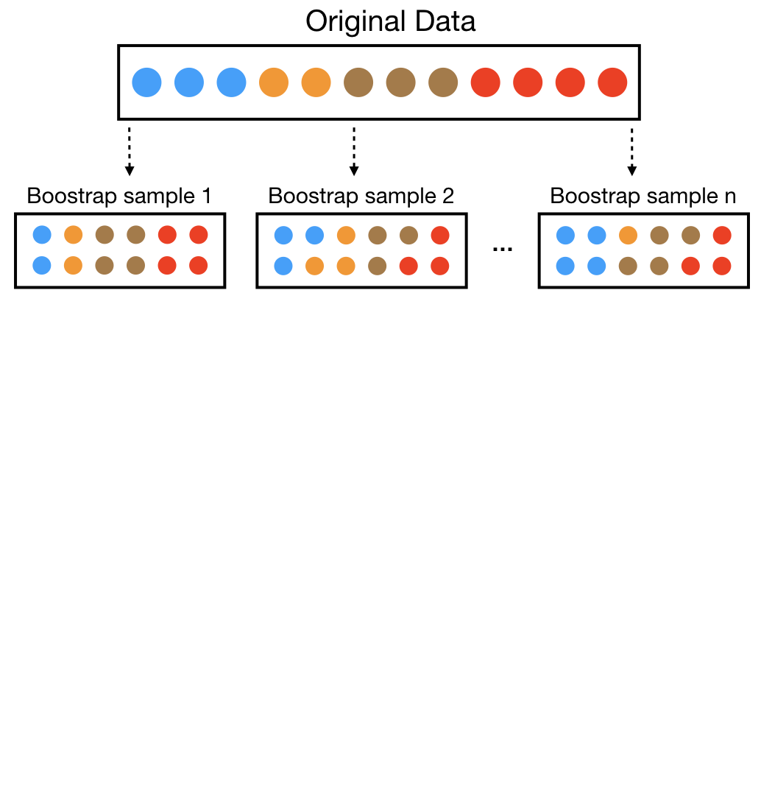
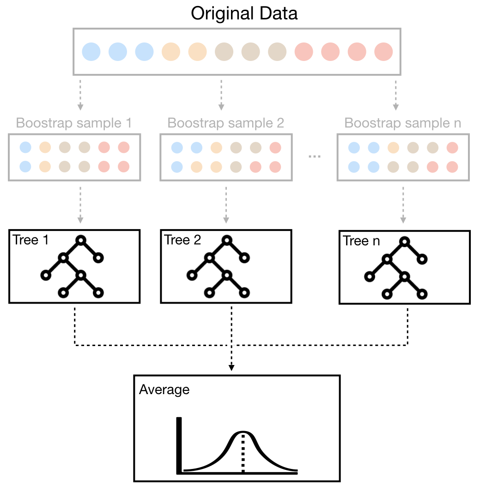
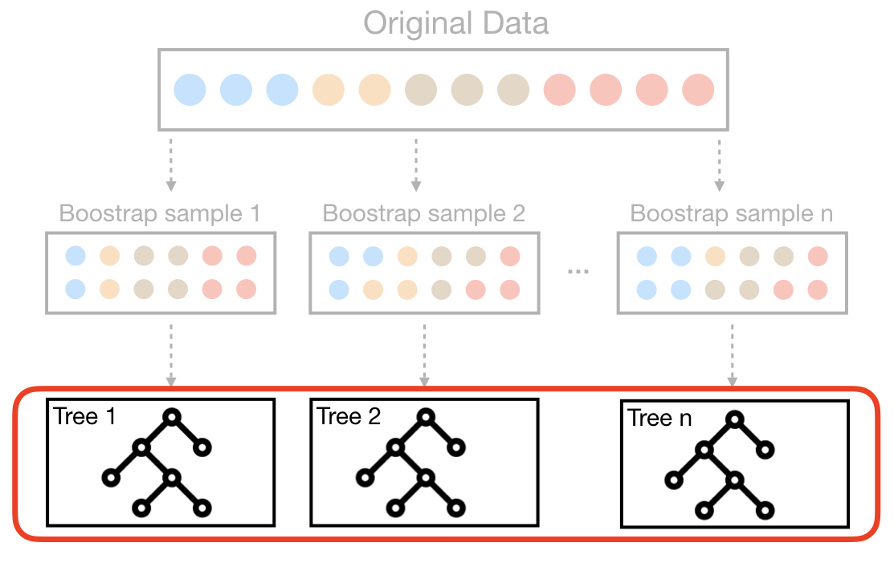
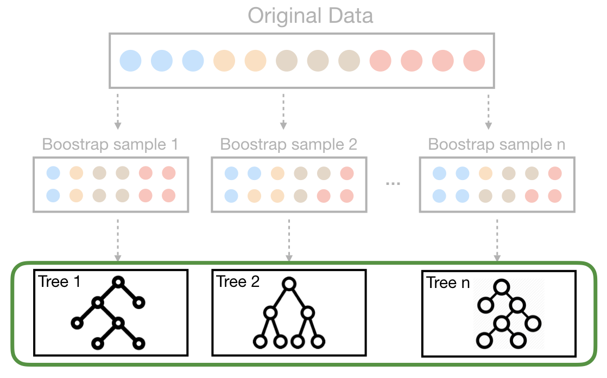
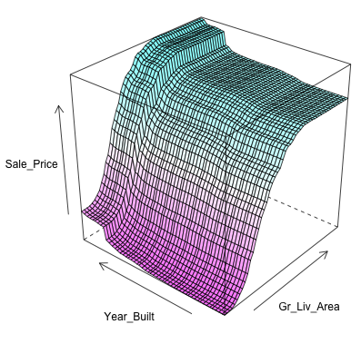

```{r setup, include=FALSE, cache=FALSE}
# Set global R options
options(htmltools.dir.version = FALSE, servr.daemon = TRUE)

# Set global knitr chunk options
knitr::opts_chunk$set(
  fig.align = "center", 
  cache = TRUE,
  error = FALSE,
  message = FALSE, 
  warning = FALSE, 
  collapse = TRUE 
)

library(tidyverse)
library(gganimate)
library(MASS)
library(randomForest)
library(ranger)
# set ggplot to black and white theme
library(ggplot2)
theme_set(theme_bw())
```

class: clear, center, middle

background-image: url(images/rf-icon.jpg)
background-position: center
background-size: cover

<br><br><br>
.font300.white[Decision Trees, Bagging, <br>& Random Forests]

---
# Introduction

.pull-left[

.center.bold.font120[Thoughts]

Random forests are an ensemble method that:

* provide competitive accuracy

* provide good _out-of-the-box_ performance

* capture non-linear, non-monotonic relationships

* automatically capture interactions

* easy to tune (relatively speaking)

* require minimal, if any, pre-processing

]

--

.pull-right[

.center.bold.font120[Overview]

* Provide solid understanding of:
   1. decision trees
   2. bagging
   3. random forests
   
* Apply a random forest model   

]

---
class: clear, center, middle

background-image: url(images/single-tree.gif)
background-size: cover

.font300.white[Decision Trees]

???

Image credit: [giphy](https://giphy.com/gifs/tree-U85Z0lxOwDoys?utm_source=media-link&utm_medium=landing&utm_campaign=Media%20Links&utm_term=)

---

# Basic Idea


```{r, echo=FALSE, out.height='90%', out.width='90%'}

```

.center[.content-box-gray[.bold[Will a customer redeem a coupon]]]

---

# A .red[ruleset] model

```{r, echo=FALSE, out.height='90%', out.width='90%'}

```

.font90[`if Loyal Customer = Yes and Household income >= $150K and Shopping mode = store then coupon redemption = Yes`]


---

# Terminology

```{r, echo=FALSE, out.height='90%', out.width='90%'}

```

---

# Growing the tree

.pull-left[

### Algorithms

- ID3 (Iterative Dichotomiser 3)
- C4.5 (successor of ID3)
- CART (Classification And Regression Tree)
- CHAID (CHi-squared Automatic Interaction Detector)
- MARS: (Multivariate Adaptive Regression Splines)
- Conditional Inference Trees
- and more...

]

---

# Growing the tree

.pull-left[

### Algorithms

- ID3 (Iterative Dichotomiser 3)
- C4.5 (successor of ID3)
- .bold.blue[CART (Classification And Regression Tree)]
- CHAID (CHi-squared Automatic Interaction Detector)
- MARS: (Multivariate Adaptive Regression Splines)
- Conditional Inference Trees
- and more...

]

.pull-right[

### CART Features `r anicon::faa("shopping-cart", animate = 'passing', speed = 'slow')`

- Classification and regression trees
- Continuous and discrete features
- Partitioning
   - Greedy top-down
   - Strictly binary splits (tends to produce tall/deep trees)
   - Variance reduction in regression trees
   - Gini impurity in classification trees
- Cost complexity pruning 
- [`r anicon::aia("google-scholar", animate = 'tada', anitype="hover", rtext = "(Breiman, 1984)")`](https://www.taylorfrancis.com/books/9781351460491)

]

<br>
.center[.content-box-gray[.bold[Most common decision tree algorithm]]]

---

# Best .red[`r anicon::nia("Binary", animate = "pulse")`] Partitioning

.pull-left[

.center.font130.bold[Regression tree]

```{r, echo=FALSE, out.width="90%"}

```

]

.pull-right[

.center.font130.bold[Classification tree]

```{r, echo=FALSE, out.width="90%"}

```

]

<br>
.center[.content-box-gray[.bold[Objective: Minimize disimilarity in terminal nodes]]]


---

# Best .red[Binary] Partitioning


.pull-left[
<br>
- __Numeric feature__: Numeric split to minimize loss function
<br><br><br><br><br>
- __Binary feature__: Category split to minimize loss function
<br><br><br><br><br>
- __Multiclass feature__: Order feature classes based on mean target variable (regression) or class proportion (classification) and choose split to minimize loss function ([`r anicon::aia("google-scholar", animate = 'tada', anitype="hover", rtext = "See ESL, section 9.2.4 for details")`](https://web.stanford.edu/~hastie/ElemStatLearn/)).

]

.pull-right[

```{r, echo=FALSE, out.height="55%", out.width="55%"}

```

]

---

# How deep to grow a tree?

Say we have the given data generated from the underlying .blue["truth"] function

<br><br>

```{r, echo=FALSE, fig.width=10, fig.height=5}
set.seed(1112)  # for reproducibility
df <- tibble::tibble(
  x = seq(from = 0, to = 2 * pi, length = 500),
  y = sin(x) + rnorm(length(x), sd = 0.5),
  truth = sin(x)
)

library(rpart)
ctrl <- list(cp = 0, minbucket = 5, maxdepth = 1)
fit <- rpart(y ~ x, data = df, control = ctrl)

df %>%
  mutate(pred = predict(fit, df)) %>%
  ggplot(aes(x, y)) +
  geom_point(alpha = .3, size = 2) +
  geom_line(aes(x, y = truth), color = "blue", size = 1)
```


---

# Depth = 1 (decision .red[stump] `r anicon::cia("images/stump.png", animate = "pulse", anitype="hover")`)

.scrollable90[
.pull-left[

```{r, echo=FALSE, fig.width=6, fig.asp=0.3, out.width="100%"}
# fit single tree
library(rpart.plot)
par(mar=c(.5,.5,.5,.5))
rpart.plot(fit)

library(partykit)
as.party(fit)
```


]

.pull-right[

```{r, echo=FALSE, fig.height=6.5}
df %>%
  mutate(pred = predict(fit, df)) %>%
  ggplot(aes(x, y)) +
  geom_point(alpha = .3, size = 2) +
  geom_line(aes(x, y = truth), color = "blue", size = 1) +
  geom_line(aes(y = pred), color = "red", size = 1) +
  geom_segment(x = 3.1, xend = 3.1, y = -Inf, yend = -.75, lty = "dashed",
               arrow = arrow(length = unit(0.5,"cm"))) +
  annotate("text", x = 3.1, y = -Inf, label = "split", hjust = 1.2, vjust = -1)
```

]
]

---

# Depth = 3 `r anicon::cia("images/small-tree-icon.png", animate = "pulse", anitype="hover")`

.scrollable90[
.pull-left[

```{r, echo=FALSE, fig.width=6, fig.asp=0.6, out.width="100%"}
# fit single tree
ctrl <- list(cp = 0, minbucket = 5, maxdepth = 3)
fit <- rpart(y ~ x, data = df, control = ctrl)
rpart.plot(fit)
as.party(fit)
```


]

.pull-right[

```{r, echo=FALSE, fig.height=6.5}
df %>%
  mutate(pred = predict(fit, df)) %>%
  ggplot(aes(x, y)) +
  geom_point(alpha = .3, size = 2) +
  geom_line(aes(x, y = truth), color = "blue", size = 1) +
  geom_line(aes(y = pred), color = "red", size = 1)
```

]
]

---

# Depth = 20 (.red[complex tree]  `r anicon::cia("images/large-tree-icon.png", animate = "pulse", anitype="hover")`)

.scrollable90[
.pull-left[

```{r, echo=FALSE, fig.height=9, fig.asp=1, out.height="100%"}
# fit single tree
ctrl <- list(cp = 0, minbucket = 5, maxdepth = 20)
fit <- rpart(y ~ x, data = df, control = ctrl)
rpart.plot(fit)
```


]

.pull-right[

```{r, echo=FALSE, fig.height=6.5}
df %>%
  mutate(pred = predict(fit, df)) %>%
  ggplot(aes(x, y)) +
  geom_point(alpha = .3, size = 2) +
  geom_line(aes(x, y = truth), color = "blue", size = 1) +
  geom_line(aes(y = pred), color = "red", size = 1)
```

]
]

---

# .red[Two Predictor] Decision Boundaries

.pull-left[

### Classification problem: Iris data

```{r, echo = FALSE, fig.height=5}
ggplot(iris, aes(Sepal.Length, Sepal.Width, color = Species)) +
  geom_point()
```

]


---

# .red[Two Predictor] Decision Boundaries

.pull-left[

### Classification problem: Iris data

```{r, echo = FALSE, fig.height=5}
ggplot(iris, aes(Sepal.Length, Sepal.Width, color = Species, shape = Species)) +
  geom_point() +
  annotate("rect", xmin = -Inf, xmax = 5.44, ymin = 2.8, ymax = Inf, alpha = .75, fill = "orange") +
  annotate("text", x = 4.0, y = 4.4, label = "setosa", hjust = 0) +
  annotate("rect", xmin = -Inf, xmax = 5.44, ymin = 2.79, ymax = -Inf, alpha = .75, fill = "grey") +
  annotate("text", x = 4.0, y = 2, label = "versicolor", hjust = 0) +
  annotate("rect", xmin = 5.45, xmax = 6.15, ymin = 3.1, ymax = Inf, alpha = .75, fill = "orange") +
  annotate("text", x = 6, y = 4.4, label = "setosa", hjust = 1, vjust = 0) +
  annotate("rect", xmin = 5.45, xmax = 6.15, ymin = 3.09, ymax = -Inf, alpha = .75, fill = "grey") +
  annotate("text", x = 6, y = 2, label = "versicolor", hjust = 1, vjust = 0, fill = "grey") +
  annotate("rect", xmin = 6.16, xmax = Inf, ymin = -Inf, ymax = Inf, alpha = .75, fill = "green") +
  annotate("text", x = 8, y = 2, label = "virginica", hjust = 1, vjust = 0, fill = "green")
```

]

.pull-right[

### Classification tree

```{r, fig.height=5, fig.asp=.7, out.height="100%", echo=FALSE}
iris_fit <- rpart(Species ~ Sepal.Length + Sepal.Width, data = iris)
rpart.plot(iris_fit)
```

]

---

# Minimize overfitting

.pull-left[

.font110[Must balance the depth and complexity of the tree to .bold[generalize] to unseen data]

2 main options:

* Early stopping 
   * Restrict tree depth
   * Restrict node size

* Pruning

]

.pull-right[

```{r, echo=FALSE, fig.height=6}
ctrl <- list(cp = 0, minbucket = 1, maxdepth = 50)
fit <- rpart(y ~ x, data = df, control = ctrl)

df %>%
  mutate(pred = predict(fit, df)) %>%
  ggplot(aes(x, y)) +
  geom_point(alpha = .3, size = 2) +
  geom_line(aes(x, y = truth), color = "blue", size = 1) +
  geom_line(aes(y = pred), color = "red", size = 1)
```

.center[.content-box-gray[.bold[Trees have a tendency to overfit]]]

]

---

# Minimize overfitting: Early stopping `r anicon::faa("stop-circle", animate = 'tada', anitype="hover", colour = "red")`

.pull-left[

.blue[Limit tree depth]: Stop splitting after a certain depth

```{r maxdepth, echo=FALSE, fig.height=5}
maxdepth <- 1:15
results <- data.frame(NULL)

for(i in maxdepth) {
 ctrl <- list(cp = 0, maxdepth = i)
 fit <- rpart(y ~ x, data = df, control = ctrl) 
 
 predictions <- mutate(df, maxdepth = maxdepth[i])
 predictions$pred <- predict(fit, df)
 results <- rbind(results, predictions)
   
}

p <- results %>%
  mutate(
    truth = sin(x),
    
    ) %>%
  ggplot(aes(x, pred)) +
  geom_point(aes(x, y), alpha = .3, size = 2) +
  geom_line(aes(x, y = truth), color = "blue", size = 1) +
  geom_line(color = "red", size = 1) +
  labs(title = 'Max depth of tree: {frame_time}') +
  transition_time(-maxdepth)
animate(p, renderer = gifski_renderer(), device = "png")
```

]

--

.pull-right[

.blue[Minimum node “size”]: Do not split intermediate node which contains too few data points

```{r minbucket, echo=FALSE, fig.height=5}
minbucket <- 1:15
results <- data.frame(NULL)

for(i in minbucket) {
 ctrl <- list(cp = 0, minbucket = i)
 fit <- rpart(y ~ x, data = df, control = ctrl) 
 
 predictions <- mutate(df, minbucket = minbucket[i])
 predictions$pred <- predict(fit, df)
 results <- rbind(results, predictions)
   
}

p <- ggplot(results, aes(x, pred)) +
  geom_point(data = results, aes(x, y), alpha = .3, size = 2) +
  geom_line(data = results, aes(x, y = truth), color = "blue", size = 1) +
  geom_line(color = "red", size = 1) +
  labs(title = 'Minimum number of obs in each terminal node: {frame_time}') +
  transition_time(minbucket)
animate(p, renderer = gifski_renderer(), device = "png")
```


]


---

# Minimize overfitting: Pruning `r anicon::faa("cut", animate = 'tada', anitype="hover", colour = "red")`

.pull-left[

1. .font120[Grow a very large tree]


]

.pull-right[

```{r, echo=FALSE, fig.height=6}
ctrl <- list(cp = 0, minbucket = 1, maxdepth = 50)
fit <- rpart(y ~ x, data = df, control = ctrl)

df %>%
  mutate(pred = predict(fit, df)) %>%
  ggplot(aes(x, y)) +
  geom_point(alpha = .3, size = 2) +
  geom_line(aes(x, y = truth), color = "blue", size = 1) +
  geom_line(aes(y = pred), color = "red", size = 1)
```

.center[.content-box-gray[.bold[Deep trees overfit]]]

]

---

# Minimize overfitting: Pruning `r anicon::faa("cut", animate = 'tada', anitype="hover", colour = "red")`

.pull-left[

1. Grow a very large tree

2. Prune it back with a _.red[cost complexity parameter]_ ( $\alpha$ ) $\times$ number of terminal nodes ( $T$ ) to find an optimal subtree:
  - Very similar to lasso penalty in regularized regression
  - Large $\alpha =$ small tree
  - Small $\alpha =$ large tree
  - Find optimal $\alpha$ with cross validation

$$ \text{minimize: loss function} + \alpha |T|  $$

]

.pull-right[

```{r, echo=FALSE, fig.height=6}
ctrl <- list(cp = 0, minbucket = 1, maxdepth = 50)
fit <- rpart(y ~ x, data = df, control = ctrl)

fit2 <- rpart(y ~ x, data = df)

df %>%
  mutate(
    pred = predict(fit, df),
    pred2 = predict(fit2, df)
    ) %>%
  ggplot(aes(x, y)) +
  geom_point(alpha = .3, size = 2) +
  geom_line(aes(x, y = truth), color = "blue", size = 1) +
  geom_line(aes(y = pred), color = "red", size = 1, alpha = .5) +
  geom_line(aes(y = pred2), color = "firebrick", size = 2)
```

.center[.content-box-gray[.bold[Penalize depth to generalize]]]

]

---

# Feature/Target Pre-processing Considerations

<br>

* __Monotonic transformations__ (i.e. log, exp, sqrt): .blue[Not required] to meet algorithm assumptions as in many parametric models; only shifts the optimal split points. 

* __Removing outliers__: .blue[unnecessary] as the emphasis is on a single binary split and outliers are not going to bias that split.

* __One-hot encoding__: .blue[unncessary] and actually forces artificial relationships between categorical levels.  Also, by increasing $p$, we reduce the probability that influential levels and variable interactions will be identified.

* __Missing values__: .blue[unnecessary] as most algorithms will 1) create new "missing" class for categorical variables, 2) auto-impute for continuous variables, or 3) use *surrogate* splits

---

# Variable importance 

Once we have a final model, we can find the most .red[influential variables] based on those that have the .red[largest reduction] in our loss function:

.pull-left[

```{r, fig.height=5, fig.asp=.7, out.height="100%", echo=FALSE}
ctrl <- list(cp = 0.01)
fit <- rpart(medv ~ ., data = Boston, control = ctrl)
rpart.plot(fit)
```

]

.pull-right[

```{r, echo=FALSE}
vip::vi(fit) %>%
  as.data.frame()
```

]

---

# Variable importance 

Once we have a final model, we can find the most .red[influential variables] based on those that have the .red[largest reduction] in our loss function:

.pull-left[

```{r, fig.height=5, fig.asp=.7, out.height="100%", echo=FALSE}
rpart.plot(fit)
```

]

.pull-right[

```{r, echo=FALSE, fig.height=6}
vip::vip(fit)
```

]

---

# Strengths & Weaknesses 

.pull-left[

### Strengths `r anicon::cia("https://emojis.slackmojis.com/emojis/images/1471045870/910/rock.gif?1471045870", animate = FALSE, size = 1)`

- .green[Small trees are easy to interpret]

- .green[Trees scale well to large _N_] (fast!!)

- .green[Can handle data of all types] (i.e., requires little, if any, preprocessing)

- .green[Automatic variable selection]

- .green[Can handle missing data]

- .green[Completely nonparametric]

]

--

.pull-right[

### Weaknesses `r anicon::cia("https://emojis.slackmojis.com/emojis/images/1471045885/967/wtf.gif?1471045885", animate = FALSE, size = 1.25)`

- .red[Large trees can be difficult to interpret]

- .red[All splits depend on previous splits] (i.e. capturing interactions `r anicon::faa("thumbs-up", animate = FALSE, colour = "green")`; additive models `r anicon::faa("thumbs-down", animate = FALSE, colour = "red")`)

- .red[Trees are step functions] (i.e., binary splits)

- .red[Single trees typically have poor predictive accuracy]

- .red[Single trees have high variance] (easy to overfit to training data)

]

---
class: clear, center, middle

background-image: url(images/bagging-icon.jpg)
background-size: cover

.font300.white[Bagging]

???

Image credit: [unsplash](https://unsplash.com/photos/19SC2oaVZW0)

---

# The problem with single trees

.pull-left[

.center[.font120[.bold[Single pruned trees are poor predictors]]]

```{r, echo=FALSE, fig.height=5.5}
fit <- rpart(y ~ x, data = df)

df %>%
  mutate(pred = predict(fit, df)) %>%
  ggplot(aes(x, y)) +
  geom_point(alpha = .3, size = 2) +
  geom_line(aes(x, y = truth), color = "blue", size = 1) +
  geom_line(aes(y = pred), color = "red", size = 1)
```

]

.pull-right[

.center[.font120[.bold[Single deep trees are noisy]]]

```{r, echo=FALSE, fig.height=5.5}
ctrl <- list(cp = 0, maxdepth = 100, minbucket = 2)
fit <- rpart(y ~ x, data = df, control = ctrl)

df %>%
  mutate(pred = predict(fit, df)) %>%
  ggplot(aes(x, y)) +
  geom_point(alpha = .3, size = 2) +
  geom_line(aes(x, y = truth), color = "blue", size = 1) +
  geom_line(aes(y = pred), color = "red", size = 1)
```

]

.center[.content-box-gray[Bagging uses this high variance to our advantage `r anicon::faa("arrow-up", animate = FALSE, colour = "red")`]]

---

# .red[B]ootstrap .red[Agg]regat.red[ing]: wisdom of the crowd

.pull-left[

1. Sample records with replacement (aka "bootstrap" the training data)

2. .white[Fit an overgrown tree to the resampled data set]

3. .white[Average predictions]

]

.pull-right[

```{r, echo=FALSE}

```


]

---

# .red[B]ootstrap .red[Agg]regat.red[ing]: wisdom of the crowd

.pull-left[

1. .opacity[.grey[Sample records with replacement (aka "bootstrap" the training data)]]

2. Fit an `r anicon::nia("overgrown", animate = "pulse")` tree to each resampled data set

3. .white[Average predictions]

]

.pull-right[

```{r, echo=FALSE}
knitr::include_graphics("images/bagging-fig2.png")
```

]

---

# .red[B]ootstrap .red[Agg]regat.red[ing]: wisdom of the crowd

.pull-left[

1. .opacity[.grey[Sample records with replacement (aka "bootstrap" the training data)]]

2. Fit an `r anicon::nia("overgrown", animate = "pulse")` tree to each resampled data set

3. .white[Average predictions]

]

.pull-right[

```{r, echo=FALSE, fig.height=7.5}
# Simulate some sine wave data
set.seed(1112)  # for reproducibility
x <- seq(from = 0, to = 2 * pi, length = 1000)
y <- sin(x) + rnorm(length(x), sd = 0.5)
df <- data.frame(x, y)

bootstrap_n <- 25
bootstrap_results <- NULL
ctrl <- list(cp = 0, minbucket = 5, maxdepth = 30)

for(i in seq_len(bootstrap_n)) {
  # reproducible sampled data frames
  set.seed(i)
  index <- sample(seq_len(nrow(df)), nrow(df), replace = TRUE)
  df_sim <- df[index, ]
  
  # fit model and add predictions to results data frame
  fit <- rpart(y ~ x, data = df_sim, control = ctrl)
  df_sim$predictions <- predict(fit, df_sim)
  df_sim$tree <- ifelse(i < 10, paste0("Tree 0", i), paste("Tree", i))
  df_sim$ob <- index
  bootstrap_results <- rbind(bootstrap_results, df_sim)
   
}

ggplot(bootstrap_results, aes(x, predictions)) +
  geom_point(data = df, aes(x, y), alpha = .1, size = 2) +
  geom_line(data = df, aes(x, y = sin(x)), color = "blue", size = 1) +
  geom_line(color = "red") +
  facet_wrap(~ tree)
```

]

---

# .red[B]ootstrap .red[Agg]regat.red[ing]: wisdom of the crowd

.pull-left[

1. .opacity[.grey[Sample records with replacement (aka "bootstrap" the training data)]]

2. .opacity[.grey[Fit an overgrown tree to each resampled data set]]

3. Average predictions

]

.pull-right[

```{r, echo=FALSE}

```

]

---

# .red[B]ootstrap .red[Agg]regat.red[ing]: wisdom of the crowd

.pull-left[

.font120.bold[As we add more trees...]

```{r, echo=FALSE, fig.height=4.5}

bootstrap_n <- 100
bootstrap_results <- NULL
ctrl <- list(cp = 0, minbucket = 5, maxdepth = 30)

for(i in seq_len(bootstrap_n)) {
  # reproducible sampled data frames
  set.seed(i)
  index <- sample(seq_len(nrow(df)), nrow(df), replace = TRUE)
  df_sim <- df[index, ]
  
  # fit model and add predictions to results data frame
  fit <- rpart(y ~ x, data = df_sim, control = ctrl)
  df_sim$predictions <- predict(fit, df_sim)
  df_sim$tree <- i
  df_sim$ob <- index
  bootstrap_results <- rbind(bootstrap_results, df_sim)
   
}

p <- ggplot(bootstrap_results, aes(x, predictions)) +
  geom_point(data = df, aes(x, y), alpha = .1, size = 2) +
  geom_line(data = df, aes(x, y = sin(x)), color = "blue", size = 1) +
  geom_line(aes(group = tree), color = "red", size = 1, alpha = .1) +
  transition_reveal(id = tree, along = tree)
animate(p, renderer = gifski_renderer(), device = "png")
```


]

.pull-right[

.font120.bold[our average prediction error reduces]

```{r, echo=FALSE, fig.height=4.5}
# assess 10-100 bagged trees
ntree <- 10:100

# create output shell to illustrate reduced error with each additional tree
rmse <- vector(mode = "numeric", length = length(ntree))
tree <- vector(mode = "numeric", length = length(ntree))
results_error <- data.frame(rmse, tree)

for (i in seq_along(ntree)) {
  # reproducibility
  set.seed(123)
  
  # perform bagged model
  model <- ipred::bagging(
  formula = y ~ .,
  data    = df,
  coob    = TRUE,
  nbagg   = ntree[i]
)
  # get OOB error
  results_error$rmse[i] <- model$err
  results_error$tree[i] <- ntree[i]

}

# compute average
p <- ggplot(results_error, aes(tree, rmse)) +
  geom_line(color = "red", size = 1) +
  transition_reveal(id = 1, along = tree)
animate(p, renderer = gifski_renderer(), device = "png")
```


]

.center[.content-box-gray[.bold[Wisdom of the crowd in action]]]

---

# However, a .red[problem remains] 

.bold[Bagging results in tree correlation...]

```{r, echo=FALSE, out.width="70%"}
knitr::include_graphics("images/tree-correlation-1.png")
```

.center[.content-box-gray[.bold[which prevents bagging from optimally reducing variance of the predictive values]] `r anicon::cia("https://emojis.slackmojis.com/emojis/images/1471045851/836/headbang.gif?1471045851", animate = FALSE, size = 3)`]

---
class: clear, center, middle

background-image: url(images/rf-icon2.jpg)
background-size: cover

.font300.white[Random Forests]

???

Image credit: [unsplash](https://unsplash.com/photos/5KvErlbdeyo)

---

# Idea

.pull-left[

### Split-variable randomization

* .font120[Follow a similar bagging process but... ]

]

.pull-right[

```{r, echo=FALSE}

```

.center[.content-box-gray[.bold[Bagging produces many correlated trees]]]

]

---
# Idea

.pull-left[

### Split-variable randomization

* Follow a similar bagging process but...

* each time a split is to be performed, the search for the split variable is .blue[limited to a random subset of *m* of the *p* variables]
   - regression trees: $m = \frac{p}{3}$
   - classification trees: $m = \sqrt{p}$ 
   - $m$ is commonly referred to as .blue[___mtry___] .white[

* Bagging introduces randomness into the rows of the data

* Random forest introduces randomness into the rows and columns of the data
]
]

.pull-right[

```{r, echo=FALSE}

```

.center[.content-box-gray[.bold[Random Forests produce many unique trees]]]

]

---

# Bagging vs Random Forest

.pull-left[
.opacity[
### Split-variable randomization

* Follow a similar bagging process but...

* each time a split is to be performed, the search for the split variable is limited to a random subset of *m* of the *p* variables
]

* Bagging introduces .red[randomness into the rows] of the data

* Random forest introduces .red[randomness into the rows and columns] of the data

]

.pull-right[

```{r, echo=FALSE, fig.height=5, fig.width=8}
data(spam, package = "kernlab")
split <- rsample::initial_split(spam)
train <- rsample::training(split)
test <- rsample::testing(split)

# fit bagging model
set.seed(8451)  # reproducibility
spam_bag <- randomForest(
  type ~ ., 
  data = train, 
  ntree = 1000,
  mtry = ncol(train)-1,  
  xtest = subset(test, select = -type),
  ytest = test$type,
  keep.forest = TRUE
)

# fit random forest model
set.seed(8451)  # reproducibility
spam_rf <- randomForest(
  type ~ ., 
  data = train, 
  ntree = 1000,
  mtry = floor(sqrt(ncol(train))),
  xtest = subset(test, select = -type),
  ytest = test$type,
  keep.forest = TRUE
)

bag_df <- data.frame(
  model = "Bagging",
  trees = 1:length(spam_bag$err.rate[,"OOB"]),
  error = spam_bag$err.rate[,"OOB"]
)

rf_df <- data.frame(
  model = "Random Forest",
  trees = 1:length(spam_rf$err.rate[,"OOB"]),
  error = spam_rf$err.rate[,"OOB"]
)

p <- rbind(bag_df, rf_df) %>%
  ggplot(aes(trees, error, color = model)) +
  geom_line() +
  theme(
    legend.title = element_blank(),
    legend.position = c(0.9, 0.9)
    ) +
  transition_reveal(id = model, along = trees)
animate(p, renderer = gifski_renderer(), device = "png")
```

]

.center[.bold[.green[Combined, this provides a more diverse set of trees that almost always lowers our prediction error.]]]

---

# Out-of-bag `r anicon::faa("shopping-bag", colour = "red", animate = "pulse", anitype="hover")`

.pull-left[
.font80[

* For large enough N, on average, 63.21% or the original records end up in any bootstrap sample

* Roughly 36.79% of the observations are not used in the construction of a particular tree

* These observations are considered .red[out-of-bag (OOB)] and can be used for efficient assessment of model performance (.bold[unstructured, but free, cross-validation])]

.font90[.blue[Pro tip:
   - When N is small, OOB is less reliable than validation
   - As N increases, OOB is far more efficient than *k*-fold CV
   - When the number of trees are about 3x the number needed for the random forest to stabilize, the OOB error estimate is equivalent to leave-one-out cross-validation error.
   
]
]
]

.pull-right[


```{r, echo=FALSE, fig.height=4.5}
oob_df <- data.frame(
  model = "OOB",
  trees = 1:length(spam_rf$err.rate[, 'OOB']),
  error = spam_rf$err.rate[, 'OOB']
)

test_df <- data.frame(
  model = "Test",
  trees = 1:length(spam_rf$test$err.rate[, 'Test']),
  error = spam_rf$test$err.rate[, 'Test']
)

p <- rbind(oob_df, test_df) %>%
  ggplot(aes(trees, error, color = model)) +
  geom_line() +
  theme(
    legend.title = element_blank(),
    legend.position = c(0.9, 0.9)
    ) +
  transition_reveal(id = model, along = trees)
animate(p, renderer = gifski_renderer(), device = "png")
```


]

---

# Tuning `r anicon::faa("cog", animate = 'spin', speed = 'slow', colour = "red")`

Random forests provide good "out-of-the-`r anicon::faa("box-open", animate = "pulse", anitype="hover")`" performance but there are a few parameters we can tune to increase performance.

--

.pull-left[

- .blue[Number of trees]

- .blue[mtry]

- .grey[Node size]

- .grey[Sampling scheme]

- .green[Split rule]

]

.pull-right[

- .blue[Typically have the largest impact on predictive accuracy.] <br>

- .grey[Tend to have marginal impact on predictive accuracy but still worth exploring. Can also increase computational efficiency.] <br>

- .green[Generally used to increase computational efficiency]

]

---

# Tuning `r anicon::faa("cog", animate = 'spin', speed = 'slow', colour = "red")`

Random forests provide good "out-of-the-`r anicon::faa("box-open", animate = "pulse", anitype="hover")`" performance but there are a few parameters we can tune to increase performance.

.font90[
.pull-left[

- .blue.bold[Number of trees] $^a$ 

   - .bold[Why]: stabalize the error
   - .bold[Rule of thumb]: start with $p \times 10$ trees and adjust as necessary
   - .bold[Caveats]:
       - small mtry and sample size values and/or larger node size values result in less correlated trees; therefore requiring more trees to converge.
       - more trees provide more robust/stable error & variable importance measures
   - .bold[Impact on computation time]: increases linearly with the number of trees

]
]

.pull-right[

```{r tuning-trees, echo=FALSE, fig.height=5}
set.seed(8451)
ames_split <- initial_split(AmesHousing::make_ames(), prop = .7, strata = "Sale_Price")
ames_train <- training(ames_split)
ames_test  <- testing(ames_split)

# number of features
n_features <- ncol(ames_train) - 1

# tuning grid
tuning_grid <- expand.grid(
  trees = seq(10, 1000, by = 20),
  rmse  = NA
)

for(i in seq_len(nrow(tuning_grid))) {
  fit <- ranger(
  formula    = Sale_Price ~ ., 
  data       = ames_train, 
  num.trees  = tuning_grid$trees[i],
  mtry       = floor(n_features / 3),
  respect.unordered.factors = 'order',
  verbose    = FALSE,
  seed       = 123
  )
  
  tuning_grid$rmse[i] <- sqrt(fit$prediction.error)
  
}


ggplot(tuning_grid, aes(trees, rmse)) +
  geom_line(size = 1) +
  ggtitle("Model with 80 features",
          subtitle = "error converges at about 750 trees") +
  geom_vline(xintercept = 750, lty = "dashed")
```

]


.font70[ *a) Technically, the number of trees is not a real tuning parameter but it is important to have a sufficient number for the estimate to stabilize.*]

---

# Tuning `r anicon::faa("cog", animate = 'spin', speed = 'slow', colour = "red")`

Random forests provide good "out-of-the-`r anicon::faa("box-open", animate = "pulse", anitype="hover")`" performance but there are a few parameters we can tune to increase performance.

.font90[
.pull-left[

- .blue.bold[Mtry] 

   - .bold[Why]: balance low tree correlation and reasonable predictive strength
   - .bold[Rule of thumb]: 
      - Regression default: $\frac{p}{3}$ 
      - Classification default: $\sqrt{p}$
      - start with 5 values evenly spaced across the range from 2 to *p* (include the default)
   - .bold[Caveats]:
      - few relevant predictors: &nbsp;&nbsp; `r anicon::faa("arrow-up", animate = FALSE)` mtry  
      - many relevant predictors: `r anicon::faa("arrow-down", animate = FALSE)` mtry 
   - .bold[Impact on computation time]: increases approx linearly with higher mtry values.

]
]

.pull-right[

```{r tuning-mtry, echo=FALSE, fig.height=6}
tuning_grid <- expand.grid(
  trees = seq(10, 1000, by = 20),
  mtry  = floor(c(seq(2, 80, length.out = 5), 26)),
  rmse  = NA
)

for(i in seq_len(nrow(tuning_grid))) {
  fit <- ranger(
  formula    = Sale_Price ~ ., 
  data       = ames_train, 
  num.trees  = tuning_grid$trees[i],
  mtry       = tuning_grid$mtry[i],
  respect.unordered.factors = 'order',
  verbose    = FALSE,
  seed       = 123
  )
  
  tuning_grid$rmse[i] <- sqrt(fit$prediction.error)
  
}

labels <- tuning_grid %>%
  filter(trees == 990) %>%
  mutate(mtry = as.factor(mtry))

tuning_grid %>%
  mutate(mtry = as.factor(mtry)) %>%
  ggplot(aes(trees, rmse, color = mtry)) +
  geom_line(size = 1, show.legend = FALSE) +
  ggrepel::geom_text_repel(data = labels, aes(trees, rmse, label = mtry), nudge_x = 50, show.legend = FALSE) +
  ylab("RMSE") +
  ggtitle("Model with 80 features",
          subtitle = "An mtry value slightly lower (21) than the default (26) improves performance")
```


]

---

# Tuning `r anicon::faa("cog", animate = 'spin', speed = 'slow', colour = "red")`

Random forests provide good "out-of-the-`r anicon::faa("box-open", animate = "pulse", anitype="hover")`" performance but there are a few parameters we can tune to increase performance.

.font90[
.pull-left[

- .blue.bold[Node size] 

   - .bold[Why]: balance tree complexity 
   - .bold[Rule of thumb]: 
      - Regression default: 5 
      - Classification default: 1
      - start with 3 values (1, 5, 10)
   - .bold[Caveats]:
      - many noisy predictors: `r anicon::faa("arrow-up", animate = FALSE)` node size 
      - if higher mtry values are performing best, `r anicon::faa("arrow-up", animate = FALSE)` node size 
   - .bold[Impact on computation time]: increases approx exponentially with small node sizes.
      - for very large data sets: `r anicon::faa("arrow-up", animate = FALSE)` node size

]
]

.pull-right[


```{r tuning-node-size, echo=FALSE, fig.height=6}
tuning_grid <- expand.grid(
  min.node.size = 1:20,
  run_time  = NA,
  rmse = NA
)

for(i in seq_len(nrow(tuning_grid))) {
  fit_time <- system.time({
    fit <- ranger(
    formula    = Sale_Price ~ ., 
    data       = ames_train, 
    num.trees  = 1000,
    mtry       = 26,
    min.node.size = tuning_grid$min.node.size[i],
    respect.unordered.factors = 'order',
    verbose    = FALSE,
    seed       = 123
  )
  })
  
  tuning_grid$run_time[i] <- fit_time[[3]]
  tuning_grid$rmse[i] <- sqrt(fit$prediction.error)
  
}

min_node_size_plot <- tuning_grid %>% 
  mutate(
    error_first = first(rmse),
    runtime_first = first(run_time),
    `Error Growth` = (rmse / error_first) - 1,
    `Run Time Reduction` = (run_time / runtime_first) - 1
    ) %>%
  gather(metric, value, `Error Growth`:`Run Time Reduction`) %>%
  ggplot(aes(min.node.size, value)) +
  geom_smooth(size = 1, se = FALSE) +
  facet_wrap(~ metric, ncol = 1, scales = "free_y") +
  scale_y_continuous(NULL, labels = scales::percent) +
  ggtitle("Node size impact on performance and run time",
          subtitle = "Data dimensions: 2054 x 81")

min_node_size_plot
```

]

---

# Tuning `r anicon::faa("cog", animate = 'spin', speed = 'slow', colour = "red")`

Random forests provide good "out-of-the-`r anicon::faa("box-open", animate = "pulse", anitype="hover")`" performance but there are a few parameters we can tune to increase performance.
<br><br>

.font90[

- .blue.bold[.opacity20[Node size] / Required split size / Max number of nodes / Max depth] 

   - Alternative parameters exist that can control tree complexity; however, most preferred random forest packages (__ranger__, __H2O__) focus on node size.
   - See [`r anicon::aia("google-scholar", animate = 'tada', anitype="hover", rtext = "(Probst et al., 2018)")`](https://arxiv.org/pdf/1804.03515.pdf) for short discussion.
   
]

---

# Tuning `r anicon::faa("cog", animate = 'spin', speed = 'slow', colour = "red")`

Random forests provide good "out-of-the-`r anicon::faa("box-open", animate = "pulse", anitype="hover")`" performance but there are a few parameters we can tune to increase performance.

.font90[
.pull-left[

- .blue.bold[Sampling scheme] 

   - .bold[Why]: balance low tree correlation and reasonable predictive strength
   - .bold[Rule of thumb]: 
      - default value is 100% with replacement
      - assess 3-4 values ranging from 25%-100%
   - .bold[Caveats]:
      - if you have dominating features - `r anicon::faa("arrow-down", animate = FALSE)` sample size to minimize tree correlation
      - if you have many categorical features with varying number of levels - try sampling without replacement
   - .bold[Impact on computation time]: 
      - for very large data sets: `r anicon::faa("arrow-down", animate = FALSE)` sample size to decrease compute time 

]
]

.pull-right[

```{r tuning-sampling-scheme, echo=FALSE, fig.height=6}
tuning_grid <- expand.grid(
  sample.fraction = seq(.05, .95, by = .05),
  replace  = c(TRUE, FALSE),
  rmse = NA
)

for(i in seq_len(nrow(tuning_grid))) {
  fit <- ranger(
    formula    = Sale_Price ~ ., 
    data       = ames_train, 
    num.trees  = 1000,
    mtry       = 26,
    sample.fraction = tuning_grid$sample.fraction[i],
    replace = tuning_grid$replace[i],
    respect.unordered.factors = 'order',
    verbose    = FALSE,
    seed       = 123
  )

  tuning_grid$rmse[i] <- sqrt(fit$prediction.error)
  
}

tuning_grid %>%
  ggplot(aes(sample.fraction, rmse, color = replace)) +
  geom_line(size = 1) +
  scale_x_continuous("Sample Fraction", breaks = seq(.1, .9, by = .1), labels = scales::percent) +
  scale_y_continuous("RMSE") +
  scale_color_discrete("Sample with Replacement") +
  theme(legend.position = c(0.8, 0.9)) +
  ggtitle("Data set with many categorical variables with varying levels",
          subtitle = "Sampling 80% without replacement minimizes error"
          )
```

]

---

# Tuning `r anicon::faa("cog", animate = 'spin', speed = 'slow', colour = "red")`

Random forests provide good "out-of-the-`r anicon::faa("box-open", animate = "pulse", anitype="hover")`" performance but there are a few parameters we can tune to increase performance.<br><br>

.font90[

- .blue.bold[Split rule] 

   - .bold[Why]: Balance tree correlation and run time
   - .bold[Rule of thumb]:
      - Regression default: variance 
      - Classification default: Gini / cross-entropy
   - .bold[Caveats]:
      - Default split rules favor variables with many possible splits (continuous & categorical w/many levels)
      - Try extra random tree splitting [`r anicon::aia("google-scholar", animate = 'tada', anitype="hover", rtext = "(Geurts et al., 2006)")`](https://link.springer.com/article/10.1007/s10994-006-6226-1) if:
         - many categorical variables with few levels
         - need to reduce run time
   - .bold[Impact on computation time]: Completely random split rule minimizes compute time since optimal split is not assessed; splits are made at random 

]

---

# Variable Importance

We have two approaches for .blue[model specific variable importance] with random forests:

.font80[
.pull-left[

.font120.bold[Impurity]

1. At each split in each tree, compute the improvement in the split-criterion
2. Average the improvement made by each variable across all the trees that the variable is used
3. The variables with the largest average decrease in MSE are considered most important.

<br>

Notes:

- more trees lead to more stable vi estimates
- smaller mtry values lead to more equal vi estimates across all variables
- bias towards variables with many categories or numeric values

]

.pull-right[

.font120.bold[Permutation] 

1. For each tree, the OOB sample is passed down the tree and the prediction accuracy is recorded. 
2. Then the values for each variable (one at a time) are randomly permuted and the accuracy is again computed. 
3. The decrease in accuracy as a result of this randomly “shaking up” of variable values is averaged over all the trees for each variable. 
4. The variables with the largest average decrease in accuracy are considered most important.

Notes:

- more trees lead to more stable vi estimates
- smaller mtry values lead to more equal vi estimates across all variables
- categorical variables with many levels can have high variance vi estimates

]
]

---

# Variable Importance

The two tend to .blue[produce similar results but with slight differences in rank order]:

.font80[
.pull-left[

.font120.bold[Impurity]

```{r vi-impurity, echo=FALSE, fig.height=6}
ames_train_rename <- ames_train %>% dplyr::select(-Sale_Price, Sale_Price)
names(ames_train_rename) <- paste0("X", 1:81)

impurity <- ranger(
    formula    = X81 ~ ., 
    data       = ames_train_rename, 
    num.trees  = 1000,
    mtry       = 26,
    verbose    = FALSE,
    seed       = 123,
    importance = 'impurity'
  )

vip::vip(impurity, num_features = 25, bar = FALSE) + ggtitle("Impurity-based variable importance")
```


]

.pull-right[

.font120.bold[Permutation] 

```{r vi-permutation, echo=FALSE, fig.height=6}
permutation <- ranger(
    formula    = X81 ~ ., 
    data       = ames_train_rename,  
    num.trees  = 1000,
    mtry       = 26,
    verbose    = FALSE,
    seed       = 123,
    importance = 'permutation'
  )

vip::vip(permutation, num_features = 25, bar = FALSE) + ggtitle("Permutation-based variable importance")
```

]
]

---
class: clear, center, middle

background-image: url(images/everyone-can-random-forest.jpg)
background-size: cover

.pull-left[
<br><br><br><br><br><br><br><br><br><br><br><br><br>
.font200.white[Implementation]
]
???

Image credit: [unsplash](https://unsplash.com/photos/mDinBvq1Sfg)

---
# Prereqs

.font130[Random Forest `r anicon::faa("toolbox", animate = FALSE)`]

* __h2o__: $n >> p$
* __ranger__: $p >> n$ 
* __caret__: implements both methods

.code60[

```{r implementation-pkgs}
# general EDA
library(dplyr)
library(ggplot2)

# machine learning
library(ranger)   #<<  
library(h2o)      #<<
library(caret)    #<<
library(rsample)  # data splitting
library(vip)      # visualize feature importance 
library(pdp)      # visualize feature effects
```

]

--

.font130[Data]

.code60[

```{r}
# Create training (70%) and test (30%) sets for the AmesHousing::make_ames() data.
# Use set.seed for reproducibility

set.seed(8451)
ames_split <- initial_split(AmesHousing::make_ames(), prop = .7, strata = "Sale_Price")
ames_train <- training(ames_split)
ames_test  <- testing(ames_split)
```

]

---
# What not to use!!!

.pull-left[

.center[`r anicon::cia("https://emojis.slackmojis.com/emojis/images/1471045875/928/snail.gif?1471045875", size=3, animate = FALSE)`]

```{r randomForest-time}
# Using the randomForest package
set.seed(123)
system.time(
  slow <- randomForest::randomForest(
    Sale_Price ~ ., 
    data = ames_train, 
    ntree = 1000,
    mtry = 26,
    importance = FALSE
  )
)
```

]

.pull-right[

.center[`r anicon::cia("https://media1.tenor.com/images/74e2555010f96dc133393de10ca93455/tenor.gif?itemid=11585360", size=3, animate = FALSE, speed = "fast")`]

```{r ranger-fast}
# Using the ranger package
set.seed(123)
system.time(
  fast <- ranger(
    Sale_Price ~ ., 
    data = ames_train, 
    num.trees = 1000,
    mtry = 26
  )
)
```

]

---

# Initial Implementation - training

.pull-left[
.font80[

* `formula`: formula specification

* `data`: training data

* `num.trees`: number of trees in the forest

* `mtry`: randomly selected predictor variables at each split. Default is $\texttt{floor}(\sqrt{\texttt{number of features}})$ ; however, for regression problems the preferred `mtry` to start with is $\texttt{floor}(\frac{\texttt{number of features}}{3}) = \texttt{floor}(\frac{80}{3}) = 26$

* `respect.unordered.factors`: specifies how to treat unordered factor variables. We recommend setting this to "order" ([`r anicon::aia("google-scholar", animate = 'tada', anitype="hover", rtext = "See ESL, section 9.2.4 for details")`](https://web.stanford.edu/~hastie/ElemStatLearn/)).

* `seed`: because this is a random algorithm, you will set the seed to get reproducible results

]
]

.pull-right[

```{r initial-implementation}
# number of features
features <- setdiff(names(ames_train), "Sale_Price")

# perform basic random forest model
fit_default <- ranger(
  formula    = Sale_Price ~ ., 
  data       = ames_train, 
  num.trees  = length(features) * 10,
  mtry       = floor(length(features) / 3),
  respect.unordered.factors = 'order',
  verbose    = FALSE,
  seed       = 123
  )

```
]

---

# Initial Implementation - results

.code70[
```{r initial-implementation-results}
# look at results
fit_default

# compute RMSE (RMSE = square root of MSE)
sqrt(fit_default$prediction.error)
```
]

.center[.content-box-grey[.bold[Default results are based on OOB errors]]]

---

# Characteristics to Consider

What we do next should be driven by attributes of our data:

--
.scrollable90[
.pull-left[

- Half our variables are numeric
- Half are categorical variables with moderate number of levels
- Likely will favor .blue[variance split rule]
- May benefit from .blue[sampling w/o replacement]

```{r many-categories}
ames_train %>%
  summarise_if(is.factor, n_distinct) %>% 
  gather() %>% 
  arrange(desc(value))
```

]

.pull-right[

- We have highly correlated data (both btwn features and with target)
- May favor .blue[lower mtry] and
- .blue[lower node size] to help decorrelate the trees<br><br>

```{r}
cor_matrix <- ames_train %>%
  mutate_if(is.factor, as.numeric) %>%
  cor()

# feature correlation
data_frame(
  row  = rownames(cor_matrix)[row(cor_matrix)[upper.tri(cor_matrix)]],
  col  = colnames(cor_matrix)[col(cor_matrix)[upper.tri(cor_matrix)]],
  corr = cor_matrix[upper.tri(cor_matrix)]
  ) %>%
  arrange(desc(abs(corr)))

# target correlation
data_frame(
    row  = rownames(cor_matrix)[row(cor_matrix)[upper.tri(cor_matrix)]],
    col  = colnames(cor_matrix)[col(cor_matrix)[upper.tri(cor_matrix)]],
    corr = cor_matrix[upper.tri(cor_matrix)]
) %>% filter(col == "Sale_Price") %>%
    arrange(desc(abs(corr)))
```

]
]

---

# Tuning

But before we tune, do we have enough `r anicon::cia("images/large-tree-icon.png", animate = "pulse", anitype="hover")`s?

.scrollable90[
.pull-left[

- Some pkgs provide OOB error for each tree
- __ranger__ only provides overall OOB

.code80[

```{r implementation-trees}
# ranger function
oob_error <- function(trees) {
  fit <- ranger(
  formula    = Sale_Price ~ ., 
  data       = ames_train, 
  num.trees  = trees, #<<
  mtry       = floor(n_features / 3),
  respect.unordered.factors = 'order',
  verbose    = FALSE,
  seed       = 123
  )
  
  sqrt(fit$prediction.error)
}

# tuning grid
trees <- seq(10, 1000, by = 20)

(rmse <- trees %>% purrr::map_dbl(oob_error))
```

]
]

.pull-right[

- using $p \times 10 = 800$ trees is sufficient
- may increase if we decrease mtry or sample size

```{r implementation-trees-plot, fig.height=4.5}
ggplot(data.frame(trees, rmse), aes(trees, rmse)) +
  geom_line(size = 1)
```

]
]

---

# Tuning

.scrollable90[
.pull-left[

.font120[Tuning grid]

- lower end of mtry range due to correlation
- lower end of node size range due to correlation
- sampling w/o replacement due to categorical features <br><br>

.code80[

```{r search-grid}
hyper_grid <- expand.grid(
  mtry            = floor(n_features * c(.05, .15, .25, .333, .4)),
  min.node.size   = c(1, 3, 5),
  replace         = c(TRUE, FALSE),
  sample.fraction = c(.5, .63, .8),
  rmse            = NA
)

# number of hyperparameter combinations
nrow(hyper_grid)

head(hyper_grid)
```

]
]

.pull-right[

.font120[Grid search execution]

- This search grid took ~2.5 minutes
- __caret__ provides grid search [`r anicon::faa("external-link-alt", animate = FALSE, colour = "blue")`](https://topepo.github.io/caret/model-training-and-tuning.html)
- For larger data, use __H2O__'s random grid search with early stopping [`r anicon::faa("external-link-alt", animate = FALSE, colour = "blue")`](http://docs.h2o.ai/h2o/latest-stable/h2o-docs/grid-search.html)

.code80[

```{r search-grid-execution}
for(i in seq_len(nrow(hyper_grid))) {
  
  # fit model for ith hyperparameter combination
  fit <- ranger(
    formula         = Sale_Price ~ ., 
    data            = ames_train, 
    num.trees       = 1000,
    mtry            = hyper_grid$mtry[i],            #<<
    min.node.size   = hyper_grid$min.node.size[i],   #<<
    replace         = hyper_grid$replace[i],         #<<
    sample.fraction = hyper_grid$sample.fraction[i], #<<
    verbose         = FALSE,
    seed            = 123,
    respect.unordered.factors = 'order',
  )
  
  # export OOB error 
  hyper_grid$rmse[i] <- sqrt(fit$prediction.error)
  
}
```

]
]
]

---

# Tuning results

.pull-left[

Our top 10 models:

- have ~1% or higher performance improvement over the default model
- sample w/o replacement
- primarily include higher sampling
- primarily use mtry = 20 or 26
- node size appears non-influential

I would follow this up with an additional grid search that focuses on:

- mtry values around 15, 18, 21, 24
- sample fraction around 63%, 70%, 75%, 80%

.center[.blue[_using too high of sampling fraction without replacement runs the risk of overfitting to your training data!_]]

]

.pull-right[

```{r grid-search-results}
default_rmse <- sqrt(fit_default$prediction.error)

hyper_grid %>%
  arrange(rmse) %>%
  mutate(perc_gain = (default_rmse - rmse) / default_rmse * 100) %>%
  head(10)
```

]

---
# Tuning in caret `r emo::ji("carrot")`

.pull-left[
Within __caret__, we can tune...

* `mtry`

* `splitrule`

* `min.node.size`

...for `method = "ranger"`

]

.pull-right[

```{r ranger-tuning-options-via-caret}
caret::getModelInfo("ranger")$ranger$parameters
```

]

---
# Tuning in caret `r emo::ji("carrot")`

.scrollable90[
.pull-left[
Within __caret__, we can tune...

* `mtry`

* `splitrule`

* `min.node.size`

...for `method = "ranger"`

]

.pull-right[

.center.bold[`r anicon::faa("exclamation-triangle", color = "red", animate = FALSE)`  This grid search takes ~28 min `r anicon::faa("exclamation-triangle", color = "red", animate = FALSE)`]

.center[this is why we like OOB errors!]

```{r ranger-tuning-via-caret, eval=FALSE}
# create a resampling method
cv <- trainControl(
  method = "repeatedcv", 
  number = 10, 
  repeats = 5
  )

# tuning grid
hyper_grid <- expand.grid(
  mtry = floor(n_features * c(.15, .20, .25)),
  min.node.size = c(1, 3, 5),
  splitrule = c("variance", "extratrees")
)

# perform resampling
set.seed(123)
cv_ranger <- train(
  Sale_Price ~ ., 
  data = ames_train, 
  trControl = cv,
  method = "ranger",
  tuneGrid = hyper_grid,
  metric = "RMSE",
  num.trees = 1000, #<<
  respect.unordered.factors = 'order' #<<
  )
```

]
]

---
# Feature Importance <a href="https://koalaverse.github.io/vip/index.html"></a>

.pull-left[

Once you find your optimal model:

- re-run with the respective hyperparameters
- include `importance` parameter
- crank up the # of trees to ensure stable vi estimates

```{r final-fit}
fit_final <- ranger(
  formula         = Sale_Price ~ ., 
  data            = ames_train, 
  num.trees       = 2000,              #<<
  mtry            = 20,
  min.node.size   = 1,
  sample.fraction = .8,
  replace         = FALSE,
  importance      = 'permutation',     #<< 
  respect.unordered.factors = 'order',
  verbose         = FALSE,
  seed            = 123
  )
```

]

.pull-right[

```{r vip-top15}
vip(fit_final, num_features = 15)
```

]

---
# Feature Effects <a href="https://bgreenwell.github.io/pdp/index.html"></a>

Partial dependence plots (PDPs), Individual Conditional Expectation (ICE) curves, and other approaches allow us to understand how _important_ variables influence our model's predictions:

.pull-left[

.center.bold[PDP: Overall Home Quality]

```{r pdp-overall-qual, fig.height=3.75}
fit_final %>%
  partial(pred.var = "Overall_Qual", train = as.data.frame(ames_train)) %>%
  autoplot()
```


]

.pull-right[

.center.bold[ICE: Overall Home Quality]

```{r ice-overall-qual, fig.height=3.75}
fit_final %>%
  partial(pred.var = "Overall_Qual", train = as.data.frame(ames_train), ice = TRUE) %>%
  autoplot(alpha = 0.05, center = TRUE)
```

]

---

# Feature Effects <a href="https://bgreenwell.github.io/pdp/index.html"></a>

Partial dependence plots (PDPs), Individual Conditional Expectation (ICE) curves, and other approaches allow us to understand how _important_ variables influence our model's predictions:

.pull-left[

.center.bold[PDP: Above Ground SqFt]

```{r pdp-ground-liv, fig.height=3.75}
fit_final %>%
  partial(pred.var = "Gr_Liv_Area", train = as.data.frame(ames_train)) %>%
  autoplot()
```


]

.pull-right[

.center.bold[ICE: Above Ground SqFt]

```{r ice-ground-liv, fig.height=3.75}
fit_final %>%
  partial(pred.var = "Gr_Liv_Area", train = as.data.frame(ames_train), ice = TRUE) %>%
  autoplot(alpha = 0.05, center = TRUE)
```

]

---

# Feature Effects <a href="https://bgreenwell.github.io/pdp/index.html"></a>

Interaction between two influential variables:

.pull-left[

```{r interaction-pdp, eval=FALSE}
fit_final %>%
  partial(
    pred.var = c("Gr_Liv_Area", "Year_Built"),
    train = as.data.frame(ames_train)
    ) %>%
  plotPartial(
    zlab = "Sale_Price",
    levelplot = FALSE, 
    drape = TRUE, 
    colorkey = FALSE,
    screen = list(z = 50, x = -60)
  )
```


]

.pull-right[

```{r interaction-pdp-output, echo=FALSE, out.height="90%", out.width="90%"}

```

]

<br><br>
.center.bold[We'll learn more about interpreting machine learning models later today.]

---

# Random Forest Summary 

.pull-left[

### Strengths `r anicon::cia("https://emojis.slackmojis.com/emojis/images/1471045870/910/rock.gif?1471045870", animate = FALSE, size = 1)`

- .green[Competitive performance.]
- .green[Remarkably good "out-of-the box"] (very little tuning required).
- .green[Built-in validation set] (don't need to sacrifice data for extra validation).
- .green[Typically does not overfit.]
- .green[Robust to outliers.]
- .green[Handles missing data] (imputation not required).
- .green[Provide automatic feature selection.]
- .green[Minimal preprocessing required.]
]

--

.pull-right[

### Weaknesses `r anicon::cia("https://emojis.slackmojis.com/emojis/images/1471045885/967/wtf.gif?1471045885", animate = FALSE, size = 1.25)`

- .red[Although accurate, often cannot compete with the accuracy of advanced boosting algorithms.] 
- .red[Can become slow on large data sets.]
- .red[Less interpretable] (although this is easily addressed with various tools such as variable importance, partial dependence plots, Shapley values, etc.).

]

---

# Random Forest Summary

.pull-left[

```{r leo, echo=FALSE, out.height="70%", out.width="70%"}

```

]


.pull-right[

<br><br>

.font120[
_"Take the output of random forests not as absolute truth, but as smart computer generated guesses that may be helpful in leading to a deeper understanding of the problem."_

--- Leo Breiman

]
]

---

# Learning More

.pull-left[

```{r isl-book-cover, echo=FALSE, out.height='55%', out.width='55%'}
knitr::include_graphics("images/isl.jpg")
```

.center.font150[[Book website](http://www-bcf.usc.edu/~gareth/ISL/)]
]


.pull-right[

```{r esl-book-cover, echo=FALSE, out.height='55%', out.width='55%'}
knitr::include_graphics("images/esl.jpg")
```

.center.font150[[Book website](https://web.stanford.edu/~hastie/ElemStatLearn/)]
]

---
class: clear, center, middle

background-image: url(images/raising-hand.gif)
background-size: cover

<br><br><br><br><br><br><br><br><br><br><br><br>
.font300.bold[`r anicon::nia("Questions?", animate = "pulse")`]

---
# Back home

<br><br><br><br>
[.center[`r anicon::faa("home", size = 10, animate = FALSE)`]](https://github.com/uc-r/Advanced-R)

.center[https://github.com/uc-r/Advanced-R]