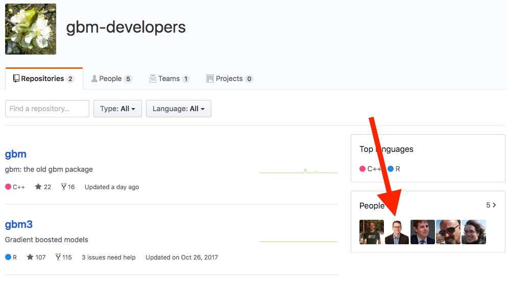

```{r setup, include=FALSE, cache=FALSE}
# Set global R options
options(htmltools.dir.version = FALSE, servr.daemon = TRUE)

# Set global knitr chunk options
knitr::opts_chunk$set(
  fig.align = "center", 
  cache = TRUE,
  error = FALSE,
  message = FALSE, 
  warning = FALSE, 
  collapse = TRUE 
)

library(tidyverse)

# set ggplot to black and white theme
library(ggplot2)
theme_set(theme_bw())
```

class: clear, center, middle

background-image: url(images/gbm-icon.jpg)
background-position: center
background-size: cover

<br><br><br>
.font300.white[Gradient Boosting Machines]

---
# Introduction

.pull-left[

.center.bold.font120[Thoughts]

- Extremely popular

- One of the leading methods in prediction competitions

- Boosted trees `r anicon::faa("arrow-right", animate = FALSE, color = "red")` similar to, but quite different than, RFs `r anicon::cia("images/headpound_bunny.gif", animate = FALSE, size = 1.5)`

- Math isn't that complicated until you want to generalize to all loss functions

]

--

.pull-right[

.center.bold.font120[Overview]

- Fundamental differences between RFs and GBMs

- Basic GBM

- Stochastic GBM

- XGBoost

]

---
# Prereqs .red[`r anicon::faa("hand-point-right", color = "red", animate = "horizontal")` code chunk 1]

.pull-left[

.center.bold.font120[Packages]

```{r prereqs-pks}
library(gbm)
library(xgboost)
```


]

.pull-right[

.center.bold.font120[Data]

```{r prereqs-data}
# ames data
ames <- AmesHousing::make_ames()

# split data
set.seed(123)
split <- rsample::initial_split(ames, strata = "Sale_Price")
ames_train <- rsample::training(split)
```

]

---
class: center, middle, inverse

.font300.white[Technicalities]

---
# Decision Trees

.pull-left[

* Many benefits `r anicon::cia("https://emojis.slackmojis.com/emojis/images/1471045870/910/rock.gif?1471045870", animate = FALSE)`
   - .green[minimal preprocessing]
   - .green[can handle any data type]
   - .green[automatically captures interactions]
   - .green[scales well to large data]
   - .green[(can be) easy to interpret]
   
* A few significant weaknesses `r anicon::cia("https://emojis.slackmojis.com/emojis/images/1471045885/967/wtf.gif?1471045885", animate = FALSE)`   
   - .red[large trees hard to interpret]
   - .red[trees are step functions] (i.e., binary splits)
   - .red[single trees typically have poor predictive accuracy]
   - .red[single trees have high variance] (easy to overfit to training data)

]

.pull-right[

```{r dt-deep, echo=FALSE}
library(rpart)
set.seed(1112)  # for reproducibility
df <- tibble::tibble(
  x = seq(from = 0, to = 2 * pi, length = 500),
  y = sin(x) + rnorm(length(x), sd = 0.5),
  truth = sin(x)
)

# fit single tree
ctrl <- list(cp = 0, minbucket = 2, maxdepth = 30)
fit <- rpart(y ~ x, data = df, control = ctrl)
df %>%
  mutate(pred = predict(fit, df)) %>%
  ggplot(aes(x, y)) +
  geom_point(alpha = .3, size = 2) +
  geom_line(aes(x, y = truth), color = "blue", size = 1) +
  geom_line(aes(y = pred), color = "red", size = 1)
```

]

---
# Bagging

.pull-left[

* Benefits `r anicon::cia("https://emojis.slackmojis.com/emojis/images/1471045870/910/rock.gif?1471045870", animate = FALSE)`
   - .green[takes advantage of a deep, single tree's high variance]
   - .green[wisdom of the crowd reduces prediction error]
   - .green[fast (typically only requires 50-100 trees)]

* Weaknesses `r anicon::cia("https://emojis.slackmojis.com/emojis/images/1471045885/967/wtf.gif?1471045885", animate = FALSE)`  
   - .red[tree correlation]
   - .red[minimizes tree diversity and, therefore,]
   - .red[limited prediction error improvement ]

]

.pull-right[

```{r bagging-gif, echo=FALSE}
library(gganimate)

bootstrap_n <- 100
bootstrap_results <- NULL
ctrl <- list(cp = 0, minbucket = 5, maxdepth = 30)

for(i in seq_len(bootstrap_n)) {
  # reproducible sampled data frames
  set.seed(i)
  index <- sample(seq_len(nrow(df)), nrow(df), replace = TRUE)
  df_sim <- df[index, ]
  
  # fit model and add predictions to results data frame
  fit <- rpart(y ~ x, data = df_sim, control = ctrl)
  df_sim$predictions <- predict(fit, df_sim)
  df_sim$tree <- i
  df_sim$ob <- index
  bootstrap_results <- rbind(bootstrap_results, df_sim)
   
}

p <- ggplot(bootstrap_results, aes(x, predictions)) +
  geom_point(data = df, aes(x, y), alpha = .1, size = 2) +
  geom_line(data = df, aes(x, y = sin(x)), color = "blue", size = 1) +
  geom_line(aes(group = tree), color = "red", size = 1, alpha = .1) +
  transition_reveal(id = tree, along = tree)
animate(p, renderer = gifski_renderer(), device = "png")
```

]

---
# Random Forests

.pull-left[

* Many benefits `r anicon::cia("https://emojis.slackmojis.com/emojis/images/1471045870/910/rock.gif?1471045870", animate = FALSE)`
   - .green[all the benefits of individual trees and bagging plus...]
   - .green[split-variable randomization reduces tree correlation]
   - .green[typically results in reduced prediction error compared to bagging]
   - .green[good out-of-box performance]
   
* Weaknesses `r anicon::cia("https://emojis.slackmojis.com/emojis/images/1471045885/967/wtf.gif?1471045885", animate = FALSE)` 
   - .red[Although accurate, often cannot compete with the accuracy of advanced boosting algorithms.]
   - .red[Can become slow on large data sets.]

]

.pull-right[

```{r bagging-vs-random-forest, echo=FALSE}
data(spam, package = "kernlab")
split <- rsample::initial_split(spam)
train <- rsample::training(split)
test <- rsample::testing(split)

# fit bagging model
set.seed(8451)  # reproducibility
spam_bag <- randomForest::randomForest(
  type ~ ., 
  data = train, 
  ntree = 1000,
  mtry = ncol(train)-1,  
  xtest = subset(test, select = -type),
  ytest = test$type,
  keep.forest = TRUE
)

# fit random forest model
set.seed(8451)  # reproducibility
spam_rf <- randomForest::randomForest(
  type ~ ., 
  data = train, 
  ntree = 1000,
  mtry = floor(sqrt(ncol(train))),
  xtest = subset(test, select = -type),
  ytest = test$type,
  keep.forest = TRUE
)

bag_df <- data.frame(
  model = "Bagging",
  trees = 1:length(spam_bag$err.rate[,"OOB"]),
  error = spam_bag$err.rate[,"OOB"]
)

rf_df <- data.frame(
  model = "Random Forest",
  trees = 1:length(spam_rf$err.rate[,"OOB"]),
  error = spam_rf$err.rate[,"OOB"]
)

p <- rbind(bag_df, rf_df) %>%
  ggplot(aes(trees, error, color = model)) +
  geom_line() +
  theme(
    legend.title = element_blank(),
    legend.position = c(0.9, 0.9)
    ) +
  transition_reveal(id = model, along = trees)
animate(p, renderer = gifski_renderer(), device = "png")
```

]

---
# How boosting works

.pull-left[

The main idea of boosting is to add new models to the ensemble sequentially. At each particular iteration, a new weak, base-learner model is trained with respect to the error of the whole ensemble learnt so far.

```{r boosting-process, echo=FALSE}
knitr::include_graphics("images/boosted-trees-process.png")
```


]

--

.pull-right[

```{r please-explain, echo=FALSE}
knitr::include_graphics("https://media.giphy.com/media/3o84UeTqecxpcQJGOA/giphy.gif")
```


]

---
# How boosting works

.pull-left[

The main idea of boosting is to add new models to the ensemble sequentially. At each particular iteration, a new .blue.bold[weak], base-learner model is trained with respect to the error of the whole ensemble learnt so far.

```{r boosting-process2, echo=FALSE}
knitr::include_graphics("images/boosted-trees-process.png")
```

]

.pull-right[

A weak model:

* one whose error rate is only slightly better than random guessing

* each step slightly improves the remaining errors

* commonly, trees with only 1-6 splits are used

* Benefits of weak models
   - speed
   - accuracy improvement
   - can avoid overfitting

]

---
# How boosting works

.pull-left[

The main idea of boosting is to add new models to the ensemble sequentially. At each particular iteration, a new weak, .blue.bold[base-learner model] is trained with respect to the error of the whole ensemble learnt so far.

```{r boosting-process3, echo=FALSE}
knitr::include_graphics("images/boosted-trees-process.png")
```

]

.pull-right[

Base-learning models:

* boosting is a framework that iteratively improves any weak learning model

* many gradient boosting applications allow you to “plug in” various classes of weak learners at your disposal

* in practice however, boosted algorithms almost always use decision trees as the base-learner

]

---
# How boosting works

.pull-left[

The main idea of boosting is to add new models to the ensemble sequentially. At each particular iteration, a new weak, base-learner model is .blue.bold[trained with respect to the error] of the whole ensemble learnt so far.

```{r boosting-process4, echo=FALSE}
knitr::include_graphics("images/boosted-trees-process.png")
```

]

.pull-right[

Sequential training with respect to errors:

* boosted trees are grown sequentially; each tree is grown using information from previously grown trees. 

   1. Fit a decision tree to the data: $F_1(x) = y$,
   2. We then fit the next decision tree to the residuals of the previous: $h_1(x) = y - F_1(x)$,
   3. Add this new tree to our algorithm: $F_2(x) = F_1(x) + h_1(x)$,
   4. Fit the next decision tree to the residuals of $F_2$: $h_2(x) = y - F_2(x)$,
   5. Add this new tree to our algorithm: $F_3(x) = F_2(x) + h_1(x)$,
   6. Continue this process until some mechanism (i.e. cross validation) tells us to stop.

]

---
# How boosting works

We call this sequential training .blue.bold[additive model ensembling] where each iteration gradually nudges our predicted values closer to the target.

.pull-left[

$$
\begin{aligned}
 \hat y & = f_0(x) + \triangle_1(x) + \triangle_2(x) + \cdots + \triangle_M(x)  \\
        & = f_0(x) + \sum^M_{m=1} \triangle_m(x) \\
        & = F_m(x)
\end{aligned}
$$

Also written as...

$$
\begin{aligned}
 F_0(x) & = f_0(x) \\
 F_m(x) & = F_{m-1}(x) + \triangle_m(x)
\end{aligned}
$$

]

.pull-right[

```{r golfer, echo=FALSE}
knitr::include_graphics("images/golf-dir-vector.png")
```

.font60.right[Image: [Terence Parr & Jeremy Howard](https://explained.ai/gradient-boosting/L2-loss.html)]

]

---
# How boosting works

.pull-left[

```{r gbm-illustration, echo=FALSE}
set.seed(1112)
df <- tibble::tibble(
  x = seq(from = 0, to = 2 * pi, length = 1000),
  y = sin(x) + rnorm(length(x), sd = 0.5),
  truth = sin(x)
)

rpartBoost <- function(x, y, data, num_trees = 100, learn_rate = 0.1, tree_depth = 6) {
  x <- data[[deparse(substitute(x))]]
  y <- data[[deparse(substitute(y))]]
  G_b_hat <- matrix(0, nrow = length(y), ncol = num_trees + 1)
  r <- y

  for(tree in seq_len(num_trees)) {

    g_b_tilde <- rpart(r ~ x, control = list(cp = 0, maxdepth = tree_depth))
    g_b_hat <- learn_rate * predict(g_b_tilde)
    G_b_hat[, tree + 1] <- G_b_hat[, tree] + matrix(g_b_hat)
    r <- r - g_b_hat
    colnames(G_b_hat) <- paste0("tree_", c(0, seq_len(num_trees)))
  }
  cbind(df, as.data.frame(G_b_hat)) %>%
    gather(tree, prediction, starts_with("tree")) %>%
    mutate(tree = stringr::str_extract(tree, "\\d+") %>% as.numeric())
}
  
p <- rpartBoost(x, y, data = df, num_trees = 750, learn_rate = 0.05, tree_depth = 1) %>%
  ggplot(aes(x, prediction)) +
  ylab("y") +
  geom_point(data = df, aes(x, y), alpha = .1) +
  geom_line(data = df, aes(x, truth), color = "blue") +
  geom_line(colour = "red", size = 1) +
  transition_manual(tree) +
  labs(title = 'Number of trees (depth = 1): {frame}')

animate(p, renderer = gifski_renderer(), device = "png")

```

]

.pull-right[

```{r gbm-residual-illustration, echo=FALSE}
resids <- rpartBoost(x, y, data = df, num_trees = 750, learn_rate = 0.05, tree_depth = 1) %>%
  mutate(residuals = abs(y - prediction))

avg_resids <- resids %>%
  group_by(tree) %>%
  summarize(avg = mean(residuals))

r <- ggplot(resids, aes(x, residuals)) +
  ylab("absolute(residuals)") +
  geom_segment(aes(x = x, xend = x, y = 0, yend = residuals), colour = "red", size = .5, alpha = .5) +
  geom_point(colour = "red", size = 1) +
  geom_text(data = avg_resids, aes(x = 4, y = 2.5, label = paste("Mean abs(residual):", round(avg, 4))), hjust = 0) +
  transition_manual(tree) +
  labs(title = 'Number of trees (depth = 1): {frame}')

animate(r, renderer = gifski_renderer(), device = "png")
```

]

---
# Boosting > Random Forest > Bagging > Single Tree

.pull-left[

<br><br>

.center.font120.blue[Typically, this allows us to eek out additional predictive performance!]

]

.pull-right[
```{r bagging-vs-random-forest-vs-boosting, echo=FALSE}
data(spam, package = "kernlab")
split <- rsample::initial_split(spam)
train <- rsample::training(split)
test <- rsample::testing(split)

# fit GBM
train$type <- ifelse(train$type == "spam", 1, 0)

# prep error data frame
gbm_df <- data.frame(
  model = "GBM",
  trees = seq_len(1000),
  error = 0
)

set.seed(8451)  # for reproducibility
spam_gbm <- gbm::gbm(
  type ~ .,
  data = train,
  distribution = "bernoulli",  # "bernoulli", "coxph", etc.
  n.trees = 1000,
  interaction.depth = 6,
  n.minobsinnode = 5,
  shrinkage = 0.2,
  bag.fraction = 1,
  train.fraction = 1
  )

for(i in seq_len(1000)) {
  pred <- predict(spam_gbm, test, n.trees = i)
  pred <- ifelse(pred >= .5, "spam", "nonspam")
  gbm_df[i, "error"] <- mean(pred != as.character(test$type))
}

p <- rbind(bag_df, rf_df) %>%
  rbind(gbm_df) %>%
  ggplot(aes(trees, error, color = model)) +
  geom_line() +
  scale_y_continuous(limits = c(.025, .1)) +
  theme(
    legend.title = element_blank(),
    legend.position = c(0.85, 0.9)
    ) +
  transition_reveal(id = model, along = trees)
animate(p, renderer = gifski_renderer(), device = "png")
```
]

---
class: center, middle, inverse

.font300.white[Basic GBM]

---
# Basic GBM

.pull-left[

.bold.font110[[gbm](https://github.com/gbm-developers/gbm)]
- The original R implementation of GMBs (by Greg Ridgeway)
- Slower than modern implementations (but still pretty fast)
- Provides OOB error estimate
- Supports the weighted tree traversal method for fast construction of PDPs
- <u>Great looking support team</u>
   
.bold.font110[[gbm3](https://github.com/gbm-developers/gbm3)]
- Shiny new version of gbm that is not backwards compatible
- Faster and supports parallel tree building
- Not currently listed on CRAN

]

.pull-right[

```{r basic-gbm-options, echo=FALSE}

```

]

---
# Basic GBM .red[`r anicon::faa("hand-point-right", color = "red", animate = "horizontal")` code chunk 2]

.pull-left[

.bold.font110[[gbm](https://github.com/gbm-developers/gbm)]
- The original R implementation of GMBs (by Greg Ridgeway)
- Slower than modern implementations (but still pretty fast)
- Provides OOB error estimate
- Supports the weighted tree traversal method for fast construction of PDPs
- Great looking support team
   
.opacity20[   
.bold.font110[[gbm3](https://github.com/gbm-developers/gbm3)]
- Shiny new version of gbm that is not backwards compatible
- Faster and supports parallel tree building
- Not currently listed on CRAN
]
]

.pull-right[
.center.bold.font90[Let's run your first GBM model]

```{r basic-gbm}
set.seed(123)
ames_gbm <- gbm(
  formula = Sale_Price ~ .,
  data = ames_train,
  distribution = "gaussian", # or bernoulli, multinomial, etc. 
  n.trees = 5000, 
  shrinkage = 0.1, 
  interaction.depth = 1, 
  n.minobsinnode = 10, 
  cv.folds = 5 
  )  

# find index for n trees with minimum CV error
min_MSE <- which.min(ames_gbm$cv.error)

# get MSE and compute RMSE
sqrt(ames_gbm$cv.error[min_MSE])
```

.center.bold.font90[`r anicon::faa("exclamation-triangle", color = "red", animate = FALSE)`  This grid search takes ~30 secs `r anicon::faa("exclamation-triangle", color = "red", animate = FALSE)`]

]

---
# What's going on?


.pull-left.font90[

<br>

* .bold[`distribution`]: specify distribution of response variable; `gbm` will make intelligent guess

* .bold[`n.trees`]: number of sequential trees to fit

* .bold[`shrinkage`]: how quickly do we improve on each iteration (aka _learning rate_)

* .bold[`interaction.depth`]: how weak of a learner do we want

* .bold[`n.minobsinnode`]: minimum number of observations in the trees terminal nodes

* .bold[`cv.folds`]: _k_-fold cross validation

]

.pull-right[

.opacity20.center.bold.font90[Let's run your first GBM model]

```{r basic-gbm-whats-going-on, eval=FALSE}
set.seed(123)
ames_gbm <- gbm(
  formula = Sale_Price ~ .,
  data = ames_train,
  distribution = "gaussian", # or bernoulli, multinomial, etc. #<<
  n.trees = 5000, #<<
  shrinkage = 0.1, #<<
  interaction.depth = 1, #<<
  n.minobsinnode = 10, #<<
  cv.folds = 5 #<<
  )  

# find index for n trees with minimum CV error
min_MSE <- which.min(ames_gbm$cv.error)

# get MSE and compute RMSE
sqrt(ames_gbm$cv.error[min_MSE])
## [1] 27028.1
```

.opacity20.center.bold.font90[`r anicon::faa("exclamation-triangle", color = "red", animate = FALSE)`  This grid search takes ~30 secs `r anicon::faa("exclamation-triangle", color = "red", animate = FALSE)`]

]

---
# What's going on?


.pull-left.font90[

.bold.center[Tunable Hyperparameters]

* .opacity20[`distribution`: specify distribution of response variable; `gbm` will make intelligent guess]

* .bold[`n.trees`]: number of sequential trees to fit

* .bold[`shrinkage`]: how quickly do we improve on each iteration (aka _learning rate_)

* .bold[`interaction.depth`]: how weak of a learner do we want

* .bold[`n.minobsinnode`]: minimum number of observations in the trees terminal nodes

* .opacity20[`cv.folds`: _k_-fold cross validation]

]

.pull-right[

.opacity20.center.bold.font90[Let's run your first GBM model]

```{r basic-gbm-whats-going-on2, eval=FALSE}
set.seed(123)
ames_gbm <- gbm(
  formula = Sale_Price ~ .,
  data = ames_train,
  distribution = "gaussian", # or bernoulli, multinomial, etc. #<<
  n.trees = 5000, #<<
  shrinkage = 0.1, #<<
  interaction.depth = 1, #<<
  n.minobsinnode = 10, #<<
  cv.folds = 5 #<<
  )  

# find index for n trees with minimum CV error
min_MSE <- which.min(ames_gbm$cv.error)

# get MSE and compute RMSE
sqrt(ames_gbm$cv.error[min_MSE])
## [1] 27028.1
```

.opacity20.center.bold.font90[`r anicon::faa("exclamation-triangle", color = "red", animate = FALSE)`  This grid search takes ~30 secs `r anicon::faa("exclamation-triangle", color = "red", animate = FALSE)`]

]

---
# Tuning `r anicon::faa("cog", animate = 'spin', speed = 'slow', colour = "red")`

In contrast to Random Forests, GBMs .bold.red[do not] provide good "out-of-the-`r anicon::faa("box-open", animate = "pulse", anitype="hover")`" performance!

--

We can divide hyperparameters into 2 primary categories:

--

.pull-left[

.center.bold[Boosting Parameters]

- Number of trees

- Learning rate

- More to come!

]

.pull-right[

.center.bold[Tree-specific Parameters]

- Tree depth

- Minimum obs in terminal node

- And others

]

---
# Boosting hyperparameters `r anicon::faa("cog", animate = 'spin', speed = 'slow', colour = "red")`

.pull-left[

.blue.bold[Number of trees]

- The averaging in bagging and RF makes it very difficult to overfit with too many trees

- GBMs will chase residuals as long as you allow them 

- Consequently:
   - We must provide enough trees to minimize error
   - But not too many where we begin to overfit


]

.pull-right[

```{r num-trees, echo=FALSE}
set.seed(1112)
df <- tibble::tibble(
  x = seq(from = 0, to = 2 * pi, length = 1000),
  y = sin(x) + rnorm(length(x), sd = 0.5),
  truth = sin(x)
)

p <- rpartBoost(x, y, data = df, num_trees = 200, learn_rate = 0.1, tree_depth = 4) %>%
  ggplot(aes(x, prediction)) +
  ylab("y") +
  geom_point(data = df, aes(x, y), alpha = .1) +
  geom_line(data = df, aes(x, truth), color = "blue") +
  geom_line(colour = "red", size = 1) +
  transition_manual(tree) +
  labs(title = 'Number of trees (depth = 1): {frame}')

animate(p, renderer = gifski_renderer(), device = "png")
```

]

---
# Boosting hyperparameters `r anicon::faa("cog", animate = 'spin', speed = 'slow', colour = "red")`  .red[`r anicon::faa("hand-point-right", color = "red", animate = "horizontal")` code chunk 3]

.pull-left[

.blue.bold[Number of trees]

- The averaging in bagging and RF makes it very difficult to overfit with too many trees

- GBMs will chase residuals as long as you allow them 

- Consequently:
   - We must provide enough trees to minimize error
   - But not too many where we begin to overfit
   - .red[plus, number of trees is dependent on other hyperparameters]

.center.bold.blue[Use CV or OOB] 

]

.pull-right[

```{r, fig.height=5}
gbm.perf(ames_gbm, method = "cv") # or "OOB"
```

<br>   
.center.bold.blue[Use CV or OOB]   

]

---
# Boosting hyperparameters `r anicon::faa("cog", animate = 'spin', speed = 'slow', colour = "red")`

.pull-left[

.blue.bold[Learning rate] (aka shrinkage)

.font120[
- Determines the impact of each tree on the final outcome
]

]

.pull-right[

```{r learning-rate, echo=FALSE, fig.height=5.5}
# create data to plot
x <- seq(-5, 5, by = .05)
y <- x^2 + 3
df <- data.frame(x, y)

step <- 5
step_size <- .2
for(i in seq_len(18)) {
  next_step <- max(step) + round(diff(range(max(step), which.min(df$y))) * step_size, 0)
  step <- c(step, next_step)
  next
}

steps <- df[step, ] %>%
  mutate(x2 = lag(x), y2 = lag(y)) %>%
  dplyr::slice(1:18)

# plot
ggplot(df, aes(x, y)) +
  geom_line(size = 1.5, alpha = .5) +
  theme_classic() +
  scale_y_continuous("Loss function", limits = c(0, 30)) +
  xlab(expression(theta)) +
  geom_segment(data = df[c(5, which.min(df$y)), ], aes(x = x, y = y, xend = x, yend = -Inf), lty = "dashed") +
  geom_point(data = filter(df, y == min(y)), aes(x, y), size = 4, shape = 21, fill = "yellow") +
  geom_point(data = steps, aes(x, y), size = 3, shape = 21, fill = "blue", alpha = .5) +
  geom_curve(data = steps, aes(x = x, y = y, xend = x2, yend = y2), curvature = 1, lty = "dotted") +
  theme(
    axis.ticks = element_blank(),
    axis.text = element_blank()
  ) +
  annotate("text", x = df[5, "x"], y = 1, label = "Initial value", hjust = -0.1, vjust = .8) +
  annotate("text", x = df[which.min(df$y), "x"], y = 1, label = "Minimium", hjust = -0.1, vjust = .8) +
  annotate("text", x = df[5, "x"], y = df[5, "y"], label = "Learning step", hjust = -.8, vjust = 0)
```

]

---
# Boosting hyperparameters `r anicon::faa("cog", animate = 'spin', speed = 'slow', colour = "red")`

.pull-left[

.blue.bold[Learning rate] (aka shrinkage)

- Determines the impact of each tree on the final outcome

- .red[Too large of a learning rate will have poor predictive capability]

- Lower values are generally preferred:
   - .green[they make the model robust to the specific characteristics of tree and thus allowing it to generalize well]
   - .green[easier to stop prior to overfitting]
   - .red[but run the risk of not reaching the optimum]
   - .red[are more computationally demanding]

]

.pull-right[

```{r learning-rate-too-big, echo=FALSE, fig.height=7}
# create too small of a learning rate
step <- 5
step_size <- .05
for(i in seq_len(10)) {
  next_step <- max(step) + round(diff(range(max(step), which.min(df$y))) * step_size, 0)
  step <- c(step, next_step)
  next
}

too_small <- df[step, ] %>%
  mutate(x2 = lag(x), y2 = lag(y))

# plot
p1 <- ggplot(df, aes(x, y)) +
  geom_line(size = 1.5, alpha = .5) +
  theme_classic() +
  scale_y_continuous("Loss function", limits = c(0, 30)) +
  xlab(expression(theta)) +
  geom_segment(data = too_small[1, ], aes(x = x, y = y, xend = x, yend = -Inf), lty = "dashed") +
  geom_point(data = too_small, aes(x, y), size = 3, shape = 21, fill = "blue", alpha = .5) +
  geom_curve(data = too_small, aes(x = x, y = y, xend = x2, yend = y2), curvature = 1, lty = "dotted") +
  theme(
    axis.ticks = element_blank(),
    axis.text = element_blank()
  ) +
  annotate("text", x = df[5, "x"], y = 1, label = "Start", hjust = -0.1, vjust = .8) +
  ggtitle("b) too small")

# create too large of a learning rate
too_large <- df[round(which.min(df$y) * (1 + c(-.9, -.6, -.2, .3)), 0), ] %>%
  mutate(x2 = lag(x), y2 = lag(y))

# plot
p2 <- ggplot(df, aes(x, y)) +
  geom_line(size = 1.5, alpha = .5) +
  theme_classic() +
  scale_y_continuous("Loss function", limits = c(0, 30)) +
  xlab(expression(theta)) +
  geom_segment(data = too_large[1, ], aes(x = x, y = y, xend = x, yend = -Inf), lty = "dashed") +
  geom_point(data = too_large, aes(x, y), size = 3, shape = 21, fill = "blue", alpha = .5) +
  geom_curve(data = too_large, aes(x = x, y = y, xend = x2, yend = y2), curvature = 1, lty = "dotted") +
  theme(
    axis.ticks = element_blank(),
    axis.text = element_blank()
  ) +
  annotate("text", x = too_large[1, "x"], y = 1, label = "Start", hjust = -0.1, vjust = .8) +
  ggtitle("a) too big")

gridExtra::grid.arrange(p2, p1, nrow = 2)
```

]

---
# Boosting hyperparameters `r anicon::faa("cog", animate = 'spin', speed = 'slow', colour = "red")`

.pull-left[

.blue.bold[Learning rate] (aka shrinkage)

- Determines the impact of each tree on the final outcome

- .red[Too large of a learning rate will have poor predictive capability]

- Lower values are generally preferred (.01 - .1):
   - .green[they make the model robust to the specific characteristics of tree and thus allowing it to generalize well]
   - .green[easier to stop prior to overfitting]
   - .red[but run the risk of not reaching the optimum]
   - .red[are more computationally demanding]
   - .bold[Requires more trees!]

]

.pull-right[

```{r small-rate-more-trees, echo=FALSE, fig.height=5}
set.seed(1112)
df <- tibble::tibble(
  x = seq(from = 0, to = 2 * pi, length = 500),
  y = sin(x) + rnorm(length(x), sd = 0.5),
  truth = sin(x)
)

results <- data.frame(NULL)

for(i in c(1, seq(25, 3000, by = 25))) {
  set.seed(8451)
  gbm_model_hi <- gbm::gbm(truth ~ x, data = df, n.trees = i, shrinkage = .1, distribution = "gaussian")
  set.seed(8451)
  gbm_model_med <- gbm::gbm(truth ~ x, data = df, n.trees = i, shrinkage = .01, distribution = "gaussian")
  set.seed(8451)
  gbm_model_lo <- gbm::gbm(truth ~ x, data = df, n.trees = i, shrinkage = .001, distribution = "gaussian")
  add_results <- df
  add_results$`shrinkage = .1` <- predict(gbm_model_hi, df, n.trees = i)
  add_results$`shrinkage = .01` <- predict(gbm_model_med, df, n.trees = i)
  add_results$`shrinkage = .001` <- predict(gbm_model_lo, df, n.trees = i)
  add_results$trees <- i
  results <- rbind(results, add_results)
}

p <- results %>%
  gather(rate, prediction, `shrinkage = .1`:`shrinkage = .001`) %>% 
  mutate(
    trees = as.integer(trees),
    rate = fct_relevel(rate, "shrinkage = .1", "shrinkage = .01", "shrinkage = .001")
    ) %>%
  ggplot(aes(x, prediction)) +
  ylab("y") +
  geom_point(data = df, aes(x, y), alpha = .1, size = 2) +
  geom_line(colour = "red", size = 1) +
  facet_wrap(~ rate, nrow = 1) +
  labs(title = 'Number of trees: {frame_time}') +
  transition_time(trees)

animate(p, renderer = gifski_renderer(), device = "png")
```

]

---
# Tree-specific hyperparameters `r anicon::faa("cog", animate = 'spin', speed = 'slow', colour = "red")`

.pull-left[

.blue.bold[Tree depth]

- controls over-fitting
- higher depth captures unique interactions
- but runs risk of over-fitting
- smaller depth (i.e. stumps) are computationally efficient
- typical values: 3-8
   - larger _n_ or _p_ are more tolerable to `r anicon::faa("arrow-up", animate = FALSE)` values


.blue.bold[Min obs in terminal nodes]

- controls over-fitting
- higher values prevent a model from learning relations which might be highly specific to the particular sample selected for a tree
- typically have small impact on performance
- smaller values can help with imbalanced classes 

]

.pull-right[

```{r depth-and-nodes, echo=FALSE}
set.seed(1112)
df <- tibble::tibble(
  x = seq(from = 0, to = 2 * pi, length = 1000),
  y = sin(x) + rnorm(length(x), sd = 0.5),
  truth = sin(x)
)

rpartBoost <- function(x, y, data, num_trees = 100, learn_rate = 0.1, tree_depth = 6, minbucket = 5) {
  x <- data[[deparse(substitute(x))]]
  y <- data[[deparse(substitute(y))]]
  G_b_hat <- matrix(0, nrow = length(y), ncol = num_trees + 1)
  r <- y

  for(tree in seq_len(num_trees)) {

    g_b_tilde <- rpart(r ~ x, control = list(cp = 0, maxdepth = tree_depth, minbucket = minbucket))
    g_b_hat <- learn_rate * predict(g_b_tilde)
    G_b_hat[, tree + 1] <- G_b_hat[, tree] + matrix(g_b_hat)
    r <- r - g_b_hat
    colnames(G_b_hat) <- paste0("tree_", c(0, seq_len(num_trees)))
  }
  cbind(df, as.data.frame(G_b_hat)) %>%
    gather(tree, prediction, starts_with("tree")) %>%
    mutate(tree = stringr::str_extract(tree, "\\d+") %>% as.numeric())
}

m1 <- rpartBoost(x, y, data = df, num_trees = 200, learn_rate = 0.1, tree_depth = 1, minbucket = 1) %>% mutate(depth = "Depth = 1", min_obs = "Min obs = 1")
m2 <- rpartBoost(x, y, data = df, num_trees = 200, learn_rate = 0.1, tree_depth = 3, minbucket = 1) %>% mutate(depth = "Depth = 3", min_obs = "Min obs = 1")
m3 <- rpartBoost(x, y, data = df, num_trees = 200, learn_rate = 0.1, tree_depth = 8, minbucket = 1) %>% mutate(depth = "Depth = 8", min_obs = "Min obs = 1")
m4 <- rpartBoost(x, y, data = df, num_trees = 200, learn_rate = 0.1, tree_depth = 1, minbucket = 5) %>% mutate(depth = "Depth = 1", min_obs = "Min obs = 5")
m5 <- rpartBoost(x, y, data = df, num_trees = 200, learn_rate = 0.1, tree_depth = 3, minbucket = 5) %>% mutate(depth = "Depth = 3", min_obs = "Min obs = 5")
m6 <- rpartBoost(x, y, data = df, num_trees = 200, learn_rate = 0.1, tree_depth = 8, minbucket = 5) %>% mutate(depth = "Depth = 8", min_obs = "Min obs = 5")
m7 <- rpartBoost(x, y, data = df, num_trees = 200, learn_rate = 0.1, tree_depth = 1, minbucket = 10) %>% mutate(depth = "Depth = 1", min_obs = "Min obs = 10")
m8 <- rpartBoost(x, y, data = df, num_trees = 200, learn_rate = 0.1, tree_depth = 3, minbucket = 10) %>% mutate(depth = "Depth = 3", min_obs = "Min obs = 10")
m9 <- rpartBoost(x, y, data = df, num_trees = 200, learn_rate = 0.1, tree_depth = 8, minbucket = 10) %>% mutate(depth = "Depth = 8", min_obs = "Min obs = 10")

p <- do.call(rbind, list(m1, m2, m3, m4, m5, m6, m7, m8, m9)) %>%
  mutate(min_obs = factor(min_obs, levels = c("Min obs = 1", "Min obs = 5", "Min obs = 10"))) %>%
  ggplot(aes(x, prediction)) +
  ylab("y") +
  geom_point(data = df, aes(x, y), alpha = .1) +
  geom_line(data = df, aes(x, truth), color = "blue") +
  geom_line(colour = "red", size = 1) +
  facet_grid(min_obs ~ depth) +
  transition_manual(tree) +
  labs(title = 'Number of trees (learning rate = 1): {frame}')

animate(p, renderer = gifski_renderer(), device = "png")
```

]


---
# Tuning strategy `r anicon::faa("cog", animate = 'spin', speed = 'slow', colour = "red")`

<br>
.font120[
1. Choose a relatively high learning rate. Generally the default value of 0.1 works but somewhere between 0.05 to 0.2 should work for different problems

2. Determine the optimum number of trees for this learning rate. 

3. Tune learning rate and assess speed vs. performance

4. Tune tree-specific parameters for decided learning rate and number of trees. 

5. Lower the learning rate and increase the estimators proportionally to get more robust models.
]

---
# Tuning strategy `r anicon::faa("cog", animate = 'spin', speed = 'slow', colour = "red")`  .red[`r anicon::faa("hand-point-right", color = "red", animate = "horizontal")` code chunk 4]

.scrollable90[
.pull-left[
<br>
.font110[
1. fix tree hyperparameters
    - moderate tree depth
    - default min obs
2. set our learning rate at .01
3. increase CV to ensure unbiased error estimate
4. Results
   - Lowest error rate yet ($21,914.55)!
   - Used nearly all our trees $\rightarrow$ increase to 6000?
   - took $\approx$ 2.25 min
5. Compared to learning rate of .001
   - error rate of $24,791.66
   - took $\approx$ 4 min
]
]

.pull-right[

.center.bold.font90[`r anicon::faa("exclamation-triangle", color = "red", animate = FALSE)`  This grid search takes ~2 mins `r anicon::faa("exclamation-triangle", color = "red", animate = FALSE)`]

```{r tune1}
set.seed(123)
ames_gbm1 <- gbm(
  formula = Sale_Price ~ .,
  data = ames_train,
  distribution = "gaussian", # or bernoulli, multinomial, etc. #<<
  n.trees = 5000, #<<
  shrinkage = 0.01, #<<
  interaction.depth = 3, #<<
  n.minobsinnode = 10, #<<
  cv.folds = 10 #<<
  )

# find index for n trees with minimum CV error
min_MSE <- which.min(ames_gbm1$cv.error)

# get MSE and compute RMSE
sqrt(ames_gbm1$cv.error[min_MSE])

gbm.perf(ames_gbm1, method = "cv")
```

]
]

---
# Tuning strategy `r anicon::faa("cog", animate = 'spin', speed = 'slow', colour = "red")`  .red[`r anicon::faa("hand-point-right", color = "red", animate = "horizontal")` code chunk 5]

.scrollable90[
.pull-left[

Now let's tune the tree-specific hyperparameters

* we could do it in `caret` but lets use functional programming

```{r hell-yeah, echo=FALSE, out.width="25%", out.height="25%"}

```

* assess 3 values for tree depth

* assess 3 values for min obs in terminal node

]

.pull-right[

.center.bold.font90[`r anicon::faa("exclamation-triangle", color = "red", animate = FALSE)`  This grid search takes ~2 mins `r anicon::faa("exclamation-triangle", color = "red", animate = FALSE)`]

```{r tune12, eval=FALSE}
# search grid
hyper_grid <- expand.grid(
  n.trees = 6000,
  shrinkage = .01
)

set.seed(123)
ames_gbm1 <- gbm(
  formula = Sale_Price ~ .,
  data = ames_train,
  distribution = "gaussian", # or bernoulli, multinomial, etc. #<<
  n.trees = 6000, #<<
  shrinkage = 0.01, #<<
  interaction.depth = 3, #<<
  n.minobsinnode = 10, #<<
  cv.folds = 10 #<<
  )

# find index for n trees with minimum CV error
min_MSE <- which.min(ames_gbm1$cv.error)

# get MSE and compute RMSE
sqrt(ames_gbm1$cv.error[min_MSE])

gbm.perf(ames_gbm1, method = "cv")
```

]
]

---
class: center, middle, inverse

.font300.white[Stochastic GBM]


---
class: center, middle, inverse

.font300.white[Extreme Gradient Boosting]


---
class: center, middle, inverse

.font300.white[Wrapping Up]

---

# Learning More

.pull-left[

```{r isl-book-cover, echo=FALSE, out.height='55%', out.width='55%'}
knitr::include_graphics("images/isl.jpg")
```

.center.font150[[Book website](http://www-bcf.usc.edu/~gareth/ISL/)]
]


.pull-right[

```{r esl-book-cover, echo=FALSE, out.height='55%', out.width='55%'}
knitr::include_graphics("images/esl.jpg")
```

.center.font150[[Book website](https://web.stanford.edu/~hastie/ElemStatLearn/)]
]

---
class: clear, center, middle

background-image: url(images/raising-hand.gif)
background-size: cover

<br><br><br><br><br><br><br><br><br><br><br><br>
.font300.bold[`r anicon::nia("Questions?", animate = "pulse")`]

---
# Back home

<br><br><br><br>
[.center[`r anicon::faa("home", size = 10, animate = FALSE)`]](https://github.com/uc-r/Advanced-R)

.center[https://github.com/uc-r/Advanced-R]


