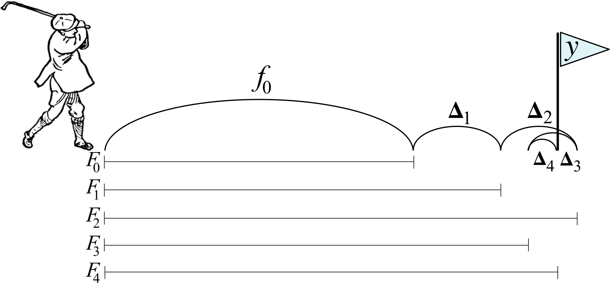

```{r setup, include=FALSE, cache=FALSE}
# Set global R options
options(htmltools.dir.version = FALSE, servr.daemon = TRUE)

# Set global knitr chunk options
knitr::opts_chunk$set(
  fig.align = "center", 
  cache = TRUE,
  error = FALSE,
  message = FALSE, 
  warning = FALSE, 
  collapse = TRUE 
)

library(tidyverse)

# set ggplot to black and white theme
library(ggplot2)
theme_set(theme_bw())
```

class: clear, center, middle

background-image: url(images/gbm-icon.jpg)
background-position: center
background-size: cover

<br><br><br>
.font300.white[Gradient Boosting Machines]

---
# Introduction

.pull-left[

.center.bold.font120[Thoughts]

- Extremely popular

- One of the leading methods in prediction competitions

- Boosted trees `r anicon::faa("arrow-right", animate = FALSE, color = "red")` similar to, but quite different than, RFs `r anicon::cia("images/headpound_bunny.gif", animate = FALSE, size = 1.5)`

]

--

.pull-right[

.center.bold.font120[Overview]

- Technical differences between RFs and GBMs

- Basic implementation

- Tuning parameters

- XGBoost

]

---
class: center, middle, inverse

.font300.white[Technicalities]

---
# Decision Trees

.pull-left[

* Many benefits `r anicon::cia("https://emojis.slackmojis.com/emojis/images/1471045870/910/rock.gif?1471045870", animate = FALSE)`
   - .green[minimal preprocessing]
   - .green[can handle any data type]
   - .green[automatically captures interactions]
   - .green[scales well to large data]
   - .green[(can be) easy to interpret]
   
* A few significant weaknesses `r anicon::cia("https://emojis.slackmojis.com/emojis/images/1471045885/967/wtf.gif?1471045885", animate = FALSE)`   
   - .red[large trees hard to interpret]
   - .red[trees are step functions] (i.e., binary splits)
   - .red[single trees typically have poor predictive accuracy]
   - .red[single trees have high variance] (easy to overfit to training data)

]

.pull-right[

```{r dt-deep, echo=FALSE}
library(rpart)
set.seed(1112)  # for reproducibility
df <- tibble::tibble(
  x = seq(from = 0, to = 2 * pi, length = 500),
  y = sin(x) + rnorm(length(x), sd = 0.5),
  truth = sin(x)
)

# fit single tree
ctrl <- list(cp = 0, minbucket = 2, maxdepth = 30)
fit <- rpart(y ~ x, data = df, control = ctrl)
df %>%
  mutate(pred = predict(fit, df)) %>%
  ggplot(aes(x, y)) +
  geom_point(alpha = .3, size = 2) +
  geom_line(aes(x, y = truth), color = "blue", size = 1) +
  geom_line(aes(y = pred), color = "red", size = 1)
```

]

---
# Bagging

.pull-left[

* Benefits `r anicon::cia("https://emojis.slackmojis.com/emojis/images/1471045870/910/rock.gif?1471045870", animate = FALSE)`
   - .green[takes advantage of a deep, single tree's high variance]
   - .green[wisdom of the crowd reduces prediction error]
   - .green[fast (typically only requires 50-100 trees)]

* Weaknesses `r anicon::cia("https://emojis.slackmojis.com/emojis/images/1471045885/967/wtf.gif?1471045885", animate = FALSE)`  
   - .red[tree correlation]
   - .red[minimizes tree diversity and, therefore,]
   - .red[limited prediction error improvement ]

]

.pull-right[

```{r bagging-gif, echo=FALSE}
library(gganimate)

bootstrap_n <- 100
bootstrap_results <- NULL
ctrl <- list(cp = 0, minbucket = 5, maxdepth = 30)

for(i in seq_len(bootstrap_n)) {
  # reproducible sampled data frames
  set.seed(i)
  index <- sample(seq_len(nrow(df)), nrow(df), replace = TRUE)
  df_sim <- df[index, ]
  
  # fit model and add predictions to results data frame
  fit <- rpart(y ~ x, data = df_sim, control = ctrl)
  df_sim$predictions <- predict(fit, df_sim)
  df_sim$tree <- i
  df_sim$ob <- index
  bootstrap_results <- rbind(bootstrap_results, df_sim)
   
}

p <- ggplot(bootstrap_results, aes(x, predictions)) +
  geom_point(data = df, aes(x, y), alpha = .1, size = 2) +
  geom_line(data = df, aes(x, y = sin(x)), color = "blue", size = 1) +
  geom_line(aes(group = tree), color = "red", size = 1, alpha = .1) +
  transition_reveal(id = tree, along = tree)
animate(p, renderer = gifski_renderer(), device = "png")
```

]

---
# Random Forests

.pull-left[

* Many benefits `r anicon::cia("https://emojis.slackmojis.com/emojis/images/1471045870/910/rock.gif?1471045870", animate = FALSE)`
   - .green[all the benefits of individual trees and bagging plus...]
   - .green[split-variable randomization reduces tree correlation]
   - .green[typically results in reduced prediction error compared to bagging]
   - .green[good out-of-box performance]
   
* Weaknesses `r anicon::cia("https://emojis.slackmojis.com/emojis/images/1471045885/967/wtf.gif?1471045885", animate = FALSE)` 
   - .red[Although accurate, often cannot compete with the accuracy of advanced boosting algorithms.]
   - .red[Can become slow on large data sets.]

]

.pull-right[

```{r bagging-vs-random-forest, echo=FALSE}
data(spam, package = "kernlab")
split <- rsample::initial_split(spam)
train <- rsample::training(split)
test <- rsample::testing(split)

# fit bagging model
set.seed(8451)  # reproducibility
spam_bag <- randomForest::randomForest(
  type ~ ., 
  data = train, 
  ntree = 1000,
  mtry = ncol(train)-1,  
  xtest = subset(test, select = -type),
  ytest = test$type,
  keep.forest = TRUE
)

# fit random forest model
set.seed(8451)  # reproducibility
spam_rf <- randomForest::randomForest(
  type ~ ., 
  data = train, 
  ntree = 1000,
  mtry = floor(sqrt(ncol(train))),
  xtest = subset(test, select = -type),
  ytest = test$type,
  keep.forest = TRUE
)

bag_df <- data.frame(
  model = "Bagging",
  trees = 1:length(spam_bag$err.rate[,"OOB"]),
  error = spam_bag$err.rate[,"OOB"]
)

rf_df <- data.frame(
  model = "Random Forest",
  trees = 1:length(spam_rf$err.rate[,"OOB"]),
  error = spam_rf$err.rate[,"OOB"]
)

p <- rbind(bag_df, rf_df) %>%
  ggplot(aes(trees, error, color = model)) +
  geom_line() +
  theme(
    legend.title = element_blank(),
    legend.position = c(0.9, 0.9)
    ) +
  transition_reveal(id = model, along = trees)
animate(p, renderer = gifski_renderer(), device = "png")
```

]

---
# How boosting works

.pull-left[

The main idea of boosting is to add new models to the ensemble sequentially. At each particular iteration, a new weak, base-learner model is trained with respect to the error of the whole ensemble learnt so far.

```{r boosting-process, echo=FALSE}
knitr::include_graphics("images/boosted-trees-process.png")
```


]

--

.pull-right[

```{r please-explain, echo=FALSE}
knitr::include_graphics("https://media.giphy.com/media/3o84UeTqecxpcQJGOA/giphy.gif")
```


]

---
# How boosting works

.pull-left[

The main idea of boosting is to add new models to the ensemble sequentially. At each particular iteration, a new .blue.bold[weak], base-learner model is trained with respect to the error of the whole ensemble learnt so far.

```{r boosting-process2, echo=FALSE}
knitr::include_graphics("images/boosted-trees-process.png")
```

]

.pull-right[

A weak model:

* one whose error rate is only slightly better than random guessing

* each step slightly improves the remaining errors

* commonly, trees with only 1-6 splits are used

* Benefits of weak models
   - speed
   - accuracy improvement
   - can avoid overfitting

]

---
# How boosting works

.pull-left[

The main idea of boosting is to add new models to the ensemble sequentially. At each particular iteration, a new weak, .blue.bold[base-learner model] is trained with respect to the error of the whole ensemble learnt so far.

```{r boosting-process3, echo=FALSE}
knitr::include_graphics("images/boosted-trees-process.png")
```

]

.pull-right[

Base-learning models:

* boosting is a framework that iteratively improves any weak learning model

* many gradient boosting applications allow you to “plug in” various classes of weak learners at your disposal

* in practice however, boosted algorithms almost always use decision trees as the base-learner

]

---
# How boosting works

.pull-left[

The main idea of boosting is to add new models to the ensemble sequentially. At each particular iteration, a new weak, base-learner model is .blue.bold[trained with respect to the error] of the whole ensemble learnt so far.

```{r boosting-process4, echo=FALSE}
knitr::include_graphics("images/boosted-trees-process.png")
```

]

.pull-right[

Sequential training with respect to errors:

* boosted trees are grown sequentially; each tree is grown using information from previously grown trees. 

   1. Fit a decision tree to the data: $F_1(x) = y$,
   2. We then fit the next decision tree to the residuals of the previous: $h_1(x) = y - F_1(x)$,
   3. Add this new tree to our algorithm: $F_2(x) = F_1(x) + h_1(x)$,
   4. Fit the next decision tree to the residuals of $F_2$: $h_2(x) = y - F_2(x)$,
   5. Add this new tree to our algorithm: $F_3(x) = F_2(x) + h_1(x)$,
   6. Continue this process until some mechanism (i.e. cross validation) tells us to stop.

]

---
# How boosting works

We call this sequential training .blue.bold[additive model ensembling] where each iteration gradually nudges our predicted values closer to the target.

.pull-left[

$$
\begin{aligned}
 \hat y & = f_0(x) + \triangle_1(x) + \triangle_2(x) + \cdots + \triangle_M(x)  \\
        & = f_0(x) + \sum^M_{m=1} \triangle_m(x) \\
        & = F_m(x)
\end{aligned}
$$

Also written as...

$$
\begin{aligned}
 F_0(x) & = f_0(x) \\
 F_m(x) & = F_{m-1}(x) + \triangle_m(x)
\end{aligned}
$$

]

.pull-right[

```{r golfer, echo=FALSE}

```

.font60.right[Image: [Terence Parr & Jeremy Howard](https://explained.ai/gradient-boosting/L2-loss.html)]

]

---
# How boosting works

.pull-left[

```{r gbm-illustration, echo=FALSE}
set.seed(1112)
df <- tibble::tibble(
  x = seq(from = 0, to = 2 * pi, length = 1000),
  y = sin(x) + rnorm(length(x), sd = 0.5),
  truth = sin(x)
)

rpartBoost <- function(x, y, data, num_trees = 100, learn_rate = 0.1, tree_depth = 6) {
  x <- data[[deparse(substitute(x))]]
  y <- data[[deparse(substitute(y))]]
  G_b_hat <- matrix(0, nrow = length(y), ncol = num_trees + 1)
  r <- y

  for(tree in seq_len(num_trees)) {

    g_b_tilde <- rpart(r ~ x, control = list(cp = 0, maxdepth = tree_depth))
    g_b_hat <- learn_rate * predict(g_b_tilde)
    G_b_hat[, tree + 1] <- G_b_hat[, tree] + matrix(g_b_hat)
    r <- r - g_b_hat
    colnames(G_b_hat) <- paste0("tree_", c(0, seq_len(num_trees)))
  }
  cbind(df, as.data.frame(G_b_hat)) %>%
    gather(tree, prediction, starts_with("tree")) %>%
    mutate(tree = stringr::str_extract(tree, "\\d+") %>% as.numeric())
}
  
p <- rpartBoost(x, y, data = df, num_trees = 750, learn_rate = 0.05, tree_depth = 1) %>%
  ggplot(aes(x, prediction)) +
  ylab("y") +
  geom_point(data = df, aes(x, y), alpha = .1) +
  geom_line(data = df, aes(x, truth), color = "blue") +
  geom_line(colour = "red", size = 1) +
  transition_manual(tree) +
  labs(title = 'Number of trees (depth = 1): {frame}')

animate(p, renderer = gifski_renderer(), device = "png")

```

]

.pull-right[

```{r gbm-residual-illustration, echo=FALSE}
resids <- rpartBoost(x, y, data = df, num_trees = 750, learn_rate = 0.05, tree_depth = 1) %>%
  mutate(residuals = abs(y - prediction))

avg_resids <- resids %>%
  group_by(tree) %>%
  summarize(avg = mean(residuals))

r <- ggplot(resids, aes(x, residuals)) +
  ylab("absolute(residuals)") +
  geom_segment(aes(x = x, xend = x, y = 0, yend = residuals), colour = "red", size = .5, alpha = .5) +
  geom_point(colour = "red", size = 1) +
  geom_text(data = avg_resids, aes(x = 4, y = 2.5, label = paste("Mean abs(residual):", round(avg, 4))), hjust = 0) +
  transition_manual(tree) +
  labs(title = 'Number of trees (depth = 1): {frame}')

animate(r, renderer = gifski_renderer(), device = "png")
```

]

---
# Boosting > Random Forest > Bagging > Single Tree

.pull-left[

.center[Typically, this allows us to eek out additional predictive performance!]

]

.pull-right[
```{r bagging-vs-random-forest-vs-boosting, echo=FALSE}
data(spam, package = "kernlab")
split <- rsample::initial_split(spam)
train <- rsample::training(split)
test <- rsample::testing(split)

# fit GBM
train$type <- ifelse(train$type == "spam", 1, 0)

# prep error data frame
gbm_df <- data.frame(
  model = "GBM",
  trees = seq_len(1000),
  error = 0
)

set.seed(8451)  # for reproducibility
spam_gbm <- gbm::gbm(
  type ~ .,
  data = train,
  distribution = "bernoulli",  # "bernoulli", "coxph", etc.
  n.trees = 1000,
  interaction.depth = 2,
  n.minobsinnode = 10,
  shrinkage = 0.2,
  bag.fraction = 1,
  train.fraction = 1
  )

for(i in seq_len(1000)) {
  pred <- predict(spam_gbm, test, n.trees = i)
  pred <- ifelse(pred >= .5, "spam", "nonspam")
  gbm_df[i, "error"] <- mean(pred != as.character(test$type))
}

p <- rbind(bag_df, rf_df) %>%
  rbind(gbm_df) %>%
  ggplot(aes(trees, error, color = model)) +
  geom_line() +
  scale_y_continuous(limits = c(.035, .1)) +
  theme(
    legend.title = element_blank(),
    legend.position = c(0.85, 0.9)
    ) +
  transition_reveal(id = model, along = trees)
animate(p, renderer = gifski_renderer(), device = "png")
```
]

---
class: center, middle, inverse

.font300.white[Basic implementation]

---
# Basic implementation


---
class: center, middle, inverse

.font300.white[Tuning]


---
class: center, middle, inverse

.font300.white[Extreme Gradient Boosting]

---
# XGBoost


---
class: center, middle, inverse

.font300.white[Wrapping Up]

---

# Learning More

.pull-left[

```{r isl-book-cover, echo=FALSE, out.height='55%', out.width='55%'}
knitr::include_graphics("images/isl.jpg")
```

.center.font150[[Book website](http://www-bcf.usc.edu/~gareth/ISL/)]
]


.pull-right[

```{r esl-book-cover, echo=FALSE, out.height='55%', out.width='55%'}
knitr::include_graphics("images/esl.jpg")
```

.center.font150[[Book website](https://web.stanford.edu/~hastie/ElemStatLearn/)]
]

---
class: clear, center, middle

background-image: url(images/raising-hand.gif)
background-size: cover

<br><br><br><br><br><br><br><br><br><br><br><br>
.font300.bold[`r anicon::nia("Questions?", animate = "pulse")`]

---
# Back home

<br><br><br><br>
[.center[`r anicon::faa("home", size = 10, animate = FALSE)`]](https://github.com/uc-r/Advanced-R)

.center[https://github.com/uc-r/Advanced-R]


