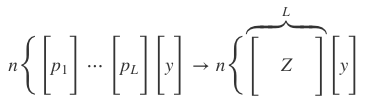

```{r setup, include=FALSE, cache=FALSE}
# Set global R options
options(htmltools.dir.version = FALSE, servr.daemon = TRUE)

# Set global knitr chunk options
knitr::opts_chunk$set(
  fig.align = "center", 
  cache = FALSE,
  error = FALSE,
  message = FALSE, 
  warning = FALSE, 
  collapse = TRUE 
)

library(tidyverse)
# set ggplot to black and white theme
library(ggplot2)
theme_set(theme_bw())
```

class: clear, center, middle

background-image: url(images/stacking-icon.jpg)
background-position: center
background-size: cover

<br><br><br>
.font300.white[Model Stacking & AutoML]


---
# Introduction

.pull-left[

.center.bold.font120[Thoughts]

- Original concept formalized by Leo Breiman [`r anicon::aia("google-scholar", animate = 'tada', anitype="hover")`](http://statistics.berkeley.edu/sites/default/files/tech-reports/367.pdf)

- Theoretically formalized in 2007 as ___Super Learners___ [`r anicon::aia("google-scholar", animate = 'tada', anitype="hover")`](https://www.degruyter.com/view/j/sagmb.2007.6.issue-1/sagmb.2007.6.1.1309/sagmb.2007.6.1.1309.xml) where the authors...

- proved that super learners will learn the optimal combination of supplied base learners and will typically perform as well as or better than any of the individual base learners.

- Nearly all prediction competitions are won with super learners

]

--

.pull-right[

.center.bold.font120[Overview]

- Basic idea

- Stacking existing models

- Stacking a grid search

- Auto machine learning search

]


---
# Prereqs .red[`r anicon::faa("hand-point-right", color = "red", animate = "horizontal")` code chunk 1]

.pull-left[

.center.bold.font120[Packages]

```{r prereqs-pks}
library(h2o)
h2o.init(max_mem_size = "5g")
```

```{r no-progress, echo=FALSE}
h2o.no_progress()
```


]

.pull-right[

.center.bold.font120[Data]

```{r prereqs-data}
# ames data
ames <- AmesHousing::make_ames()

# split data
set.seed(123)
split <- rsample::initial_split(ames, strata = "Sale_Price")
ames_train <- rsample::training(split) %>%
  as.h2o()
```

]

---
class: clear, center, middle, inverse

.font300.white[Basic Idea]


---
# Common ensemble methods

<br>
.font110[
* Ensemble machine learning methods use multiple learning algorithms to obtain better predictive performance than could be obtained from any of the constituent learning algorithms.

* Combining multiple predictors is not new
   - Bagging
   - Random forests
   - Gradient boosting
   
* However, these ensemble approaches combine common weak base learning algorithms (i.e. decision trees)  

* Stacking, on the other hand, is designed to .bold.blue[ensemble a diverse group of strong learners.]
]

---
# Super learner algorithm

Part 1: Set up the ensemble
- Specify a list of _L_ base learners (with a specific set of model parameters).
- Specify a metalearning algorithm. Can be any one of the algorithms discussed in the previous chapters but most often is regularized regression.

---
# Super learner algorithm

.opacity[Part 1: Set up the ensemble]

Part 2: Train the ensemble
- Train each of the _L_ base learners on the training set.
- Perform k-fold cross-validation on each of these learners and collect the cross-validated predicted values from each of the _L_ algorithms (must use the same k-folds for each base learner). These predicted values represent  $p_1,…,p_L$.
- The _N_ cross-validated predicted values from each of the _L_ algorithms can be combined to form a new $N \times L$ matrix (represented by _Z_). This matrix, along with the original response vector (_y_), is called the “level-one” data. (N = number of rows in the training set.)

```{r stacking-eq, echo=FALSE}

```

- Train the metalearning algorithm on the level-one data ( $y=f(Z)$ ). The “ensemble model” consists of the __L__ base learning models and the metalearning model, which can then be used to generate predictions on a test set.

---
# Super learner algorithm

.opacity[Part 1: Set up the ensemble]

.opacity[Part 2: Train the ensemble]

Part 3: Predict on new data
- To generate ensemble predictions, first generate predictions from the base learners.
- Feed those predictions into the metalearner to generate the ensemble prediction.

<br><br><br><br>
--

.center.bold.font90[_Stacking never does worse than selecting the single best base learner on the training data. .blue[The biggest gains are usually produced when stacking base learners that have high variability, and uncorrelated, predicted values.] The more similar the predicted values, the less advantage there is in stacking._]

---
# Package implementation `r emo::ji("package")`
<br>
.font110[
* [h2o](http://docs.h2o.ai/h2o/latest-stable/h2o-docs/data-science/stacked-ensembles.html): My go-to package for stacking and autoML. Provides three appraoches for model stacking.

* [SuperLearner](https://github.com/ecpolley/SuperLearner): original implementation, works with `caret` and many other algorithm packages.  Worth exploring.

* [subsemble](https://github.com/ledell/subsemble): developed by Erin Ledell who now is one of the developers of __h2o__. Maintained for backward compatibility but not forward development

* [caretEnsemble](https://github.com/zachmayer/caretEnsemble): implements a boostrapped (rather than cross-validated) version of stacking. The bootstrapped version will train faster since bootrapping (with a train/test) is a fraction of the work as k-fold cross-validation, however the the ensemble performance suffers as a result of this shortcut.
]

---
class: clear, center, middle, inverse

.font300.white[Stacking Existing Models]


---
class: clear, center, middle, inverse

.font300.white[Stacking a Grid Search]


---
class: clear, center, middle, inverse

.font300.white[Auto ML Search]


